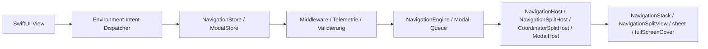
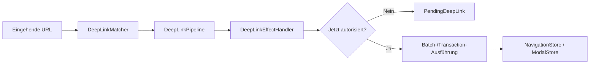

# InnoRouter

[English](README.md) | [한국어](README.ko.md) | [Español](README.es.md) | [Deutsch](README.de.md) | [简体中文](README.zh-Hans.md) | [日本語](README.ja.md) | [Русский](README.ru.md)

[](https://swiftpackageindex.com/InnoSquadCorp/InnoRouter)
[](https://swiftpackageindex.com/InnoSquadCorp/InnoRouter)
[](https://opensource.org/licenses/MIT)
[](https://codecov.io/gh/InnoSquadCorp/InnoRouter)

InnoRouter ist ein SwiftUI-natives Navigations-Framework, das auf typisiertem Zustand, expliziter Befehlsausführung und Deep-Link-Planung an der App-Grenze basiert.

Es behandelt Navigation als erstklassige State Machine statt als verstreute, view-lokale Seiteneffekte.

## Was InnoRouter besitzt

InnoRouter ist verantwortlich für:

- Stack-Navigationszustand über `RouteStack`
- Befehlsausführung über `NavigationCommand` und `NavigationEngine`
- SwiftUI-Navigationsautorität über `NavigationStore`
- Modale Autorität für `sheet` und `fullScreenCover` über `ModalStore`
- Deep-Link-Matching und -Planung über `DeepLinkMatcher` und `DeepLinkPipeline`
- App-Grenze-Ausführungshelfer über `InnoRouterNavigationEffects` und `InnoRouterDeepLinkEffects`

Es ist absichtlich keine allgemeine Anwendungs-State-Machine.

Halten Sie diese Anliegen außerhalb von InnoRouter:

- Geschäftsworkflow-Zustand
- Authentifizierungs-/Sitzungslebenszyklus
- Netzwerk-Retry- oder Transportzustand
- Alerts und Bestätigungsdialoge

## Anforderungen

- iOS 18+
- iPadOS 18+
- macOS 15+
- tvOS 18+
- watchOS 11+
- visionOS 2+
- Swift 6.2+

Die iOS-18-Untergrenze und die `swift-tools-version: 6.2` Paketbasis sind
bewusst gewählt: Sie ermöglichen es jedem öffentlichen Typ, strikte Concurrency
und `Sendable` ohne die `@preconcurrency` / `@unchecked Sendable` Auswege zu
übernehmen, was bedeutet, dass der Navigationszustand nie unbemerkt vom
Main-Actor zwischen View-Code und Store wegläuft. Der Preis ist ein kleineres
Adoptionsfenster als bei Bibliotheken, die iOS 13–16 ansprechen; der Vorteil
ist ein Router, dessen `Sendable`/`@MainActor`-Disziplin vom Compiler
überprüft statt in Prosa dokumentiert wird.

Das Macro-Target hängt derzeit von `swift-syntax` `603.0.1` mit einer
`.upToNextMinor`-Beschränkung ab. Diese Abhängigkeit und der in CI gepinnte
Xcode/Swift-Toolchain können das Paket mit einem neueren Swift-Host-Build
(z. B. Swift 6.3) validieren, aber die unterstützte Paketbasis bleibt bei
Swift 6.2, bis ein Major-Release sie ausdrücklich anhebt.

| Concurrency-Haltung | InnoRouter | TCA / FlowStacks / andere auf iOS 13+ |
|---|---|---|
| Öffentliche Typen deklarieren `Sendable` bedingungslos | ✅ | ⚠ teilweise — viele nutzen `@preconcurrency` |
| Stores sind `@MainActor`-isoliert, keine Laufzeit-Hops | ✅ | ⚠ variiert |
| `@unchecked Sendable` / `nonisolated(unsafe)` im Quellcode | ❌ keine | ⚠ in einigen Adaptern verwendet |
| Strikter Concurrency-Modus | ✅ pro Modul erzwungen | ⚠ Opt-in oder teilweise |

## Plattformunterstützung

InnoRouter wird über SwiftUI auf jeder Apple-Plattform ausgeliefert. Es sind
keine UIKit- oder AppKit-Bridge-Module erforderlich.

| Fähigkeit | iOS | iPadOS | macOS | tvOS | watchOS | visionOS |
|---|---|---|---|---|---|---|
| `NavigationStore` / `NavigationHost` / `FlowStore` / `FlowHost` | ✅ | ✅ | ✅ | ✅ | ✅ | ✅ |
| `NavigationSplitHost` / `CoordinatorSplitHost` | ✅ | ✅ | ✅ | ✅ | ❌ | ✅ |
| `ModalHost` `.sheet` | ✅ | ✅ | ✅ | ✅ | ✅ | ✅ |
| `ModalHost` `.fullScreenCover` nativ | ✅ | ✅ | ⚠ degradiert | ✅ | ⚠ degradiert | ⚠ degradiert |
| `TabCoordinator.badge` Status-API / native Darstellung | ✅ | ✅ | ✅ | ⚠ nur Status | ⚠ nur Status | ✅ |
| `DeepLinkPipeline` / `FlowDeepLinkPipeline` | ✅ | ✅ | ✅ | ✅ | ✅ | ✅ |
| `SceneStore` / `SceneHost` (Windows, volumetric, immersive) | — | — | — | — | — | ✅ |
| `innoRouterOrnament(_:content:)` View-Modifier | no-op | no-op | no-op | no-op | no-op | ✅ |

`⚠ degradiert` bedeutet, dass die Store-API die Anfrage unverändert akzeptiert,
aber der SwiftUI-Host sie als `.sheet` rendert, weil `.fullScreenCover` nicht
verfügbar ist. `⚠ nur Status` bedeutet, dass der Coordinator den Badge-Status
speichert und freigibt, aber `TabCoordinatorView` das native visuelle Badge von
SwiftUI auslässt, weil `.badge(_:)` nicht verfügbar ist. `❌` bedeutet, dass
das Symbol auf dieser Plattform nicht deklariert ist; bauen Sie es hinter
`#if !os(...)`.

## Installation

```swift skip package-manifest-fragment
dependencies: [
    .package(url: "https://github.com/InnoSquadCorp/InnoRouter.git", from: "4.1.0")
]
```

InnoRouter wird als reines Quellcode-SwiftPM-Paket ausgeliefert. Es liefert keine
Binärartefakte, und die Library Evolution ist absichtlich deaktiviert, damit
Quellcode-Builds plattformübergreifend einfach bleiben.

Das Dokumentations-Gate hält außerdem mindestens einen vollständigen Swift-Snippet
gegen das Paket typgeprüft:

```swift compile
import InnoRouter

enum CompileCheckedRoute: Route {
    case home
}

let compileCheckedStack = RouteStack<CompileCheckedRoute>()
_ = compileCheckedStack.path
```

## 4.0.0 OSS-Release-Vertrag

`4.0.0` ist InnoRouters erstes OSS-Release und die erste Version, die vom
öffentlichen SemVer-Vertrag abgedeckt wird. Neue Anwender sollten von `4.1.0`
oder neuer installieren. Frühere private/interne Paket-Snapshots sind nicht
Teil der OSS-Kompatibilitätslinie; Teams, die sie getestet haben, sollten die
öffentliche API-Verwendung gegen die 4.x-Dokumente als einmalige Quellcode-Migration
validieren.

### SemVer-Verpflichtung für die 4.x-Linie

Innerhalb der `4.x.y`-Releases folgt InnoRouter
[Semantic Versioning](https://semver.org/) strikt:

- **`4.x.y` → `4.x.(y+1)`** Patch-Releases: nur Bugfixes. Keine Änderungen
  der öffentlichen API-Signatur. Keine beobachtbaren Verhaltensänderungen
  außer der Behebung des dokumentierten Bugs.
- **`4.x.y` → `4.(x+1).0`** Minor-Releases: nur additiv. Neue Typen, neue
  Methoden, neue Cases, neue Konfigurationsoptionen. Bestehende Signaturen
  behalten ihre Form, und bestehende Aufrufstellen kompilieren unverändert.
- **`4.x.y` → `5.0.0`** Major-Releases: alles, was die Quellcode-Kompatibilität
  bricht, ein öffentliches Symbol entfernt, eine generische Beschränkung
  einengt oder das dokumentierte Laufzeitverhalten so ändert, dass bestehende
  Aufrufstellen überrascht werden können.

Ausnahme: Die unten beschriebene historische Bereinigung in `4.1.0` ist eine
dokumentierte einmalige Ausnahme. Nach dieser Adoptionsbasis sind Minor-Releases
der 4.x-Linie unter diesem Vertrag nur additiv.

Pre-Release-Tags verwenden die Form `4.1.0-rc.1` / `4.2.0-beta.2`. Die Regex
`^[0-9]+\.[0-9]+\.[0-9]+$` des Release-Workflows akzeptiert nur finale Tags;
Pre-Release-Tags werden über einen separaten manuellen Flow ausgeliefert,
der in [`RELEASING.md`](RELEASING.md) dokumentiert ist.

### Was als Breaking Change zählt

Für die Zwecke der 4.x-SemVer-Verpflichtung bedeutet ein *Breaking Change*
einen der folgenden:

- Entfernen oder Umbenennen eines öffentlichen Symbols (Typ, Methode,
  Eigenschaft, Associated Type, Case).
- Ändern einer öffentlichen Methodensignatur, sodass sie an einer bestehenden
  Aufrufstelle nicht mehr kompiliert (Hinzufügen eines nicht-defaulteten
  Parameters, Verschärfen einer generischen Beschränkung, Vertauschen des
  Rückgabetyps).
- Ändern des dokumentierten Verhaltens einer öffentlichen API, sodass ein
  bestehender korrekter Aufrufer ein anderes beobachtbares Ergebnis erzeugt
  (z. B. das Umkippen einer Standard-`NavigationPathMismatchPolicy`).
- Anheben des minimal unterstützten Swift-Toolchains oder der Plattformbasis.

Umgekehrt sind die folgenden *nicht* Breaking und können in jedem Minor-Release
landen:

- Hinzufügen neuer Cases zu einem nicht-`@frozen` öffentlichen Enum.
- Hinzufügen neuer defaulteter Parameter zu einer öffentlichen Methode.
- Verschärfen rein interner Typen.
- Performance-Verbesserungen, die die Semantik bewahren.
- Reine Dokumentationsänderungen.

Der vollständige 4.0-Basisdurchlauf ist in [`CHANGELOG.md`](CHANGELOG.md) zusammengefasst.

### Ausnahme: Historische Bereinigung in 4.1.0

`4.1.0` ist die Adoptionsbasis nach dem Pre-User-Cleanup-Durchlauf. Es
entfernt ungenutzte Dispatcher-Object-APIs, behält `replaceStack` als das
einzige vollständige Stack-Replacement-Intent und verschiebt Effect-Beobachtung
zu expliziten Event-Streams. Das ist die einzige dokumentierte source-breaking
Ausnahme in der 4.x-Linie. Neue Apps sollten von `4.1.0` ausgehen; das
`4.0.0`-Tag bleibt als erster OSS-Snapshot verfügbar.

### Imports

Das Umbrella-Target `InnoRouter` re-exportiert alles außer dem Macros-Produkt.
`@Routable` / `@CasePathable` erfordern einen expliziten `import InnoRouterMacros`
— das Umbrella überspringt diesen Re-Export absichtlich, damit Nicht-Macro-Dateien
nicht die Kosten der Macro-Plugin-Auflösung tragen:

```swift skip doc-fragment
import InnoRouter            // Stores, Hosts, Intents, Deep Links, Scenes
import InnoRouterMacros      // nur in Dateien, die @Routable / @CasePathable verwenden
```

`@EnvironmentNavigationIntent`, `@EnvironmentModalIntent` und jeder andere
Property Wrapper oder View-Modifier kommen aus `InnoRouter`, nicht aus
`InnoRouterMacros`.

Die SwiftSyntax-gestützte Macro-Implementation bleibt für die 4.x-Linie in
diesem Paket. Eine Aufteilung in Package-Traits oder ein separates Macro-Paket
sollte erst nach Messung von `swift package show-traits`,
`swift build --target InnoRouter` und `swift build --target InnoRouterMacros`
gegen die Migrationskosten evaluiert werden.

| Produkt | Wann importieren |
|---|---|
| `InnoRouter` | App-Code, der Stores, Hosts, Intents, Coordinators, Deep Links, Scenes oder Persistenz-Helfer benötigt. |
| `InnoRouterMacros` | Nur Dateien, die `@Routable` oder `@CasePathable` verwenden. |
| `InnoRouterNavigationEffects` | App-Grenze-Code, der `NavigationCommand`-Werte außerhalb einer SwiftUI-View ausführt. |
| `InnoRouterDeepLinkEffects` | App-Grenze-Code, der ausstehende Deep Links handhabt oder fortsetzt. |
| `InnoRouterEffects` | Kompatibilitäts-Import, wenn beide Effect-Module zusammen re-exportiert werden sollen. |
| `InnoRouterTesting` | Test-Targets, die host-loses `NavigationTestStore`, `ModalTestStore` oder `FlowTestStore` wollen. |

## Module

- `InnoRouter`: Umbrella-Re-Export von `InnoRouterCore`, `InnoRouterSwiftUI` und `InnoRouterDeepLink`
- `InnoRouterCore`: Route-Stack, Validatoren, Befehle, Ergebnisse, Batch-/Transaction-Executoren, Middleware
- `InnoRouterSwiftUI`: Stores, Stack-/Split-/Modal-Hosts, Coordinators, Environment-Intent-Dispatch
- `InnoRouterDeepLink`: Pattern-Matching, Diagnostik, Pipeline-Planung, ausstehende Deep Links
- `InnoRouterNavigationEffects`: synchrone `@MainActor`-Ausführungshelfer für App-Grenzen
- `InnoRouterDeepLinkEffects`: Deep-Link-Ausführungshelfer auf Navigationseffekten
- `InnoRouterEffects`: Kompatibilitäts-Umbrella für beide Effect-Module
- `InnoRouterMacros`: `@Routable` und `@CasePathable`

## Die richtige Oberfläche wählen

Nutzen Sie die kleinste Oberfläche, die die benötigte Übergangsautorität besitzt:

| Bedarf | Verwenden |
|---|---|
| Ein typisierter SwiftUI-Stack | `NavigationStore` + `NavigationHost` |
| Split-View-Stack auf unterstützten Plattformen | `NavigationStore` + `NavigationSplitHost` |
| Sheet- / Cover-Autorität ohne Stack-Resets | `ModalStore` + `ModalHost` |
| Push-+-Modal-Flows, Wiederherstellung oder Multi-Step-Deep-Links | `FlowStore` + `FlowHost` + `FlowPlan` |
| URL zu Push-only-Befehlsplan | `DeepLinkMatcher` + `DeepLinkPipeline` |
| URL zu Push-Prefix plus Modal-Tail-Flow | `FlowDeepLinkMatcher` + `FlowDeepLinkPipeline` |
| visionOS-Windows, Volumes, Immersive Spaces | `SceneStore` + `SceneHost` / `SceneAnchor` |
| Reducer, Effekt oder App-Grenze-Ausführung | `InnoRouterNavigationEffects` / `InnoRouterDeepLinkEffects` |
| Router-Assertions ohne SwiftUI-Hosts | `InnoRouterTesting` |

`NavigationStore`, `FlowStore`, `ModalStore`, `SceneStore`, Effects und Testing
sind absichtlich getrennt. Die Bibliothek hält diese Autoritäten explizit,
damit Apps nur die Teile übernehmen, die zu ihrer Routing-Grenze passen.

### Schneller Entscheidungsbaum

```text
Kombiniert die Bildschirmoberfläche Push und Modal in einem Flow?
├── Ja → FlowStore + FlowHost (eine Wahrheitsquelle, ein Events-Stream)
└── Nein → besitzt sie nur modale Autorität (Sheet / Cover)?
         ├── Ja → ModalStore + ModalHost
         └── Nein → NavigationStore + NavigationHost
                   (Split-View-Variante: NavigationSplitHost)
```

Zum Dispatchen aus View-Code (ohne Store-Referenz) verwenden Sie den passenden
Intent-Typ in [`Docs/IntentSelectionGuide.md`](Docs/IntentSelectionGuide.md):
`NavigationIntent` für die nur-Stack-Stores, `FlowIntent` für `FlowStore`
(sechs überlappende Cases plus modal-aware Varianten, die nur `FlowIntent` kennt).

## Dokumentation

- Aktuelles DocC-Portal: [InnoRouter latest docs](https://innosquadcorp.github.io/InnoRouter/latest/)
- Versionierte Docs-Wurzel: [InnoRouter docs](https://innosquadcorp.github.io/InnoRouter/)
- Release-Checkliste: [RELEASING.md](RELEASING.md)
- Maintainer-Schnellanleitung: [CLAUDE.md](CLAUDE.md)

`README.md` ist der Repository-Einstiegspunkt.
DocC ist die detaillierte Modul-Referenz.

### Tutorial-Artikel

Schritt-für-Schritt-Durchgänge für die häufigsten Adoptionspfade. Jeder Artikel
lebt im relevanten DocC-Katalog, sodass die gerenderte DocC-Site, die GitHub-
Quellcode-Ansicht und ein Offline-Build von `swift package generate-documentation`
denselben Inhalt zeigen.

| Artikel | Katalog | Behandelt |
| --- | --- | --- |
| [Tutorial-LoginOnboarding](Sources/InnoRouterSwiftUI/InnoRouterSwiftUI.docc/Articles/Tutorial-LoginOnboarding.md) | `InnoRouterSwiftUI` | Aufbau eines Login → Onboarding → Home-Flows mit `FlowStore` und `ChildCoordinator` |
| [Tutorial-DeepLinkReconciliation](Sources/InnoRouterSwiftUI/InnoRouterSwiftUI.docc/Articles/Tutorial-DeepLinkReconciliation.md) | `InnoRouterSwiftUI` | Cold-Start- vs. Warm-Deep-Links abgleichen, einschl. Pending-Replay |
| [Tutorial-MiddlewareComposition](Sources/InnoRouterSwiftUI/InnoRouterSwiftUI.docc/Articles/Tutorial-MiddlewareComposition.md) | `InnoRouterSwiftUI` | Typisiertes Middleware komponieren, Befehle abfangen, Churn beobachten |
| [Tutorial-MigratingFromNestedHosts](Sources/InnoRouterSwiftUI/InnoRouterSwiftUI.docc/Articles/Tutorial-MigratingFromNestedHosts.md) | `InnoRouterSwiftUI` | Verschachtelte `NavigationHost` + `ModalHost` Stacks durch `FlowHost` ersetzen |
| [Tutorial-Throttling](Sources/InnoRouterSwiftUI/InnoRouterSwiftUI.docc/Articles/Tutorial-Throttling.md) | `InnoRouterSwiftUI` | `ThrottleNavigationMiddleware` mit deterministischen Test-Clocks verwenden |
| [Tutorial-StoreObserver](Sources/InnoRouterSwiftUI/InnoRouterSwiftUI.docc/Articles/Tutorial-StoreObserver.md) | `InnoRouterSwiftUI` | `StoreObserver` über den vereinheitlichten `events`-Stream übernehmen |
| [Tutorial-VisionOSScenes](Sources/InnoRouterSwiftUI/InnoRouterSwiftUI.docc/Articles/Tutorial-VisionOSScenes.md) | `InnoRouterSwiftUI` | visionOS-Windows, volumetrische Scenes und Immersive Spaces aus `SceneStore` ansteuern |
| [Tutorial-FlowDeepLinkPipeline](Sources/InnoRouterDeepLink/InnoRouterDeepLink.docc/Articles/Tutorial-FlowDeepLinkPipeline.md) | `InnoRouterDeepLink` | Zusammengesetzte Push-+-Modal-Deep-Links über `FlowDeepLinkPipeline` aufbauen |
| [Tutorial-StatePersistence](Sources/InnoRouterCore/InnoRouterCore.docc/Tutorial-StatePersistence.md) | `InnoRouterCore` | `FlowPlan` / `RouteStack` über Launches mit `StatePersistence` persistieren |
| [Tutorial-TestingFlows](Sources/InnoRouterTesting/InnoRouterTesting.docc/Articles/Tutorial-TestingFlows.md) | `InnoRouterTesting` | Host-lose Swift-Testing-Assertions über `FlowTestStore` |

## Wie es funktioniert

### Laufzeit-Flow



- Views emittieren typisiertes Intent über Environment-Dispatcher.
- Stores besitzen Navigations- oder Modal-Autorität.
- Hosts übersetzen Store-Zustand in native SwiftUI-Navigations-APIs.

### Deep-Link-Flow



- Matching und Planung bleiben rein.
- Effect-Handler sind die Grenze, an der die App-Policy entscheidet, jetzt auszuführen oder zu verschieben.
- Ausstehende Deep Links bewahren den geplanten Übergang, bis die App ihn replayen kann.

## Schnellstart

### 1. Eine Route definieren

Ohne Macros:

```swift skip doc-fragment
import InnoRouter

enum HomeRoute: Route {
    case list
    case detail(id: String)
    case settings
}
```

Mit Macros:

```swift skip doc-fragment
import InnoRouter
import InnoRouterMacros

@Routable
enum HomeRoute {
    case list
    case detail(id: String)
    case settings
}
```

### 2. Einen `NavigationStore` erstellen

```swift skip doc-fragment
import InnoRouter
import OSLog

let store = try NavigationStore<HomeRoute>(
    initialPath: [.list],
    configuration: NavigationStoreConfiguration(
        routeStackValidator: .nonEmpty.combined(with: .rooted(at: .list)),
        logger: Logger(subsystem: "com.example.app", category: "navigation")
    )
)
```

### 3. In SwiftUI hosten

```swift skip doc-fragment
import SwiftUI
import InnoRouter

struct AppRoot: View {
    @State private var store = try! NavigationStore<HomeRoute>(
        initialPath: [.list]
    )

    var body: some View {
        NavigationHost(store: store) { route in
            switch route {
            case .list:
                HomeListView()
            case .detail(let id):
                DetailView(id: id)
            case .settings:
                SettingsView()
            }
        } root: {
            HomeListView()
        }
    }
}
```

### 4. Intent aus einer Child-View emittieren

```swift skip doc-fragment
struct HomeListView: View {
    @EnvironmentNavigationIntent(HomeRoute.self) private var navigationIntent

    var body: some View {
        List {
            Button("Detail") {
                navigationIntent(.go(.detail(id: "123")))
            }

            Button("Settings") {
                navigationIntent(.go(.settings))
            }

            Button("Back") {
                navigationIntent(.back)
            }
        }
    }
}
```

Views sollten Intent emittieren. Sie sollten keine direkte Mutationsautorität über den Router-Zustand haben.

## Zustands- und Ausführungsmodell

InnoRouter macht drei verschiedene Ausführungssemantiken verfügbar.

### Einzelner Befehl

`execute(_:)` wendet einen `NavigationCommand` an und gibt ein typisiertes `NavigationResult` zurück.

### Batch

`executeBatch(_:stopOnFailure:)` bewahrt die Pro-Schritt-Befehlsausführung, fasst aber die Beobachtung zusammen.

Verwenden Sie Batch-Ausführung, wenn:

- mehrere Befehle dennoch einer nach dem anderen laufen sollen
- Middleware jeden Schritt sehen soll
- Beobachter ein aggregiertes Übergangsereignis erhalten sollen

### Transaction

`executeTransaction(_:)` zeigt Befehle in einem Schatten-Stack vor und committet nur, wenn jeder Schritt gelingt.

Verwenden Sie Transaction-Ausführung, wenn:

- partieller Erfolg nicht akzeptabel ist
- Sie Rollback bei Fehlschlag oder Abbruch wollen
- ein All-or-Nothing-Commit-Ereignis wichtiger ist als Schritt-für-Schritt-Beobachtung

### `.sequence`

`.sequence` ist Befehlsalgebra, keine Transaktion.

Sie ist absichtlich:

- links nach rechts
- nicht-atomar
- typisiert über `NavigationResult.multiple`

Frühere erfolgreiche Schritte bleiben angewendet, auch wenn ein späterer Schritt fehlschlägt.

### `send(_:)` vs `execute(_:)` — den richtigen Einstiegspunkt wählen

InnoRouter macht Navigation über vier nach Zweck geschichteten Einstiegspunkten verfügbar.
Wählen Sie denjenigen, der zur Aufrufstelle passt, nicht den, der zur Datenform passt.

| Schicht       | Einstieg                           | Verwenden, wenn                                                                                |
| ------------- | ---------------------------------- | --------------------------------------------------------------------------------------------- |
| View-Intent   | `store.send(_:)`                   | Ein benanntes `NavigationIntent` aus einer SwiftUI-View dispatchen (`go`, `back`, `backToRoot`, …). |
| Befehl        | `store.execute(_:)`                | Einen einzelnen `NavigationCommand` an die Engine weiterleiten und das typisierte `NavigationResult` inspizieren. |
| Batch         | `store.executeBatch(_:)`           | Mehrere Befehle einer nach dem anderen ausführen, dabei Middleware-Sichtbarkeit und ein einzelnes Beobachter-Ereignis behalten. |
| Transaction   | `store.executeTransaction(_:)`     | All-or-Nothing committen — gegen einen Schatten-Stack vorzeigen, dann nur committen, wenn jeder Schritt gelingt. |

Faustregel:

- Views senden. Coordinators und Effect-Grenzen führen aus.
- `send` ist intent-förmig (kein Rückgabewert zum Inspizieren); `execute*` ist
  befehlsförmig (gibt ein typisiertes Ergebnis für Branching, Telemetrie,
  Retries zurück).
- Für atomare Multi-Schritt-Flows, die bei partiellem Fehlschlag rollbacken
  müssen, bevorzugen Sie `executeTransaction` gegenüber handgemachten Batches.

Die gleiche Schichtung gilt für `ModalStore` und `FlowStore`:
`send(_: ModalIntent)` / `send(_: FlowIntent)` aus Views, und
`execute(_:)` / `executeBatch(_:)` / `executeTransaction(_:)` an der Engine-Grenze.

### Wahl zwischen `.sequence`, `executeBatch` und `executeTransaction`

| Sie wollen… | Verwenden | Warum |
|---|---|---|
| Eine beobachtbare Änderung für viele Befehle, Best-Effort | `executeBatch(_:stopOnFailure:)` | Zusammengefasste `onChange` / `events`, optionales Fail-Fast |
| All-or-Nothing-Anwendung mit Rollback | `executeTransaction(_:)` | Schattenzustand-Vorschau, journalbasiertes Verwerfen |
| Einen zusammengesetzten *Wert*, den die Engine plant / validiert | `NavigationCommand.sequence([...])` | Reiner Befehl, fließt durch jedes Middleware als eine Einheit |
| Nur den letzten Befehl nach einem stillen Fenster auslösen | `DebouncingNavigator` | Async-Wrapping-Navigator, `Clock`-injizierbar |
| Pro Schlüssel rate-limitieren | `ThrottleNavigationMiddleware` | Synchron, letzter Akzept-Zeitstempel |

Die vollständige Entscheidungsmatrix mit ausgearbeiteten Beispielen und
Antipatterns lebt im DocC-Tutorial
[`Guide-SequenceVsBatchVsTransaction`](Sources/InnoRouterSwiftUI/InnoRouterSwiftUI.docc/Articles/Guide-SequenceVsBatchVsTransaction.md).

## Stack-Routing-Oberfläche

`NavigationIntent` ist die offizielle SwiftUI-Stack-Intent-Oberfläche:

- `.go(Route)`
- `.goMany([Route])`
- `.back`
- `.backBy(Int)`
- `.backTo(Route)`
- `.backToRoot`
- `.replaceStack([Route])`

`NavigationStore.send(_:)` ist der SwiftUI-Einstiegspunkt für diese Intents.

## Modal-Routing-Oberfläche

InnoRouter unterstützt modales Routing für:

- `sheet`
- `fullScreenCover`

Verwenden Sie:

- `ModalStore`
- `ModalHost`
- `ModalIntent`
- `@EnvironmentModalIntent`

Beispiel:

```swift skip doc-fragment
@Routable
enum AppModalRoute {
    case profile
    case onboarding
}

struct ShellView: View {
    @State private var modalStore = ModalStore<AppModalRoute>()

    var body: some View {
        ModalHost(store: modalStore) { route in
            switch route {
            case .profile:
                ProfileView()
            case .onboarding:
                OnboardingView()
            }
        } content: {
            HomeView()
        }
    }
}
```

### Modale Scope-Grenze

Auf iOS und tvOS mappt `ModalHost` Stile direkt auf `sheet` und `fullScreenCover`.
Auf anderen unterstützten Plattformen degradiert `fullScreenCover` sicher zu `sheet`.

InnoRouter besitzt absichtlich **nicht**:

- `alert`
- `confirmationDialog`

Halten Sie diese als feature-lokalen oder coordinator-lokalen Präsentationszustand.

### Modale Beobachtbarkeit

`ModalStoreConfiguration` bietet leichtgewichtige Lifecycle-Hooks:

- `logger`
- `onPresented`
- `onDismissed`
- `onQueueChanged`
- `onMiddlewareMutation`
- `onCommandIntercepted`

`ModalDismissalReason` unterscheidet:

- `.dismiss`
- `.dismissAll`
- `.systemDismiss`

### Modale Middleware

`ModalStore` macht dieselbe Middleware-Oberfläche wie `NavigationStore` verfügbar:

- `ModalMiddleware` / `AnyModalMiddleware<M>` mit `willExecute` / `didExecute`.
- `ModalInterception` lässt Middleware `.proceed(command)` (einschl. umgeschriebener Befehle)
  oder `.cancel(reason:)` mit einem `ModalCancellationReason` ausführen.
- `ModalStore.addMiddleware` / `insertMiddleware` / `removeMiddleware` /
  `replaceMiddleware` / `moveMiddleware` — handle-basiertes CRUD passend zu Navigation.
- `execute(_:) -> ModalExecutionResult<M>` routet alle `.present`,
  `.dismissCurrent` und `.dismissAll` durch das Registry.
- `ModalMiddlewareMutationEvent` macht Registry-Churn für Analytics sichtbar.

## Split-Navigation

Für iPad- und macOS-Detail-Navigation verwenden Sie:

- `NavigationSplitHost`
- `CoordinatorSplitHost`

InnoRouter besitzt in Split-Layouts nur den Detail-Stack.

Diese bleiben app-eigentum:

- Sidebar-Auswahl
- Spaltensichtbarkeit
- Compact-Anpassung

## Coordinator-Oberfläche

Coordinators sind Policy-Objekte, die zwischen SwiftUI-Intent und Befehlsausführung sitzen.

Verwenden Sie `CoordinatorHost` oder `CoordinatorSplitHost`, wenn:

- View-Intent zuerst Policy-Routing benötigt
- App-Shells Koordinationslogik benötigen
- mehrere Navigationsautoritäten hinter einem Coordinator komponiert werden sollen

`FlowCoordinator` und `TabCoordinator` sind Helfer, kein Ersatz für `NavigationStore`.

Empfohlene Aufteilung:

- `NavigationStore`: Route-Stack-Autorität
- `TabCoordinator`: Shell-/Tab-Auswahl-Zustand
- `FlowCoordinator`: lokale Schritt-Progression in einem Ziel

### Child-Coordinator-Verkettung

`ChildCoordinator` lässt einen Parent-Coordinator inline einen Finish-Wert
über `parent.push(child:) -> Task<Child.Result?, Never>` abwarten:

```swift skip doc-fragment
let signupResult = await parentCoordinator.push(child: SignUpCoordinator())
if let user = signupResult {
    parentCoordinator.handle(.go(.home(user)))
}
```

Callbacks (`onFinish`, `onCancel`) werden synchron installiert, sodass das
Child sie zu jedem Zeitpunkt feuern kann, einschließlich vor dem `await` des
Parents. Die Designbegründung finden Sie in
[`Docs/design-child-coordinator-handoff.md`](Docs/design-child-coordinator-handoff.md).

Die Stornierung des Parent-`Task` propagiert über
`ChildCoordinator.parentDidCancel()` (Standard-leere No-Op) zum Child. Überschreiben
Sie es, um vorübergehenden Zustand abzubauen — Sheets schließen, laufende
Anfragen stornieren, temporäre Stores freigeben — wenn die Parent-View entlassen wird:

```swift skip doc-fragment
final class SignUpCoordinator: ChildCoordinator {
    typealias Result = UserID
    var onFinish: (@MainActor @Sendable (UserID) -> Void)?
    var onCancel: (@MainActor @Sendable () -> Void)?

    func parentDidCancel() {
        signUpAPIClient.cancelActiveRequests()
    }
}
```

`parentDidCancel` ist gerichtet (Parent → Child). Es ruft `onCancel` nicht auf
(das bleibt Child → Parent); die zwei Hooks sind orthogonal.

## Benannte Navigations-Intents

Häufige Intents werden aus bestehenden `NavigationCommand`-Primitiven komponiert:

- `NavigationIntent.replaceStack([R])` — setzt den Stack in einem beobachtbaren Schritt auf die gegebenen Routen zurück.
- `NavigationIntent.backOrPush(R)` — pop zu `route`, wenn sie bereits im Stack existiert, sonst push.
- `NavigationIntent.pushUniqueRoot(R)` — push nur, wenn der Stack noch keine gleiche Route enthält.

Diese routen durch die normale `send` → `execute`-Pipeline, sodass Middleware
und Telemetrie sie identisch zu direkten `NavigationCommand`-Aufrufen beobachten.

## Case-typisierte Ziel-Bindings

`NavigationStore` und `ModalStore` machen `binding(case:)`-Helfer verfügbar,
die durch den von `@Routable` / `@CasePathable` emittierten `CasePath` indiziert sind:

```swift skip doc-fragment
struct DetailSheet: View {
    @Environment(\.navigationStore) private var store: NavigationStore<AppRoute>

    var body: some View {
        SomeDetailView()
            .sheet(item: store.binding(case: \AppRoute.detail)) { detail in
                DetailView(detail: detail)
            }
    }
}
```

Bindings routen jedes Set durch die bestehende Befehlspipeline, sodass
Middleware und Telemetrie sie genauso beobachten wie direkte
`execute(...)`-Aufrufe. `ModalStore.binding(case:style:)` ist pro
Präsentationsstil (`.sheet` / `.fullScreenCover`) gescoped.

## Deep-Link-Modell

Deep Links werden als Pläne behandelt, nicht als versteckte Seiteneffekte.

Kernteile:

- `DeepLinkMatcher`
- `DeepLinkPipeline`
- `DeepLinkDecision`
- `PendingDeepLink`
- `NavigationPlan`

Typischer Ablauf:

1. eine URL einer Route zuordnen
2. nach Scheme/Host ablehnen oder akzeptieren
3. Authentifizierungsrichtlinie anwenden
4. `.plan`, `.pending`, `.rejected` oder `.unhandled` emittieren
5. den resultierenden Navigationsplan explizit ausführen

### Matcher-Diagnostik

`DeepLinkMatcher` und `FlowDeepLinkMatcher` können melden:

- doppelte Patterns
- Wildcard-Shadowing
- Parameter-Shadowing
- nicht-terminale Wildcards

Diagnostik ändert die Deklarationsreihenfolge-Präzedenz nicht. Sie hilft beim
Erkennen von Authoring-Fehlern, ohne das Laufzeitverhalten still zu ändern.
Verwenden Sie `try DeepLinkMatcher(strict:)` oder `try FlowDeepLinkMatcher(strict:)`
in Release-Readiness-Gates, wenn Diagnostik den Build fehlschlagen lassen soll.

### Zusammengesetzte Deep Links (Push + Modal-Tail)

`FlowDeepLinkPipeline` erweitert die Push-only-Pipeline, sodass eine einzelne
URL ein Push-Prefix **plus** einen modalen Endschritt in einem atomaren
`FlowStore.apply(_:)` rehydrieren kann:

```swift skip doc-fragment
let matcher = FlowDeepLinkMatcher<AppRoute> {
    FlowDeepLinkMapping("/home/detail/:id") { params in
        guard let id = params.firstValue(forName: "id") else { return nil }
        return FlowPlan(steps: [.push(.home), .push(.detail(id: id))])
    }
    FlowDeepLinkMapping("/onboarding/privacy") { _ in
        FlowPlan(steps: [.sheet(.privacyPolicy)])
    }
}

let pipeline = FlowDeepLinkPipeline(
    allowedSchemes: ["myapp"],
    allowedHosts: ["app"],
    matcher: matcher,
    authenticationPolicy: .required(
        shouldRequireAuthentication: { _ in true },
        isAuthenticated: { SessionStore.shared.isAuthenticated }
    )
)

let handler = FlowDeepLinkEffectHandler(pipeline: pipeline, applier: flowStore)

FlowHost(store: flowStore, destination: destination) { RootView() }
    .onOpenURL { _ = handler.handle($0) }
```

Jeder `FlowDeepLinkMapping`-Handler gibt einen **vollständigen** `FlowPlan`
zurück, sodass Multi-Segment-URLs an der Deklarationsstelle explizit sind.
Die Pipeline verwendet die `DeepLinkAuthenticationPolicy` + `PendingDeepLink`-Semantik
der Push-only-Pipeline wortwörtlich für symmetrische Authentifizierungsverschiebung
und Replay. Den vollständigen Walk-through finden Sie in
[`Sources/InnoRouterDeepLink/InnoRouterDeepLink.docc/Articles/Tutorial-FlowDeepLinkPipeline.md`](Sources/InnoRouterDeepLink/InnoRouterDeepLink.docc/Articles/Tutorial-FlowDeepLinkPipeline.md).

## Middleware

Middleware bietet eine Querschnitts-Policy-Schicht um die Befehlsausführung.

Pre-Ausführung:

- `willExecute(_:state:) -> NavigationInterception`
- `.proceed(updatedCommand)`
- `.cancel(reason)`

Post-Ausführung:

- `didExecute(_:result:state:) -> NavigationResult`

Middleware kann:

- Befehle umschreiben
- die Ausführung mit typisierten Stornierungsgründen blockieren
- Ergebnisse nach der Ausführung falten

Middleware kann den Store-Zustand nicht direkt mutieren.

### Typisierte Stornierung

Stornierungsgründe verwenden `NavigationCancellationReason`:

- `.middleware(debugName:command:)`
- `.conditionFailed`
- `.custom(String)`

### Middleware-Verwaltung

`NavigationStore` macht handle-basierte Verwaltung verfügbar:

- `addMiddleware`
- `insertMiddleware`
- `removeMiddleware`
- `replaceMiddleware`
- `moveMiddleware`
- `middlewareMetadata`

## Path-Reconciliation

SwiftUI-`NavigationStack(path:)`-Updates werden zurück auf semantische Befehle gemappt.

Regeln:

- Prefix-Shrink → `.popCount` oder `.popToRoot`
- Prefix-Expand → batched `.push`
- Nicht-Prefix-Mismatch → `NavigationPathMismatchPolicy`

Verfügbare Mismatch-Policies:

- `.replace` — Standard-Produktions-Stance; akzeptiert SwiftUIs nicht-prefix-Path-Rewrite
  und emittiert ein Mismatch-Ereignis.
- `.assertAndReplace` — Debug-/Pre-Release-Stance; assertet, dann mit derselben
  Replacement-Semantik wiederherstellen.
- `.ignore` — Store-autoritative Stance; beobachtet das Rewrite, behält aber
  den aktuellen Stack unverändert.
- `.custom` — Domain-Reparatur-Stance; mappt die alten/neuen Paths auf einen
  Befehl, einen Batch oder ein No-Op.

Wenn `NavigationStoreConfiguration.logger` gesetzt ist, emittiert die
Mismatch-Behandlung strukturierte Telemetrie.

## Effect-Module

### `InnoRouterNavigationEffects`

Verwenden Sie dies, wenn App-Shell-Code eine kleine Ausführungsfassade über einer
Navigator-Grenze möchte.

Schlüssel-API:

- `execute(_:)`
- `execute(_ commands:)`
- `executeTransaction(_:)`
- `executeGuarded(_:, prepare:)`

Diese APIs sind synchrone `@MainActor`-APIs, mit Ausnahme des expliziten
async-Guard-Helfers.

### `InnoRouterDeepLinkEffects`

Verwenden Sie dies, wenn Deep-Link-Pläne an einer App-Grenze mit typisierten
Ergebnissen ausgeführt werden sollen.

Schlüssel-API:

- `handle(_ url:)`
- `resumePendingDeepLink()`
- `resumePendingDeepLinkIfAllowed(_:)`

### Umbrella `DeepLinkCoordinating`

Coordinators, die `DeepLinkCoordinating` adoptieren, erhalten dieselbe
typisierte Ergebnis-Oberfläche durch `DeepLinkCoordinationOutcome<Route>`.
Pipeline-Ablehnungen (`rejected`, `unhandled`) und Resume-Zustände
(`pending`, `executed`, `noPendingDeepLink`) sind alle beobachtbar, ohne
in den Stack-Zustand hineinzuschauen.

- `handleDeepLink(_:) -> DeepLinkCoordinationOutcome<Route>`
- `resumePendingDeepLinkIfPossible() -> DeepLinkCoordinationOutcome<Route>`
- `resumePendingDeepLinkIfAllowed(_:) async -> DeepLinkCoordinationOutcome<Route>`

## `Examples` vs `ExamplesSmoke`

Das Repository trennt Dokumentationsbeispiele und CI-Beispiele absichtlich.

- `Examples/`: menschengerichtete, idiomatische, macro-basierte Beispiele
- `ExamplesSmoke/`: compiler-stabile Smoke-Fixtures für CI

Aktuelle Beispiele decken ab:

- eigenständiges Stack-Routing
- Coordinator-Routing
- Deep Links
- Split-Navigation
- App-Shell-Komposition
- Modal-Routing

## Docs- und Release-Flow

### DocC

DocC wird pro Modul gebaut und auf GitHub Pages veröffentlicht.

Veröffentlichte Struktur:

- `/InnoRouter/latest/`
- `/InnoRouter/4.1.0/`
- `/InnoRouter/` Root-Portal

### CI

CI validiert:

- `swift test`
- `principle-gates`
- `platforms`-Workflow für Pro-Plattform-SwiftUI-Coverage
- Beispiel-Smoke-Builds
- DocC-Vorschau-Build

### CD

CD läuft nur auf reinen Semver-Tags:

- `4.1.0`

Ungültige Tag-Beispiele:

- jedes Tag mit führendem `v`
- `release-4.1.0`

Verantwortungen des Release-Workflows:

- Code-/Dokumentations-Gates erneut ausführen
- Vor dem Tagging ein lokales `./scripts/principle-gates.sh --platforms=all` oder einen grünen GitHub `platforms`-Workflow verlangen
- versioniertes DocC bauen
- `/latest/` aktualisieren
- ältere versionierte Docs erhalten
- GitHub Release veröffentlichen

### SwiftUI-Philosophie-Ausrichtung

InnoRouter folgt der deklarativen Richtung von SwiftUI und macht dabei
bewusste Trade-offs für gemeinsame Navigationsautorität.

- Views emittieren Intent statt direkt den Router-Zustand zu mutieren.
- Stack-, Split-Detail- und Modal-Autoritäten bleiben getrennt.
- Fehlende Environment-Verkabelung schlägt schnell fehl.
- `NavigationStore` bleibt ein Referenztyp, weil es geteilte Autorität ist,
  kein flüchtiger lokaler Zustand.
- `Coordinator` bleibt aus demselben Grund `AnyObject`.

Das ist ein bewusster pragmatischer Trade-off, kein versehentliches Abdriften von SwiftUI.

## Examples

Menschengerichtete Beispiele leben hier:

- [Examples/StandaloneExample.swift](https://github.com/InnoSquadCorp/InnoRouter/blob/main/Examples/StandaloneExample.swift)
- [Examples/CoordinatorExample.swift](https://github.com/InnoSquadCorp/InnoRouter/blob/main/Examples/CoordinatorExample.swift)
- [Examples/DeepLinkExample.swift](https://github.com/InnoSquadCorp/InnoRouter/blob/main/Examples/DeepLinkExample.swift)
- [Examples/SplitCoordinatorExample.swift](https://github.com/InnoSquadCorp/InnoRouter/blob/main/Examples/SplitCoordinatorExample.swift)
- [Examples/AppShellExample.swift](https://github.com/InnoSquadCorp/InnoRouter/blob/main/Examples/AppShellExample.swift)

## Quality-Gates

Führen Sie diese lokal aus, bevor Sie ein Release schneiden:

```bash
swift test
./scripts/principle-gates.sh
./scripts/build-docc-site.sh --version preview --skip-latest
```

## Flow-Stack

`FlowStore<R>` repräsentiert einen vereinheitlichten Push-+-Sheet-+-Cover-Flow
als ein einzelnes Array von `RouteStep<R>`-Werten. Er besitzt einen inneren
`NavigationStore<R>` und `ModalStore<R>`, delegiert an jeden, während er
Invarianten erzwingt (höchstens eine abschließende Modal, Modal immer am Tail,
Middleware-Rollbacks reconcilieren den Path).

Diese inneren Stores sind in 4.0 `@_spi(FlowStoreInternals)`. App-Code sollte
`FlowStore.path`, `send(_:)`, `apply(_:)`, `events` und `intentDispatcher` als
die öffentliche Autoritätsoberfläche behandeln; direkte innere Store-Mutation
ist Hosts und fokussierten Invariant-Tests vorbehalten.

Typische Verwendung:

```swift skip doc-fragment
let flow = FlowStore<AppRoute>()
let restoredFlow = try FlowStore<AppRoute>(
    validating: persistedSteps
)

flow.send(.push(.home))
flow.send(.push(.detail(id)))
flow.send(.presentSheet(.share))   // tail modal
flow.apply(FlowPlan(steps: [.push(.home), .cover(.paywall)]))
```

- `FlowHost` komponiert `ModalHost` über `NavigationHost` und injiziert eine
  Environment-Closure für `@EnvironmentFlowIntent(Route.self)`-Dispatch.
- `FlowStoreConfiguration` komponiert `NavigationStoreConfiguration` und
  `ModalStoreConfiguration` und fügt `onPathChanged` und `onIntentRejected` hinzu.
- `FlowStore(validating:configuration:)` ist der throwende Initializer für
  wiederhergestellte oder extern bereitgestellte `[RouteStep]`-Werte; der
  Kompatibilitäts-Initializer `initial:` zwingt ungültige Eingaben weiterhin auf
  einen leeren Path.
- `FlowRejectionReason` macht Invariantenverletzungen sichtbar
  (`pushBlockedByModalTail`, `invalidResetPath`, `middlewareRejected(debugName:)`).

## Host-loses Testing (`InnoRouterTesting`)

`InnoRouterTesting` ist ein auslieferbares Swift-Testing-natives Assertion-Harness,
das `NavigationStore`, `ModalStore` und `FlowStore` umhüllt. Tests benötigen
keinen `@testable import InnoRouterSwiftUI` mehr und keine
handgefertigten `Mutex<[Event]>`-Sammler — jeder öffentliche Beobachtungs-Callback
wird in eine FIFO-Queue gepuffert, und Tests entleeren sie mit TCA-artigen
`receive(...)`-Aufrufen.

Fügen Sie das Produkt nur zum Test-Target hinzu:

```swift skip doc-fragment
// Package.swift
.testTarget(
    name: "AppTests",
    dependencies: [
        .product(name: "InnoRouter", package: "InnoRouter"),
        .product(name: "InnoRouterTesting", package: "InnoRouter"),
    ]
)
```

Dann schreiben Sie Tests gegen die Produktions-Intents:

```swift skip doc-fragment
import Testing
import InnoRouter
import InnoRouterTesting

@Test
@MainActor
func pushHomeThenDetail() {
    let store = NavigationTestStore<AppRoute>()

    store.send(.go(.home))
    store.receiveChange { _, new in new.path == [.home] }

    store.executeBatch([.push(.detail("42"))])
    store.receiveChange { _, new in new.path == [.home, .detail("42")] }
    store.receiveBatch { $0.isSuccess }

    store.expectNoMoreEvents()
}
```

Was das Harness abdeckt:

- **`NavigationTestStore<R>`** — `onChange`, `onBatchExecuted`,
  `onTransactionExecuted`, `onMiddlewareMutation` und `onPathMismatch`. Leitet
  `send`, `execute`, `executeBatch`, `executeTransaction` unverändert an den
  zugrunde liegenden Store weiter.
- **`ModalTestStore<M>`** — `onPresented`, `onDismissed`, `onQueueChanged`,
  `onCommandIntercepted`, `onMiddlewareMutation`.
- **`FlowTestStore<R>`** — FlowStore-Level-`onPathChanged` + `onIntentRejected`,
  plus `.navigation(...)`- und `.modal(...)`-Wrapper um die inneren Store-Emissionen
  in einer einzelnen Queue. Ein Test kann die vollständige durch ein einzelnes
  `FlowIntent` ausgelöste Kette einschließlich Middleware-Cancellation-Pfaden behaupten.

Erschöpfung ist standardmäßig `.strict`: jedes nicht behauptete Ereignis beim
Store-Deinit feuert ein Swift-Testing-Issue. Verwenden Sie `.off` für
inkrementelle Migrationen von Legacy-Test-Fixtures.

## Zustandswiederherstellung

Routen, die `Codable` opt-in einschalten, erhalten round-trip-fähige
`RouteStack`-, `RouteStep`- und `FlowPlan`-Werte gratis:

```swift skip doc-fragment
enum AppRoute: Route, Codable {
    case home
    case detail(String)
    case settings
}

let persistence = StatePersistence<AppRoute>()

// Bei Scene-Background / Checkpoint:
let data = try persistence.encode(FlowPlan(steps: flowStore.path))
try data.write(to: restorationURL, options: .atomic)

// Beim Launch:
if let data = try? Data(contentsOf: restorationURL) {
    flowStore.apply(try persistence.decode(data))
}
```

`StatePersistence<R: Route & Codable>` umhüllt einen `JSONEncoder` und
`JSONDecoder` (beide konfigurierbar) und stoppt an der `Data`-Grenze —
File-URLs, `UserDefaults`, iCloud und Scene-Phase-Hooks sind App-Anliegen.
Fehler propagieren als die zugrunde liegenden `EncodingError` /
`DecodingError`, sodass Aufrufer Schema-Drift von I/O-Fehlern unterscheiden können.

`FlowPlan(steps: flowStore.path)` ist ein Snapshot des aktuell sichtbaren Flows:
er speichert den Navigations-Push-Stack plus den aktiven modalen Tail, falls
einer sichtbar ist. Er serialisiert nicht den modalen Backlog. Eingereihte
Präsentationen leben in `ModalStore.queuedPresentations` als interner
Ausführungszustand und sind außerhalb des aktuellen `FlowPlan`-Persistenz-Vertrags.
Apps, die eingereihte Modal-Arbeit wiederherstellen müssen, sollten einen
app-eigenen Queue-Snapshot zusammen mit dem `FlowPlan` persistieren und ihn
nach dem Launch durch ihre eigene Routing-Policy replayen.

## Vereinheitlichter Beobachtungsstream

Jeder Store veröffentlicht einen einzelnen `events: AsyncStream`, der die
gesamte Beobachtungsoberfläche abdeckt — Stack-Änderungen, Batch-/
Transaction-Abschlüsse, Path-Mismatch-Auflösungen, Middleware-Registry-Mutationen,
Modal-Present-/Dismiss-/Queue-Updates, Befehlsabfangungen und Flow-Level-Path-
oder Intent-Rejection-Signale.

```swift skip doc-fragment
Task {
    for await event in flowStore.events {
        switch event {
        case .navigation(.changed(_, let to)):
            analytics.track("nav_path", to.path)
        case .modal(.commandIntercepted(_, .cancelled(let reason))):
            Log.warning("modal cancelled: \(reason)")
        case .intentRejected(let intent, let reason):
            Log.info("flow rejected \(intent) because \(reason)")
        default:
            continue
        }
    }
}
```

Individuelle `onChange`-, `onPresented`-, `onCommandIntercepted`- usw.-Callbacks
auf jedem `*Configuration`-Typ bleiben source-kompatibel; der `events`-Stream ist
ein zusätzlicher Kanal, kein Ersatz.

### Backpressure (Gegendruck)

Jeder Store fächert jedes Ereignis über eine `AsyncStream.Continuation` pro
Subscriber an jeden Subscriber aus. Um die Warteschlange pro Subscriber unter
Last zu begrenzen, akzeptiert jeder Store ein `eventBufferingPolicy` in seiner
Konfiguration:

- `.bufferingNewest(1024)` (Standard) — behält die jüngsten 1024 Ereignisse
  pro Subscriber, verwirft ältere Ereignisse wenn der Puffer voll ist.
  Dimensioniert für realistische Navigations-Bursts und hält das gehaltene
  Working Set begrenzt.
- `.bufferingOldest(N)` — behält die ältesten N Ereignisse pro Subscriber,
  verwirft neuere Ereignisse wenn der Puffer voll ist.
- `.unbounded` — puffert jedes Ereignis, bis der Subscriber es entleert.
  Verwenden Sie dies für Test-Harnesses oder kurzlebige Subscriber, deren
  Lebensdauer Sie kontrollieren und die deterministische, verlustfreie
  Reihenfolge erfordern.

```swift skip doc-fragment
let store = try NavigationStore<HomeRoute>(
    initialPath: [.list],
    configuration: NavigationStoreConfiguration(
        eventBufferingPolicy: .bufferingNewest(2048)
    )
)
```

`ModalStoreConfiguration.eventBufferingPolicy` steuert `ModalStore.events`.
`FlowStoreConfiguration.eventBufferingPolicy` steuert das flow-level
`FlowStore.events` fan-out, während
`FlowStoreConfiguration.navigation.eventBufferingPolicy` und
`FlowStoreConfiguration.modal.eventBufferingPolicy` die umhüllten inneren
Store-Streams steuern. Verluste sind still — wenn Ihre Analytics-Pipeline
"kein Ereignis aufgetreten" von "ein Ereignis wurde aus dem Puffer verworfen"
unterscheiden muss, abonnieren Sie mit `.unbounded` und tunen Sie selbst das Tempo.

Der vollständige Vertrag ist in
[`Event-Stream-Backpressure`](Sources/InnoRouterCore/InnoRouterCore.docc/Articles/Event-Stream-Backpressure.md)
dokumentiert.

## Roadmap

Verfolgt in
[`Docs/competitive-analysis-and-roadmap.md`](Docs/competitive-analysis-and-roadmap.md).
Mit dem ausgelieferten P3-Polish-Cluster ist das P0-/P1-/P3-Backlog leer.
Die öffentliche OSS-Linie beginnt bei der 4.0-Basis; siehe
[`CHANGELOG.md`](CHANGELOG.md) für ausgelieferte Oberflächenänderungen.

- [x] **P2-3 UIKit-Escape** — abgelehnt für das 4.0.0-OSS-Release. InnoRouter
      behält eine SwiftUI-only-Positionierungshaltung; Teams, die UIKit-/AppKit-
      Adapter benötigen, können diese Oberflächen außerhalb von InnoRouter komponieren.
- [x] **Debounce-Semantik** — ausgeliefert in 4.0.0 als `DebouncingNavigator`,
      ein `Clock`-injizierbarer Wrapper um einen `NavigationCommandExecutor`.
      Die synchrone `NavigationCommand`-Algebra bleibt timer-frei.

## Anwender

InnoRouter steht am Anfang seiner öffentlichen Adoptionskurve. Wenn Sie InnoRouter
in Produktion ausliefern, öffnen Sie bitte eine PR, die Ihr Projekt zur Liste unten
hinzufügt — ein generischer Deskriptor (`a finance app at $company`) ist okay,
falls ein öffentlicher Name noch nicht möglich ist. Anwender-Signal hilft
prospektiven Nutzern, die Reife einzuschätzen.

- _Ihr Projekt hier._

Die Datei
[`Examples/SampleAppExample.swift`](Examples/SampleAppExample.swift)
zeigt die vollständige Headline-Feature-Oberfläche — Deep-Link-Pipeline mit
Auth-Gating, FlowStore-Push-+-Modal-Projektion und DebouncingNavigator-Such-Debouncing
— in einer einzelnen, in sich geschlossenen Autoritätsklasse komponiert.

## Mitwirken

Siehe [`CONTRIBUTING.md`](CONTRIBUTING.md) für Branching, Commit-Konventionen,
öffentliche-API-Änderungsregeln und Macro-Test-Anforderungen.
Sicherheitsfunde folgen dem privaten Prozess in [`SECURITY.md`](SECURITY.md).
Teilnahme wird erwartet, [`CODE_OF_CONDUCT.md`](CODE_OF_CONDUCT.md) zu folgen.

## Lizenz

MIT
