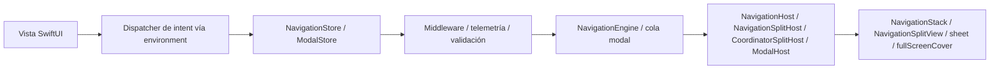
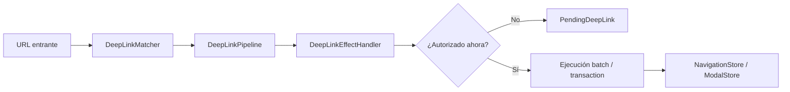

# InnoRouter

[English](README.md) | [한국어](README.ko.md) | [Español](README.es.md) | [Deutsch](README.de.md) | [简体中文](README.zh-Hans.md) | [日本語](README.ja.md) | [Русский](README.ru.md)

[](https://swiftpackageindex.com/InnoSquadCorp/InnoRouter)
[](https://swiftpackageindex.com/InnoSquadCorp/InnoRouter)
[](https://opensource.org/licenses/MIT)
[](https://codecov.io/gh/InnoSquadCorp/InnoRouter)

InnoRouter es un framework de navegación nativo de SwiftUI construido alrededor de estado tipado, ejecución explícita de comandos y planificación de deep-link en el límite de la aplicación.

Trata la navegación como una máquina de estados de primer nivel en vez de una dispersión de efectos secundarios locales a la vista.

## Lo que InnoRouter posee

InnoRouter es responsable de:

- estado de navegación de stack a través de `RouteStack`
- ejecución de comandos a través de `NavigationCommand` y `NavigationEngine`
- autoridad de navegación de SwiftUI a través de `NavigationStore`
- autoridad modal para `sheet` y `fullScreenCover` a través de `ModalStore`
- coincidencia y planificación de deep-link a través de `DeepLinkMatcher` y `DeepLinkPipeline`
- ayudantes de ejecución en el límite de la app a través de `InnoRouterNavigationEffects` e `InnoRouterDeepLinkEffects`

Intencionadamente no es una máquina de estados general de aplicación.

Mantenga estas preocupaciones fuera de InnoRouter:

- estado del flujo de trabajo de negocio
- ciclo de vida de autenticación/sesión
- estado de reintento de red o transporte
- alertas y diálogos de confirmación

## Requisitos

- iOS 18+
- iPadOS 18+
- macOS 15+
- tvOS 18+
- watchOS 11+
- visionOS 2+
- Swift 6.2+

El piso de iOS 18 y la línea base del paquete `swift-tools-version: 6.2` son
deliberados: permiten que cada tipo público adopte concurrencia estricta y
`Sendable` sin las salidas de escape `@preconcurrency` / `@unchecked Sendable`,
lo que significa que el estado de navegación nunca se filtra silenciosamente
fuera del actor principal en el límite entre el código de la vista y el store.
El costo es una ventana de adopción más pequeña que las bibliotecas que apuntan
a iOS 13–16; el beneficio es un router cuya disciplina `Sendable`/`@MainActor`
es verificada por el compilador en lugar de documentada en prosa.

El target de macros depende actualmente de `swift-syntax` `603.0.1` con una
restricción `.upToNextMinor`. Esa dependencia y el toolchain Xcode/Swift fijado
en CI pueden validar el paquete con una build de Swift host más reciente
(por ejemplo Swift 6.3), pero el piso del paquete soportado permanece en
Swift 6.2 hasta que un release mayor lo eleve explícitamente.

| Postura de concurrencia | InnoRouter | TCA / FlowStacks / otros en iOS 13+ |
|---|---|---|
| Tipos públicos declaran `Sendable` incondicionalmente | ✅ | ⚠ parcial — muchos usan `@preconcurrency` |
| Stores aislados a `@MainActor`, sin saltos en runtime | ✅ | ⚠ varía |
| `@unchecked Sendable` / `nonisolated(unsafe)` en código fuente | ❌ ninguno | ⚠ usado en algunos adaptadores |
| Modo de concurrencia estricta | ✅ aplicado por módulo | ⚠ opcional o parcial |

## Soporte de plataformas

InnoRouter funciona en cada plataforma Apple a través de SwiftUI. No se requieren
módulos puente de UIKit o AppKit.

| Capacidad | iOS | iPadOS | macOS | tvOS | watchOS | visionOS |
|---|---|---|---|---|---|---|
| `NavigationStore` / `NavigationHost` / `FlowStore` / `FlowHost` | ✅ | ✅ | ✅ | ✅ | ✅ | ✅ |
| `NavigationSplitHost` / `CoordinatorSplitHost` | ✅ | ✅ | ✅ | ✅ | ❌ | ✅ |
| `ModalHost` `.sheet` | ✅ | ✅ | ✅ | ✅ | ✅ | ✅ |
| `ModalHost` `.fullScreenCover` nativo | ✅ | ✅ | ⚠ degrada | ✅ | ⚠ degrada | ⚠ degrada |
| API de estado `TabCoordinator.badge` / visual nativo | ✅ | ✅ | ✅ | ⚠ solo estado | ⚠ solo estado | ✅ |
| `DeepLinkPipeline` / `FlowDeepLinkPipeline` | ✅ | ✅ | ✅ | ✅ | ✅ | ✅ |
| `SceneStore` / `SceneHost` (windows, volumetric, immersive) | — | — | — | — | — | ✅ |
| Modificador de vista `innoRouterOrnament(_:content:)` | no-op | no-op | no-op | no-op | no-op | ✅ |

`⚠ degrada` significa que la API del store acepta la solicitud sin cambios pero
el host de SwiftUI la renderiza como `.sheet` porque `.fullScreenCover` no está
disponible. `⚠ solo estado` significa que el coordinator almacena y expone el
estado del badge, pero `TabCoordinatorView` omite el badge visual nativo de
SwiftUI porque `.badge(_:)` no está disponible. `❌` significa que el símbolo
no está declarado en esa plataforma; constrúyalo detrás de `#if !os(...)`.

## Instalación

```swift skip package-manifest-fragment
dependencies: [
    .package(url: "https://github.com/InnoSquadCorp/InnoRouter.git", from: "4.1.0")
]
```

InnoRouter se distribuye como un paquete SwiftPM solo de fuente. No incluye
artefactos binarios, y la library evolution está intencionalmente desactivada
para que las builds de fuente permanezcan simples en todas las plataformas Apple.

La puerta de documentación también mantiene al menos un fragmento Swift completo
verificado contra el paquete:

```swift compile
import InnoRouter

enum CompileCheckedRoute: Route {
    case home
}

let compileCheckedStack = RouteStack<CompileCheckedRoute>()
_ = compileCheckedStack.path
```

## Contrato de release OSS 4.0.0

`4.0.0` es el primer release OSS de InnoRouter y la primera versión cubierta por
el contrato público de SemVer. Los nuevos adoptantes deberían instalar desde
`4.0.0` o más reciente. Las instantáneas privadas/internas anteriores no son
parte de la línea de compatibilidad OSS; los equipos que las probaron deberían
validar el uso de la API pública contra los documentos 4.x como una migración
de fuente única.

### Compromiso SemVer para la línea 4.x

Dentro de los releases `4.x.y`, InnoRouter sigue
[Semantic Versioning](https://semver.org/) estrictamente:

- **`4.x.y` → `4.x.(y+1)`** releases de parche: solo correcciones de bugs.
  Sin cambios de firma de API pública. Sin cambios de comportamiento observable
  más allá de arreglar el bug documentado.
- **`4.x.y` → `4.(x+1).0`** releases menores: solo aditivos. Nuevos tipos,
  nuevos métodos, nuevos casos, nuevas opciones de configuración. Las firmas
  existentes mantienen su forma y los sitios de llamada existentes siguen
  compilando sin modificación.
- **`4.x.y` → `5.0.0`** releases mayores: cualquier cosa que rompa la
  compatibilidad de fuente, elimine un símbolo público, restrinja una restricción
  genérica, o cambie el comportamiento documentado en runtime de una forma que
  pueda sorprender a los sitios de llamada existentes.

Excepción: la limpieza histórica `4.1.0` descrita abajo es una excepción
documentada y única. Después de esa línea base de adopción, los releases
menores 4.x son solo aditivos bajo este contrato.

Las etiquetas de pre-release usan la forma `4.1.0-rc.1` / `4.2.0-beta.2`. La
expresión regular `^[0-9]+\.[0-9]+\.[0-9]+$` del workflow de release solo acepta
etiquetas finales; las etiquetas pre-release se publican a través de un flujo
manual separado documentado en [`RELEASING.md`](RELEASING.md).

### Qué cuenta como cambio rompedor

Para los propósitos del compromiso SemVer 4.x, un *cambio rompedor* significa
cualquiera de:

- Eliminar o renombrar un símbolo público (tipo, método, propiedad,
  associated type, caso).
- Cambiar una firma de método público de manera que no compile para un sitio
  de llamada existente (agregar un parámetro sin valor por defecto, restringir
  una restricción genérica, cambiar el tipo de retorno).
- Cambiar el comportamiento documentado de una API pública de tal forma que
  un llamador correcto existente produzca un resultado observable diferente
  (por ejemplo, voltear un `NavigationPathMismatchPolicy` por defecto).
- Elevar el toolchain mínimo de Swift soportado o el piso de plataforma.

Por el contrario, los siguientes *no son* rompedores y pueden aterrizar en
cualquier release menor:

- Agregar nuevos casos a un enum público no `@frozen`.
- Agregar nuevos parámetros con valor por defecto a un método público.
- Restringir tipos solo internos.
- Mejoras de rendimiento que preservan la semántica.
- Cambios solo de documentación.

El barrido completo de la línea base 4.0 se resume en
[`CHANGELOG.md`](CHANGELOG.md).

### Excepción: limpieza histórica 4.1.0

`4.1.0` es la línea base de adopción después del paso de limpieza pre-usuario.
Elimina APIs de objetos dispatcher no usadas, mantiene `replaceStack` como el
único intent de reemplazo de stack completo, y mueve la observación de efectos
a flujos de eventos explícitos. Es la única excepción source-breaking
documentada en la línea 4.x. Las nuevas apps deberían comenzar desde `4.1.0`;
la etiqueta `4.0.0` permanece disponible como la primera instantánea OSS.

### Imports

El target paraguas `InnoRouter` re-exporta todo excepto el producto de macros.
`@Routable` / `@CasePathable` requieren un `import InnoRouterMacros` explícito
— el paraguas omite deliberadamente esa re-exportación para que los archivos
sin macros no paguen el costo de resolución del plugin de macros:

```swift skip doc-fragment
import InnoRouter            // stores, hosts, intents, deep links, scenes
import InnoRouterMacros      // solo en archivos que usan @Routable / @CasePathable
```

`@EnvironmentNavigationIntent`, `@EnvironmentModalIntent` y todos los demás
property wrappers o modificadores de vista vienen de `InnoRouter`, no de
`InnoRouterMacros`.

La implementación de macros respaldada por SwiftSyntax permanece en este paquete
para la línea 4.x. Una división de package-traits o paquete-macros-separado
debería evaluarse solo después de medir `swift package show-traits`,
`swift build --target InnoRouter` y `swift build --target InnoRouterMacros`
contra el costo de migración.

| Producto | Cuándo importar |
|---|---|
| `InnoRouter` | Código de app que necesita stores, hosts, intents, coordinators, deep links, scenes o ayudantes de persistencia. |
| `InnoRouterMacros` | Solo archivos que usan `@Routable` o `@CasePathable`. |
| `InnoRouterNavigationEffects` | Código en el límite de la app que ejecuta valores `NavigationCommand` fuera de una vista SwiftUI. |
| `InnoRouterDeepLinkEffects` | Código en el límite de la app que maneja o reanuda deep links pendientes. |
| `InnoRouterEffects` | Import de compatibilidad cuando ambos módulos de efectos deben re-exportarse juntos. |
| `InnoRouterTesting` | Targets de test que quieren `NavigationTestStore`, `ModalTestStore` o `FlowTestStore` sin host. |

## Módulos

- `InnoRouter`: re-exportación paraguas de `InnoRouterCore`, `InnoRouterSwiftUI` e `InnoRouterDeepLink`
- `InnoRouterCore`: route stack, validators, comandos, resultados, ejecutores de batch/transaction, middleware
- `InnoRouterSwiftUI`: stores, hosts de stack/split/modal, coordinators, dispatch de intent vía environment
- `InnoRouterDeepLink`: coincidencia de patrones, diagnósticos, planificación de pipeline, deep links pendientes
- `InnoRouterNavigationEffects`: ayudantes de ejecución síncronos `@MainActor` para límites de app
- `InnoRouterDeepLinkEffects`: ayudantes de ejecución de deep-link superpuestos a efectos de navegación
- `InnoRouterEffects`: paraguas de compatibilidad para ambos módulos de efectos
- `InnoRouterMacros`: `@Routable` y `@CasePathable`

## Eligiendo la superficie correcta

Use la superficie más pequeña que posea la autoridad de transición que necesita:

| Necesidad | Use |
|---|---|
| Un stack SwiftUI tipado | `NavigationStore` + `NavigationHost` |
| Stack split-view en plataformas soportadas | `NavigationStore` + `NavigationSplitHost` |
| Autoridad de sheet / cover sin reset de stack | `ModalStore` + `ModalHost` |
| Flujos push + modal, restauración o deep links multi-paso | `FlowStore` + `FlowHost` + `FlowPlan` |
| URL a plan de comandos solo-push | `DeepLinkMatcher` + `DeepLinkPipeline` |
| URL a flujo prefijo-push más cola-modal | `FlowDeepLinkMatcher` + `FlowDeepLinkPipeline` |
| Windows, volúmenes, immersive spaces de visionOS | `SceneStore` + `SceneHost` / `SceneAnchor` |
| Reducer, efecto o ejecución en límite de app | `InnoRouterNavigationEffects` / `InnoRouterDeepLinkEffects` |
| Aserciones de router sin hosts SwiftUI | `InnoRouterTesting` |

`NavigationStore`, `FlowStore`, `ModalStore`, `SceneStore`, effects y testing
están intencionalmente separados. La biblioteca mantiene estas autoridades
explícitas para que las apps adopten solo las piezas que coinciden con su
límite de enrutamiento.

### Diagrama de flujo de decisión rápida

```text
¿La superficie de pantalla combina push y modal en un flujo?
├── Sí → FlowStore + FlowHost (una fuente de verdad, un flujo de eventos)
└── No → ¿posee solo autoridad modal (sheet / cover)?
         ├── Sí → ModalStore + ModalHost
         └── No → NavigationStore + NavigationHost
                 (variante split-view: NavigationSplitHost)
```

Para hacer dispatch desde código de vista (sin referencia al store), use el tipo
de intent correspondiente en [`Docs/IntentSelectionGuide.md`](Docs/IntentSelectionGuide.md):
`NavigationIntent` para los stores de solo stack, `FlowIntent` para
`FlowStore` (seis casos superpuestos más variantes modal-aware que solo
`FlowIntent` conoce).

## Documentación

- Portal DocC más reciente: [InnoRouter latest docs](https://innosquadcorp.github.io/InnoRouter/latest/)
- Raíz de docs versionados: [InnoRouter docs](https://innosquadcorp.github.io/InnoRouter/)
- Lista de comprobación de release: [RELEASING.md](RELEASING.md)
- Guía rápida del mantenedor: [CLAUDE.md](CLAUDE.md)

`README.md` es el punto de entrada al repositorio.
DocC es la referencia detallada a nivel de módulo.

### Artículos de tutorial

Recorridos paso a paso para los caminos de adopción más comunes. Cada artículo
vive dentro del catálogo DocC relevante para que el sitio DocC renderizado, la
vista de fuente de GitHub y una build offline `swift package generate-documentation`
muestren todos el mismo contenido.

| Artículo | Catálogo | Cubre |
| --- | --- | --- |
| [Tutorial-LoginOnboarding](Sources/InnoRouterSwiftUI/InnoRouterSwiftUI.docc/Articles/Tutorial-LoginOnboarding.md) | `InnoRouterSwiftUI` | Construir un flujo login → onboarding → home con `FlowStore` y `ChildCoordinator` |
| [Tutorial-DeepLinkReconciliation](Sources/InnoRouterSwiftUI/InnoRouterSwiftUI.docc/Articles/Tutorial-DeepLinkReconciliation.md) | `InnoRouterSwiftUI` | Reconciliar deep links cold-start vs warm, incluyendo replay pendiente |
| [Tutorial-MiddlewareComposition](Sources/InnoRouterSwiftUI/InnoRouterSwiftUI.docc/Articles/Tutorial-MiddlewareComposition.md) | `InnoRouterSwiftUI` | Componer middleware tipado, interceptar comandos, observar churn |
| [Tutorial-MigratingFromNestedHosts](Sources/InnoRouterSwiftUI/InnoRouterSwiftUI.docc/Articles/Tutorial-MigratingFromNestedHosts.md) | `InnoRouterSwiftUI` | Reemplazar stacks anidados `NavigationHost` + `ModalHost` con `FlowHost` |
| [Tutorial-Throttling](Sources/InnoRouterSwiftUI/InnoRouterSwiftUI.docc/Articles/Tutorial-Throttling.md) | `InnoRouterSwiftUI` | Usar `ThrottleNavigationMiddleware` con clocks de test deterministas |
| [Tutorial-StoreObserver](Sources/InnoRouterSwiftUI/InnoRouterSwiftUI.docc/Articles/Tutorial-StoreObserver.md) | `InnoRouterSwiftUI` | Adoptar `StoreObserver` sobre el flujo unificado `events` |
| [Tutorial-VisionOSScenes](Sources/InnoRouterSwiftUI/InnoRouterSwiftUI.docc/Articles/Tutorial-VisionOSScenes.md) | `InnoRouterSwiftUI` | Conducir windows visionOS, escenas volumétricas y immersive spaces desde `SceneStore` |
| [Tutorial-FlowDeepLinkPipeline](Sources/InnoRouterDeepLink/InnoRouterDeepLink.docc/Articles/Tutorial-FlowDeepLinkPipeline.md) | `InnoRouterDeepLink` | Construir deep links push + modal compuestos a través de `FlowDeepLinkPipeline` |
| [Tutorial-StatePersistence](Sources/InnoRouterCore/InnoRouterCore.docc/Tutorial-StatePersistence.md) | `InnoRouterCore` | Persistir `FlowPlan` / `RouteStack` entre lanzamientos con `StatePersistence` |
| [Tutorial-TestingFlows](Sources/InnoRouterTesting/InnoRouterTesting.docc/Articles/Tutorial-TestingFlows.md) | `InnoRouterTesting` | Aserciones Swift Testing sin host vía `FlowTestStore` |

## Cómo funciona

### Flujo en runtime



- Las vistas emiten intent tipado a través de dispatchers de environment.
- Los stores poseen autoridad de navegación o modal.
- Los hosts traducen estado del store a APIs nativas de navegación SwiftUI.

### Flujo de deep-link



- La coincidencia y la planificación permanecen puras.
- Los manejadores de efecto son el límite donde la política de la app decide ejecutar ahora o diferir.
- Los deep links pendientes preservan la transición planificada hasta que la app esté lista para reproducirla.

## Inicio rápido

### 1. Defina una ruta

Sin macros:

```swift skip doc-fragment
import InnoRouter

enum HomeRoute: Route {
    case list
    case detail(id: String)
    case settings
}
```

Con macros:

```swift skip doc-fragment
import InnoRouter
import InnoRouterMacros

@Routable
enum HomeRoute {
    case list
    case detail(id: String)
    case settings
}
```

### 2. Cree un `NavigationStore`

```swift skip doc-fragment
import InnoRouter
import OSLog

let store = try NavigationStore<HomeRoute>(
    initialPath: [.list],
    configuration: NavigationStoreConfiguration(
        routeStackValidator: .nonEmpty.combined(with: .rooted(at: .list)),
        logger: Logger(subsystem: "com.example.app", category: "navigation")
    )
)
```

### 3. Aloje en SwiftUI

```swift skip doc-fragment
import SwiftUI
import InnoRouter

struct AppRoot: View {
    @State private var store = try! NavigationStore<HomeRoute>(
        initialPath: [.list]
    )

    var body: some View {
        NavigationHost(store: store) { route in
            switch route {
            case .list:
                HomeListView()
            case .detail(let id):
                DetailView(id: id)
            case .settings:
                SettingsView()
            }
        } root: {
            HomeListView()
        }
    }
}
```

### 4. Emita intent desde una vista hija

```swift skip doc-fragment
struct HomeListView: View {
    @EnvironmentNavigationIntent(HomeRoute.self) private var navigationIntent

    var body: some View {
        List {
            Button("Detail") {
                navigationIntent(.go(.detail(id: "123")))
            }

            Button("Settings") {
                navigationIntent(.go(.settings))
            }

            Button("Back") {
                navigationIntent(.back)
            }
        }
    }
}
```

Las vistas deberían emitir intent. No deberían tener autoridad directa de mutación sobre el estado del router.

## Modelo de estado y ejecución

InnoRouter expone tres semánticas de ejecución distintas.

### Comando único

`execute(_:)` aplica un `NavigationCommand` y devuelve un `NavigationResult` tipado.

### Batch

`executeBatch(_:stopOnFailure:)` preserva la ejecución por paso de comando pero coalesca la observación.

Use ejecución batch cuando:

- múltiples comandos deberían ejecutarse uno por uno
- el middleware aún debería ver cada paso
- los observadores aún deberían recibir un evento de transición agregado

### Transaction

`executeTransaction(_:)` previsualiza comandos en un stack sombra y hace commit solo si cada paso tiene éxito.

Use ejecución transaction cuando:

- el éxito parcial no es aceptable
- quiere rollback en fallo o cancelación
- un evento de commit todo-o-nada importa más que la observación paso-a-paso

### `.sequence`

`.sequence` es álgebra de comandos, no una transacción.

Es intencionalmente:

- de izquierda a derecha
- no atómico
- tipado a través de `NavigationResult.multiple`

Los pasos exitosos anteriores permanecen aplicados incluso si un paso posterior falla.

### `send(_:)` vs `execute(_:)` — eligiendo el punto de entrada correcto

InnoRouter expone navegación a través de cuatro puntos de entrada en capas por propósito.
Elija el que coincide con el sitio de llamada, no el que coincide con la forma de los datos.

| Capa         | Entrada                            | Use cuando                                                                                       |
| ------------ | ---------------------------------- | ------------------------------------------------------------------------------------------------ |
| View intent  | `store.send(_:)`                   | Hace dispatch de un `NavigationIntent` con nombre desde una vista SwiftUI (`go`, `back`, `backToRoot`, …). |
| Comando      | `store.execute(_:)`                | Reenvía un solo `NavigationCommand` al engine e inspecciona el `NavigationResult` tipado.       |
| Batch        | `store.executeBatch(_:)`           | Ejecuta múltiples comandos uno por uno mientras mantiene visibilidad del middleware y un solo evento de observador. |
| Transaction  | `store.executeTransaction(_:)`     | Hace commit todo-o-nada — previsualiza contra un stack sombra, luego hace commit solo si cada paso tiene éxito. |

Regla práctica:

- Las vistas hacen send. Los coordinators y límites de efecto hacen execute.
- `send` tiene forma de intent (sin valor de retorno para inspeccionar);
  `execute*` tiene forma de comando (devuelve un resultado tipado para
  ramificación, telemetría, reintentos).
- Para flujos atómicos multi-paso que deben revertir en fallo parcial, prefiera
  `executeTransaction` sobre batches hechos a mano.

La misma capa aplica a `ModalStore` y `FlowStore`:
`send(_: ModalIntent)` / `send(_: FlowIntent)` desde vistas, y
`execute(_:)` / `executeBatch(_:)` / `executeTransaction(_:)` en el límite del engine.

### Eligiendo entre `.sequence`, `executeBatch` y `executeTransaction`

| Quiere… | Use | Por qué |
|---|---|---|
| Un cambio observable para muchos comandos, mejor esfuerzo | `executeBatch(_:stopOnFailure:)` | `onChange` / `events` coalescados, fail-fast opcional |
| Aplicar todo-o-nada con rollback | `executeTransaction(_:)` | Previsualización de estado sombra, descarte basado en journal |
| Un *valor* compuesto que el engine planifica / valida | `NavigationCommand.sequence([...])` | Comando puro, fluye por cada middleware como una unidad |
| Disparar solo el comando más reciente después de una ventana silenciosa | `DebouncingNavigator` | Navegador async wrapper, `Clock` inyectable |
| Limitar tasa por clave | `ThrottleNavigationMiddleware` | Síncrono, último timestamp aceptado |

La matriz de decisión completa con ejemplos trabajados y antipatrones vive en el
tutorial DocC
[`Guide-SequenceVsBatchVsTransaction`](Sources/InnoRouterSwiftUI/InnoRouterSwiftUI.docc/Articles/Guide-SequenceVsBatchVsTransaction.md).

## Superficie de enrutamiento de stack

`NavigationIntent` es la superficie oficial de stack-intent SwiftUI:

- `.go(Route)`
- `.goMany([Route])`
- `.back`
- `.backBy(Int)`
- `.backTo(Route)`
- `.backToRoot`
- `.replaceStack([Route])`

`NavigationStore.send(_:)` es el punto de entrada SwiftUI para estos intents.

## Superficie de enrutamiento modal

InnoRouter soporta enrutamiento modal para:

- `sheet`
- `fullScreenCover`

Use:

- `ModalStore`
- `ModalHost`
- `ModalIntent`
- `@EnvironmentModalIntent`

Ejemplo:

```swift skip doc-fragment
@Routable
enum AppModalRoute {
    case profile
    case onboarding
}

struct ShellView: View {
    @State private var modalStore = ModalStore<AppModalRoute>()

    var body: some View {
        ModalHost(store: modalStore) { route in
            switch route {
            case .profile:
                ProfileView()
            case .onboarding:
                OnboardingView()
            }
        } content: {
            HomeView()
        }
    }
}
```

### Límite de scope modal

En iOS y tvOS, `ModalHost` mapea estilos directamente a `sheet` y `fullScreenCover`.
En otras plataformas soportadas, `fullScreenCover` degrada de manera segura a `sheet`.

InnoRouter intencionadamente **no** posee:

- `alert`
- `confirmationDialog`

Manténgalos como estado de presentación local-a-feature o local-a-coordinator.

### Observabilidad modal

`ModalStoreConfiguration` provee hooks de ciclo de vida ligeros:

- `logger`
- `onPresented`
- `onDismissed`
- `onQueueChanged`
- `onMiddlewareMutation`
- `onCommandIntercepted`

`ModalDismissalReason` distingue:

- `.dismiss`
- `.dismissAll`
- `.systemDismiss`

### Middleware modal

`ModalStore` expone la misma superficie de middleware que `NavigationStore`:

- `ModalMiddleware` / `AnyModalMiddleware<M>` con `willExecute` / `didExecute`.
- `ModalInterception` permite que el middleware haga `.proceed(command)`
  (incluyendo comandos reescritos) o `.cancel(reason:)` con un `ModalCancellationReason`.
- `ModalStore.addMiddleware` / `insertMiddleware` / `removeMiddleware` /
  `replaceMiddleware` / `moveMiddleware` — CRUD basado en handles que coincide
  con navegación.
- `execute(_:) -> ModalExecutionResult<M>` enruta todos los `.present`,
  `.dismissCurrent` y `.dismissAll` a través del registry.
- `ModalMiddlewareMutationEvent` expone churn del registry para analítica.

## Navegación split

Para navegación detalle de iPad y macOS, use:

- `NavigationSplitHost`
- `CoordinatorSplitHost`

InnoRouter posee solo el stack de detalle en layouts split.

Estos permanecen propiedad de la app:

- selección de sidebar
- visibilidad de columna
- adaptación compacta

## Superficie de coordinator

Los coordinators son objetos de política que se sientan entre el intent SwiftUI
y la ejecución del comando.

Use `CoordinatorHost` o `CoordinatorSplitHost` cuando:

- el intent de la vista necesita enrutamiento de política primero
- los shells de app necesitan lógica de coordinación
- múltiples autoridades de navegación deberían componerse detrás de un coordinator

`FlowCoordinator` y `TabCoordinator` son ayudantes, no reemplazos para `NavigationStore`.

División recomendada:

- `NavigationStore`: autoridad de route-stack
- `TabCoordinator`: estado de selección de shell/tab
- `FlowCoordinator`: progresión local de pasos dentro de un destino

### Encadenamiento de coordinator hijo

`ChildCoordinator` permite a un coordinator padre esperar un valor de finalización
en línea a través de `parent.push(child:) -> Task<Child.Result?, Never>`:

```swift skip doc-fragment
let signupResult = await parentCoordinator.push(child: SignUpCoordinator())
if let user = signupResult {
    parentCoordinator.handle(.go(.home(user)))
}
```

Los callbacks (`onFinish`, `onCancel`) se instalan sincrónicamente para que el
hijo pueda dispararlos en cualquier momento, incluso antes del `await` del padre.
Vea [`Docs/design-child-coordinator-handoff.md`](Docs/design-child-coordinator-handoff.md)
para la justificación de diseño.

La cancelación del `Task` padre se propaga al hijo a través de
`ChildCoordinator.parentDidCancel()` (no-op vacío por defecto). Sobrescríbalo
para desmontar estado transitorio — descartar sheets, cancelar requests en
vuelo, liberar stores temporales — cuando la vista padre se descarte:

```swift skip doc-fragment
final class SignUpCoordinator: ChildCoordinator {
    typealias Result = UserID
    var onFinish: (@MainActor @Sendable (UserID) -> Void)?
    var onCancel: (@MainActor @Sendable () -> Void)?

    func parentDidCancel() {
        signUpAPIClient.cancelActiveRequests()
    }
}
```

`parentDidCancel` es direccional (padre → hijo). No invoca `onCancel` (que
permanece hijo → padre); los dos hooks son ortogonales.

## Intents de navegación con nombre

Los intents de alta frecuencia se componen a partir de primitivas existentes
de `NavigationCommand`:

- `NavigationIntent.replaceStack([R])` — restablece el stack a las rutas dadas
  en un paso observable.
- `NavigationIntent.backOrPush(R)` — pop a `route` si ya existe en el stack,
  de lo contrario lo empuja.
- `NavigationIntent.pushUniqueRoot(R)` — empuja solo si el stack ya no contiene
  una ruta igual.

Estos enrutan a través del pipeline normal `send` → `execute` para que el
middleware y la telemetría los observen idénticamente a llamadas directas
de `NavigationCommand`.

## Bindings de destino tipados por caso

`NavigationStore` y `ModalStore` exponen ayudantes `binding(case:)` clavados
por el `CasePath` emitido por `@Routable` / `@CasePathable`:

```swift skip doc-fragment
struct DetailSheet: View {
    @Environment(\.navigationStore) private var store: NavigationStore<AppRoute>

    var body: some View {
        SomeDetailView()
            .sheet(item: store.binding(case: \AppRoute.detail)) { detail in
                DetailView(detail: detail)
            }
    }
}
```

Los bindings enrutan cada set a través del pipeline de comandos existente
para que el middleware y la telemetría los observen exactamente como observan
llamadas directas a `execute(...)`. `ModalStore.binding(case:style:)` está
delimitado por estilo de presentación (`.sheet` / `.fullScreenCover`).

## Modelo de deep-link

Los deep links se manejan como planes, no efectos secundarios ocultos.

Piezas centrales:

- `DeepLinkMatcher`
- `DeepLinkPipeline`
- `DeepLinkDecision`
- `PendingDeepLink`
- `NavigationPlan`

Flujo típico:

1. coincida una URL en una ruta
2. rechace o acepte por scheme/host
3. aplique política de autenticación
4. emita `.plan`, `.pending`, `.rejected` o `.unhandled`
5. ejecute el plan de navegación resultante explícitamente

### Diagnósticos del matcher

`DeepLinkMatcher` y `FlowDeepLinkMatcher` pueden reportar:

- patrones duplicados
- shadowing de wildcard
- shadowing de parámetros
- wildcards no terminales

Los diagnósticos no cambian la precedencia de orden de declaración. Ayudan a
detectar errores de autoría sin cambiar silenciosamente el comportamiento de
runtime. Use `try DeepLinkMatcher(strict:)` o `try FlowDeepLinkMatcher(strict:)`
en puertas de release-readiness cuando los diagnósticos deberían fallar la build.

### Deep links compuestos (push + cola modal)

`FlowDeepLinkPipeline` extiende el pipeline solo-push para que una única URL
pueda rehidratar un prefijo push **más** un paso terminal modal en un solo
`FlowStore.apply(_:)` atómico:

```swift skip doc-fragment
let matcher = FlowDeepLinkMatcher<AppRoute> {
    FlowDeepLinkMapping("/home/detail/:id") { params in
        guard let id = params.firstValue(forName: "id") else { return nil }
        return FlowPlan(steps: [.push(.home), .push(.detail(id: id))])
    }
    FlowDeepLinkMapping("/onboarding/privacy") { _ in
        FlowPlan(steps: [.sheet(.privacyPolicy)])
    }
}

let pipeline = FlowDeepLinkPipeline(
    allowedSchemes: ["myapp"],
    allowedHosts: ["app"],
    matcher: matcher,
    authenticationPolicy: .required(
        shouldRequireAuthentication: { _ in true },
        isAuthenticated: { SessionStore.shared.isAuthenticated }
    )
)

let handler = FlowDeepLinkEffectHandler(pipeline: pipeline, applier: flowStore)

FlowHost(store: flowStore, destination: destination) { RootView() }
    .onOpenURL { _ = handler.handle($0) }
```

Cada handler `FlowDeepLinkMapping` devuelve un `FlowPlan` **completo**, así que
las URLs multi-segmento son explícitas en el sitio de declaración. El pipeline
reutiliza la semántica `DeepLinkAuthenticationPolicy` + `PendingDeepLink` del
pipeline solo-push para diferimiento y replay simétrico de autenticación. Vea
[`Sources/InnoRouterDeepLink/InnoRouterDeepLink.docc/Articles/Tutorial-FlowDeepLinkPipeline.md`](Sources/InnoRouterDeepLink/InnoRouterDeepLink.docc/Articles/Tutorial-FlowDeepLinkPipeline.md)
para el recorrido completo.

## Middleware

El middleware proporciona una capa de política transversal alrededor de la
ejecución de comandos.

Pre-ejecución:

- `willExecute(_:state:) -> NavigationInterception`
- `.proceed(updatedCommand)`
- `.cancel(reason)`

Post-ejecución:

- `didExecute(_:result:state:) -> NavigationResult`

El middleware puede:

- reescribir comandos
- bloquear ejecución con razones de cancelación tipadas
- doblar resultados después de la ejecución

El middleware no puede mutar el estado del store directamente.

### Cancelación tipada

Las razones de cancelación usan `NavigationCancellationReason`:

- `.middleware(debugName:command:)`
- `.conditionFailed`
- `.custom(String)`

### Gestión de middleware

`NavigationStore` expone gestión basada en handles:

- `addMiddleware`
- `insertMiddleware`
- `removeMiddleware`
- `replaceMiddleware`
- `moveMiddleware`
- `middlewareMetadata`

## Reconciliación de path

Las actualizaciones de SwiftUI `NavigationStack(path:)` se mapean de vuelta a
comandos semánticos.

Reglas:

- prefix shrink → `.popCount` o `.popToRoot`
- prefix expand → `.push` por lotes
- mismatch no-prefix → `NavigationPathMismatchPolicy`

Políticas de mismatch disponibles:

- `.replace` — postura predeterminada de producción; acepta la reescritura de
  path no-prefix de SwiftUI y emite un evento mismatch.
- `.assertAndReplace` — postura debug / pre-release; assert, luego recupera con
  la misma semántica de reemplazo.
- `.ignore` — postura store-autoritativa; observa la reescritura pero mantiene
  el stack actual sin cambios.
- `.custom` — postura de reparación de dominio; mapea los paths viejo/nuevo a
  un comando, un batch o no-op.

Cuando se establece `NavigationStoreConfiguration.logger`, el manejo de mismatch
emite telemetría estructurada.

## Módulos de efecto

### `InnoRouterNavigationEffects`

Use esto cuando el código del shell de la app quiera una pequeña fachada de
ejecución sobre un límite de navigator.

API clave:

- `execute(_:)`
- `execute(_ commands:)`
- `executeTransaction(_:)`
- `executeGuarded(_:, prepare:)`

Estas APIs son síncronas `@MainActor`, excepto el ayudante de guard async explícito.

### `InnoRouterDeepLinkEffects`

Use esto cuando los planes de deep-link deberían ejecutarse en un límite de app
con resultados tipados.

API clave:

- `handle(_ url:)`
- `resumePendingDeepLink()`
- `resumePendingDeepLinkIfAllowed(_:)`

### Paraguas `DeepLinkCoordinating`

Los coordinators que adoptan `DeepLinkCoordinating` obtienen la misma superficie
de resultados tipados a través de `DeepLinkCoordinationOutcome<Route>`. Las
negativas del pipeline (`rejected`, `unhandled`) y los estados de reanudación
(`pending`, `executed`, `noPendingDeepLink`) son todos observables sin
inspeccionar el estado del stack.

- `handleDeepLink(_:) -> DeepLinkCoordinationOutcome<Route>`
- `resumePendingDeepLinkIfPossible() -> DeepLinkCoordinationOutcome<Route>`
- `resumePendingDeepLinkIfAllowed(_:) async -> DeepLinkCoordinationOutcome<Route>`

## `Examples` vs `ExamplesSmoke`

El repositorio separa intencionalmente los ejemplos de documentación de los ejemplos de CI.

- `Examples/`: ejemplos para humanos, idiomáticos, basados en macros
- `ExamplesSmoke/`: fixtures de smoke estables al compilador para CI

Los ejemplos actuales cubren:

- enrutamiento de stack autónomo
- enrutamiento por coordinator
- deep links
- navegación split
- composición de shell de app
- enrutamiento modal

## Documentos y flujo de release

### DocC

DocC se construye por módulo y se publica a GitHub Pages.

Estructura publicada:

- `/InnoRouter/latest/`
- `/InnoRouter/4.0.0/`
- `/InnoRouter/` portal raíz

### CI

CI valida:

- `swift test`
- `principle-gates`
- workflow `platforms` para cobertura SwiftUI por plataforma
- builds smoke de ejemplos
- build de previsualización DocC

### CD

CD se ejecuta solo en etiquetas semver puras:

- `4.0.0`

Ejemplos de etiquetas inválidas:

- cualquier etiqueta con un `v` inicial
- `release-4.0.0`

Responsabilidades del workflow de release:

- volver a ejecutar puertas de código/documentación
- requerir `./scripts/principle-gates.sh --platforms=all` local o un workflow `platforms` verde de GitHub antes de etiquetar
- construir DocC versionado
- actualizar `/latest/`
- preservar docs versionados antiguos
- publicar GitHub Release

### Alineación filosófica con SwiftUI

InnoRouter sigue la dirección declarativa de SwiftUI mientras hace
trade-offs deliberados para la autoridad de navegación compartida.

- Las vistas emiten intent en lugar de mutar directamente el estado del router.
- Las autoridades de stack, split-detail y modal permanecen separadas.
- El cableado de environment faltante falla rápido.
- `NavigationStore` permanece como tipo de referencia porque es autoridad
  compartida, no estado local efímero.
- `Coordinator` permanece como `AnyObject` por la misma razón.

Este es un trade-off pragmático intencional, no una desviación accidental de SwiftUI.

## Examples

Los ejemplos para humanos viven aquí:

- [Examples/StandaloneExample.swift](https://github.com/InnoSquadCorp/InnoRouter/blob/main/Examples/StandaloneExample.swift)
- [Examples/CoordinatorExample.swift](https://github.com/InnoSquadCorp/InnoRouter/blob/main/Examples/CoordinatorExample.swift)
- [Examples/DeepLinkExample.swift](https://github.com/InnoSquadCorp/InnoRouter/blob/main/Examples/DeepLinkExample.swift)
- [Examples/SplitCoordinatorExample.swift](https://github.com/InnoSquadCorp/InnoRouter/blob/main/Examples/SplitCoordinatorExample.swift)
- [Examples/AppShellExample.swift](https://github.com/InnoSquadCorp/InnoRouter/blob/main/Examples/AppShellExample.swift)

## Puertas de calidad

Ejecute estos localmente antes de cortar un release:

```bash
swift test
./scripts/principle-gates.sh
./scripts/build-docc-site.sh --version preview --skip-latest
```

## Flow stack

`FlowStore<R>` representa un flujo unificado push + sheet + cover como un único
arreglo de valores `RouteStep<R>`. Posee un `NavigationStore<R>` y `ModalStore<R>`
internos, delegando a cada uno mientras hace cumplir invariantes (un modal
final como máximo, modal siempre en la cola, los rollbacks de middleware
reconcilian el path).

Esos stores internos son `@_spi(FlowStoreInternals)` en 4.0. El código de app
debería tratar `FlowStore.path`, `send(_:)`, `apply(_:)`, `events` e
`intentDispatcher` como la superficie pública de autoridad; la mutación directa
del store interno está reservada para hosts y tests de invariante enfocados.

Uso típico:

```swift skip doc-fragment
let flow = FlowStore<AppRoute>()
let restoredFlow = try FlowStore<AppRoute>(
    validating: persistedSteps
)

flow.send(.push(.home))
flow.send(.push(.detail(id)))
flow.send(.presentSheet(.share))   // tail modal
flow.apply(FlowPlan(steps: [.push(.home), .cover(.paywall)]))
```

- `FlowHost` compone `ModalHost` sobre `NavigationHost` e inyecta una clausura
  de environment para dispatch `@EnvironmentFlowIntent(Route.self)`.
- `FlowStoreConfiguration` compone `NavigationStoreConfiguration` y
  `ModalStoreConfiguration`, agregando `onPathChanged` y `onIntentRejected`.
- `FlowStore(validating:configuration:)` es el initializer throwing para
  valores `[RouteStep]` restaurados o suministrados externamente; el initializer
  de compatibilidad `initial:` aún coacciona entrada inválida a un path vacío.
- `FlowRejectionReason` expone violaciones de invariante
  (`pushBlockedByModalTail`, `invalidResetPath`, `middlewareRejected(debugName:)`).

## Testing sin host (`InnoRouterTesting`)

`InnoRouterTesting` es un arnés de aserciones nativo de Swift Testing que envuelve
`NavigationStore`, `ModalStore` y `FlowStore`. Los tests ya no necesitan
`@testable import InnoRouterSwiftUI` o colectores `Mutex<[Event]>` hechos a mano —
cada callback de observación pública se almacena en una cola FIFO, y los tests
la drenan con llamadas estilo TCA `receive(...)`.

Agregue el producto solo al target de test:

```swift skip doc-fragment
// Package.swift
.testTarget(
    name: "AppTests",
    dependencies: [
        .product(name: "InnoRouter", package: "InnoRouter"),
        .product(name: "InnoRouterTesting", package: "InnoRouter"),
    ]
)
```

Luego escriba tests contra los intents de producción:

```swift skip doc-fragment
import Testing
import InnoRouter
import InnoRouterTesting

@Test
@MainActor
func pushHomeThenDetail() {
    let store = NavigationTestStore<AppRoute>()

    store.send(.go(.home))
    store.receiveChange { _, new in new.path == [.home] }

    store.executeBatch([.push(.detail("42"))])
    store.receiveChange { _, new in new.path == [.home, .detail("42")] }
    store.receiveBatch { $0.isSuccess }

    store.expectNoMoreEvents()
}
```

Lo que cubre el arnés:

- **`NavigationTestStore<R>`** — `onChange`, `onBatchExecuted`,
  `onTransactionExecuted`, `onMiddlewareMutation`, `onPathMismatch`. Reenvía
  `send`, `execute`, `executeBatch`, `executeTransaction` al store subyacente
  sin cambios.
- **`ModalTestStore<M>`** — `onPresented`, `onDismissed`, `onQueueChanged`,
  `onCommandIntercepted`, `onMiddlewareMutation`.
- **`FlowTestStore<R>`** — nivel FlowStore `onPathChanged` + `onIntentRejected`,
  más wrappers `.navigation(...)` y `.modal(...)` alrededor de las emisiones
  del store interno en una sola cola. Un test puede afirmar la cadena completa
  disparada por un solo `FlowIntent`, incluyendo caminos de cancelación de
  middleware.

Exhaustividad por defecto a `.strict`: cualquier evento no afirmado al deinit
del store dispara un issue de Swift Testing. Use `.off` para migraciones
incrementales desde fixtures de tests legacy.

## Restauración de estado

Las rutas que optan por `Codable` obtienen valores `RouteStack`, `RouteStep`
y `FlowPlan` con round-trip gratis:

```swift skip doc-fragment
enum AppRoute: Route, Codable {
    case home
    case detail(String)
    case settings
}

let persistence = StatePersistence<AppRoute>()

// En scene background / checkpoint:
let data = try persistence.encode(FlowPlan(steps: flowStore.path))
try data.write(to: restorationURL, options: .atomic)

// En launch:
if let data = try? Data(contentsOf: restorationURL) {
    flowStore.apply(try persistence.decode(data))
}
```

`StatePersistence<R: Route & Codable>` envuelve un `JSONEncoder` y `JSONDecoder`
(ambos configurables) y se detiene en el límite de `Data` — URLs de archivo,
`UserDefaults`, iCloud y hooks de scene-phase son preocupaciones de la app.
Los errores propagan como `EncodingError` / `DecodingError` subyacentes para
que los llamadores puedan distinguir schema drift de fallo de I/O.

`FlowPlan(steps: flowStore.path)` es una instantánea del flujo actualmente
visible: almacena el push stack de navegación más la cola modal activa, si
una está visible. No serializa el backlog modal. Las presentaciones en cola
viven en `ModalStore.queuedPresentations` como estado de ejecución interno
y están fuera del contrato de persistencia actual de `FlowPlan`. Las apps
que deben restaurar trabajo modal en cola deberían persistir una instantánea
de cola propiedad de la app junto con el `FlowPlan` y reproducirla a través
de su propia política de enrutamiento después del launch.

## Flujo de observación unificado

Cada store publica un único `events: AsyncStream` que cubre la superficie
completa de observación — cambios de stack, completaciones de batch / transaction,
resoluciones de path-mismatch, mutaciones de middleware-registry, actualizaciones
modales de present / dismiss / queue, intercepciones de comandos y señales de
flow-level path o intent-rejection.

```swift skip doc-fragment
Task {
    for await event in flowStore.events {
        switch event {
        case .navigation(.changed(_, let to)):
            analytics.track("nav_path", to.path)
        case .modal(.commandIntercepted(_, .cancelled(let reason))):
            Log.warning("modal cancelled: \(reason)")
        case .intentRejected(let intent, let reason):
            Log.info("flow rejected \(intent) because \(reason)")
        default:
            continue
        }
    }
}
```

Los callbacks individuales `onChange`, `onPresented`, `onCommandIntercepted`,
etc. en cada tipo `*Configuration` permanecen source-compatibles; el flujo
`events` es un canal adicional, no un reemplazo.

### Contrapresión (Backpressure)

Cada store distribuye todos los eventos a cada subscriber a través de una
`AsyncStream.Continuation` por subscriber. Para acotar la cola por subscriber
bajo carga, cada store acepta un `eventBufferingPolicy` en su configuración:

- `.bufferingNewest(1024)` (predeterminado) — retiene los 1024 eventos más
  recientes por subscriber, descarta eventos más antiguos cuando el búfer
  se llena. Dimensionado para ráfagas de navegación realistas mientras
  mantiene el working set retenido acotado.
- `.bufferingOldest(N)` — retiene los N eventos más antiguos por subscriber,
  descarta eventos nuevos cuando el búfer se llena.
- `.unbounded` — almacena todos los eventos hasta que el subscriber los
  drene. Use esto para harness de test o subscribers de vida corta donde
  controla el lifetime y requiere ordenamiento determinístico y sin pérdidas.

```swift skip doc-fragment
let store = try NavigationStore<HomeRoute>(
    initialPath: [.list],
    configuration: NavigationStoreConfiguration(
        eventBufferingPolicy: .bufferingNewest(2048)
    )
)
```

`ModalStoreConfiguration.eventBufferingPolicy` controla `ModalStore.events`.
`FlowStoreConfiguration.eventBufferingPolicy` controla el fan-out flow-level de
`FlowStore.events`, mientras que
`FlowStoreConfiguration.navigation.eventBufferingPolicy` y
`FlowStoreConfiguration.modal.eventBufferingPolicy` controlan los streams de los
stores internos envueltos. Los descartes son silenciosos — si su pipeline de
analítica debe distinguir "no ocurrió evento" de "un evento se descartó del
búfer", suscríbase con `.unbounded` y haga el pacing usted mismo.

El contrato completo está documentado en
[`Event-Stream-Backpressure`](Sources/InnoRouterCore/InnoRouterCore.docc/Articles/Event-Stream-Backpressure.md).

## Roadmap

Rastreado en
[`Docs/competitive-analysis-and-roadmap.md`](Docs/competitive-analysis-and-roadmap.md).
Con el cluster de pulido P3 enviado, el backlog P0 / P1 / P3 está vacío.
La línea OSS pública comienza en la línea base 4.0; vea
[`CHANGELOG.md`](CHANGELOG.md) para cambios de superficie enviados.

- [x] **P2-3 Escape de UIKit** — declinado para el release OSS 4.0.0.
      InnoRouter mantiene una postura de posicionamiento solo-SwiftUI;
      los equipos que necesitan adaptadores UIKit / AppKit pueden componer
      esas superficies fuera de InnoRouter.
- [x] **Semántica de debounce** — enviada en 4.0.0 como
      `DebouncingNavigator`, un wrapper inyectable con `Clock` alrededor de
      un `NavigationCommandExecutor`. La álgebra síncrona de
      `NavigationCommand` permanece sin timer.

## Adoptantes

InnoRouter está al inicio de su curva de adopción pública. Si envía InnoRouter
en producción, por favor abra un PR que añada su proyecto a la lista de abajo —
un descriptor genérico (`a finance app at $company`) está bien si un nombre
público no es aún posible. La señal de adoptantes ayuda a los usuarios
prospectivos a calibrar la madurez.

- _Su proyecto aquí._

El archivo
[`Examples/SampleAppExample.swift`](Examples/SampleAppExample.swift)
muestra la superficie completa de la característica destacada — pipeline de
deep-link con gating de auth, proyección push+modal de FlowStore, y debouncing
de búsqueda DebouncingNavigator — compuesto en una sola clase de autoridad
autocontenida.

## Contribuir

Vea [`CONTRIBUTING.md`](CONTRIBUTING.md) para ramificación, convenciones de
commit, reglas de cambio de API pública y requisitos de test de macros.
Los hallazgos de seguridad siguen el proceso privado en
[`SECURITY.md`](SECURITY.md). La participación se espera que siga
[`CODE_OF_CONDUCT.md`](CODE_OF_CONDUCT.md).

## Licencia

MIT
