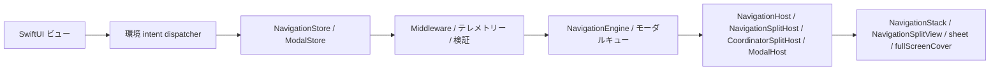
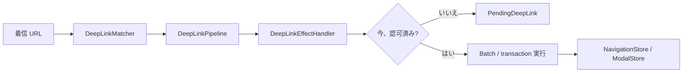

# InnoRouter

[English](README.md) | [한국어](README.ko.md) | [Español](README.es.md) | [Deutsch](README.de.md) | [简体中文](README.zh-Hans.md) | [日本語](README.ja.md) | [Русский](README.ru.md)

[](https://swiftpackageindex.com/InnoSquadCorp/InnoRouter)
[](https://swiftpackageindex.com/InnoSquadCorp/InnoRouter)
[](https://opensource.org/licenses/MIT)
[](https://codecov.io/gh/InnoSquadCorp/InnoRouter)

InnoRouter は、型付き状態、明示的なコマンド実行、アプリ境界でのディープリンクプランニングを中心に構築された SwiftUI ネイティブのナビゲーションフレームワークです。

ナビゲーションを、ビューにローカルな副作用の散乱ではなく、第一級のステートマシンとして扱います。

## InnoRouter が所有するもの

InnoRouter は以下を担当します:

- `RouteStack` を介したスタックナビゲーション状態
- `NavigationCommand` と `NavigationEngine` を介したコマンド実行
- `NavigationStore` を介した SwiftUI ナビゲーション権限
- `ModalStore` を介した `sheet` と `fullScreenCover` のモーダル権限
- `DeepLinkMatcher` と `DeepLinkPipeline` を介したディープリンクのマッチングとプランニング
- `InnoRouterNavigationEffects` と `InnoRouterDeepLinkEffects` を介したアプリ境界実行ヘルパー

意図的に汎用アプリケーションステートマシンではありません。

これらの関心事は InnoRouter の外に保ってください:

- ビジネスワークフロー状態
- 認証/セッションのライフサイクル
- ネットワークリトライまたはトランスポート状態
- アラートと確認ダイアログ

## 要件

- iOS 18+
- iPadOS 18+
- macOS 15+
- tvOS 18+
- watchOS 11+
- visionOS 2+
- Swift 6.2+

iOS 18 フロアと `swift-tools-version: 6.2` パッケージベースラインは
意図的なものです:すべてのパブリック型が `@preconcurrency` /
`@unchecked Sendable` のエスケープハッチなしで strict concurrency と
`Sendable` を採用できるようにし、これによりナビゲーション状態がビュー
コードとストア間の境界で main actor の外に静かに漏れることがなくなります。
代償は iOS 13–16 をターゲットとするライブラリよりも採用ウィンドウが小さい
ことであり、利点はルーターの `Sendable`/`@MainActor` 規律が散文ではなく
コンパイラによってチェックされることです。

マクロターゲットは現在 `swift-syntax` `603.0.1` に `.upToNextMinor` 制約で
依存しています。その依存と CI の固定 Xcode/Swift toolchain は新しい Swift
ホストビルド(例 Swift 6.3)でパッケージを検証する可能性がありますが、
サポートされるパッケージフロアはメジャーリリースが明示的に引き上げるまで
Swift 6.2 のままです。

| 並行性スタンス | InnoRouter | iOS 13+ の TCA / FlowStacks / その他 |
|---|---|---|
| パブリック型は `Sendable` を無条件に宣言 | ✅ | ⚠ 部分的 — 多くは `@preconcurrency` を使用 |
| ストアは `@MainActor` 隔離、ランタイム hop なし | ✅ | ⚠ 状況による |
| ソース内の `@unchecked Sendable` / `nonisolated(unsafe)` | ❌ なし | ⚠ 一部のアダプターで使用 |
| Strict concurrency モード | ✅ モジュール単位で強制 | ⚠ オプトインまたは部分的 |

## プラットフォームサポート

InnoRouter はすべての Apple プラットフォーム上で SwiftUI を介して出荷されます。
UIKit や AppKit のブリッジモジュールは不要です。

| 機能 | iOS | iPadOS | macOS | tvOS | watchOS | visionOS |
|---|---|---|---|---|---|---|
| `NavigationStore` / `NavigationHost` / `FlowStore` / `FlowHost` | ✅ | ✅ | ✅ | ✅ | ✅ | ✅ |
| `NavigationSplitHost` / `CoordinatorSplitHost` | ✅ | ✅ | ✅ | ✅ | ❌ | ✅ |
| `ModalHost` `.sheet` | ✅ | ✅ | ✅ | ✅ | ✅ | ✅ |
| `ModalHost` `.fullScreenCover` ネイティブ | ✅ | ✅ | ⚠ ダウングレード | ✅ | ⚠ ダウングレード | ⚠ ダウングレード |
| `TabCoordinator.badge` 状態 API / ネイティブビジュアル | ✅ | ✅ | ✅ | ⚠ 状態のみ | ⚠ 状態のみ | ✅ |
| `DeepLinkPipeline` / `FlowDeepLinkPipeline` | ✅ | ✅ | ✅ | ✅ | ✅ | ✅ |
| `SceneStore` / `SceneHost` (windows、volumetric、immersive) | — | — | — | — | — | ✅ |
| `innoRouterOrnament(_:content:)` ビュー modifier | no-op | no-op | no-op | no-op | no-op | ✅ |

`⚠ ダウングレード` は、ストア API がリクエストをそのまま受け入れますが、
SwiftUI ホストが `.fullScreenCover` を利用できないため `.sheet` として
レンダリングすることを意味します。`⚠ 状態のみ` は、コーディネーターが
バッジ状態を保存・公開しますが、`TabCoordinatorView` が `.badge(_:)` を
利用できないため SwiftUI のネイティブなビジュアルバッジを省略することを
意味します。`❌` はそのプラットフォームでシンボルが宣言されていないことを
意味します。`#if !os(...)` で囲んでビルドしてください。

## インストール

```swift skip package-manifest-fragment
dependencies: [
    .package(url: "https://github.com/InnoSquadCorp/InnoRouter.git", from: "4.2.0")
]
```

InnoRouter はソースのみの SwiftPM パッケージとして配布されます。バイナリ
アーティファクトは出荷せず、library evolution は意図的にオフになっており、
Apple プラットフォーム全体でソースビルドがシンプルに保たれます。

ドキュメントゲートはまた、少なくとも 1 つの完全な Swift スニペットを
パッケージに対して型チェックします:

```swift compile
import InnoRouter

enum CompileCheckedRoute: Route {
    case home
}

let compileCheckedStack = RouteStack<CompileCheckedRoute>()
_ = compileCheckedStack.path
```

## 4.0.0 OSS リリース契約

`4.0.0` は InnoRouter の最初の OSS リリースであり、パブリック SemVer
契約でカバーされる最初のバージョンです。新しい採用者は `4.2.0` 以降から
インストールするべきです。以前のプライベート/内部パッケージスナップショットは
OSS 互換性ラインの一部ではありません。それらをテストしたチームは、
4.x ドキュメントに対するパブリック API 使用法を一回限りのソース移行として
検証するべきです。

### 4.x ラインの SemVer コミットメント

`4.x.y` リリース内で、InnoRouter は [Semantic Versioning](https://semver.org/)
に厳密に従います:

- **`4.x.y` → `4.x.(y+1)`** パッチリリース:バグ修正のみ。パブリック API
  シグネチャの変更なし。文書化されたバグの修正以外、観察可能な動作変更なし。
- **`4.x.y` → `4.(x+1).0`** マイナーリリース:追加のみ。新しい型、新しい
  メソッド、新しい case、新しい設定オプション。既存のシグネチャは形を保ち、
  既存の呼び出し箇所は変更なしでコンパイルします。
- **`4.x.y` → `5.0.0`** メジャーリリース:ソース互換性を破壊するもの、
  パブリックシンボルを削除するもの、ジェネリック制約を狭めるもの、または
  既存の呼び出し箇所を驚かせる方法で文書化されたランタイム動作を変更
  するもの全て。

例外:以下の `4.1.0` 歴史的クリーンアップは、文書化された一度限りの
例外です。その採用ベースライン以降、4.x マイナーリリースはこの契約の下で
追加のみです。

プレリリースタグは `4.1.0-rc.1` / `4.2.0-beta.2` 形式を使用します。
リリースワークフローの `^[0-9]+\.[0-9]+\.[0-9]+$` 正規表現は最終タグのみを
受け入れます。プレリリースタグは [`RELEASING.md`](RELEASING.md) に文書化
された別の手動フローで出荷されます。

### 何が破壊的変更とみなされるか

4.x SemVer コミットメントの目的において、*破壊的変更*とは以下の
いずれかを意味します:

- パブリックシンボル(型、メソッド、プロパティ、associated type、case)の
  削除または名前変更。
- 既存の呼び出し箇所でコンパイルに失敗するようなパブリックメソッド
  シグネチャの変更(デフォルト値なしのパラメータの追加、ジェネリック制約の
  厳格化、戻り値型の交換)。
- 既存の正しい呼び出し元が異なる観察可能な結果を生成するようにパブリック
  API の文書化された動作を変更すること(例:デフォルトの
  `NavigationPathMismatchPolicy` を反転する)。
- サポートされる最小 Swift toolchain またはプラットフォームフロアを上げる。

逆に、以下は破壊的*ではない*ため、任意のマイナーリリースでランディング
できます:

- 非 `@frozen` パブリック enum に新しい case を追加する。
- パブリックメソッドにデフォルト値ありのパラメータを追加する。
- 内部のみの型を厳格化する。
- セマンティクスを保持するパフォーマンス改善。
- ドキュメントのみの変更。

完全な 4.0 ベースラインスイープは [`CHANGELOG.md`](CHANGELOG.md) で
要約されています。

### 例外:4.1.0 歴史的クリーンアップ

`4.1.0` は事前ユーザクリーンアップパス後の採用ベースラインです。未使用の
ディスパッチャオブジェクト API を削除し、`replaceStack` を唯一のフルスタック
置換 intent として保持し、effect 観察を明示的なイベントストリームに
移動します。これは 4.x ラインで文書化された唯一の source-breaking 例外です。
新しいアプリは `4.1.0` から開始するべきです。`4.0.0` タグは最初の OSS
スナップショットとして利用可能なまま残ります。

### Imports

アンブレラターゲット `InnoRouter` は macros プロダクト以外のすべてを
re-export します。`@Routable` / `@CasePathable` には明示的な
`import InnoRouterMacros` が必要です — アンブレラはマクロを使用しない
ファイルがマクロプラグイン解決コストを支払わないように、その re-export を
意図的にスキップします:

```swift skip doc-fragment
import InnoRouter            // stores、hosts、intents、deep links、scenes
import InnoRouterMacros      // @Routable / @CasePathable を使用するファイルのみ
```

`@EnvironmentNavigationIntent`、`@EnvironmentModalIntent`、その他すべての
プロパティラッパーまたはビュー modifier は `InnoRouterMacros` ではなく
`InnoRouter` から来ます。

SwiftSyntax がバックエンドのマクロ実装は 4.x ラインの間このパッケージに
留まります。package-traits または別のマクロパッケージへの分割は、
`swift package show-traits`、`swift build --target InnoRouter`、
`swift build --target InnoRouterMacros` を移行コストに対して測定した後でのみ
評価するべきです。

| Product | いつ import するか |
|---|---|
| `InnoRouter` | stores、hosts、intents、coordinators、deep links、scenes、または永続化ヘルパーを必要とするアプリコード。 |
| `InnoRouterMacros` | `@Routable` または `@CasePathable` を使用するファイルのみ。 |
| `InnoRouterNavigationEffects` | SwiftUI ビューの外側で `NavigationCommand` 値を実行するアプリ境界コード。 |
| `InnoRouterDeepLinkEffects` | 保留中のディープリンクを処理または再開するアプリ境界コード。 |
| `InnoRouterEffects` | 両方の effect モジュールを一緒に re-export する場合の互換 import。 |
| `InnoRouterTesting` | ホストレスの `NavigationTestStore`、`ModalTestStore`、`FlowTestStore` を望むテストターゲット。 |

## モジュール

- `InnoRouter`:`InnoRouterCore`、`InnoRouterSwiftUI`、`InnoRouterDeepLink` のアンブレラ re-export
- `InnoRouterCore`:route stack、validators、commands、results、batch/transaction executors、middleware
- `InnoRouterSwiftUI`:stores、stack/split/modal hosts、coordinators、environment intent dispatch
- `InnoRouterDeepLink`:パターンマッチング、診断、pipeline プランニング、保留中ディープリンク
- `InnoRouterNavigationEffects`:アプリ境界用の同期 `@MainActor` 実行ヘルパー
- `InnoRouterDeepLinkEffects`:ナビゲーション effect 上に重ねたディープリンク実行ヘルパー
- `InnoRouterEffects`:両方の effect モジュールの互換アンブレラ
- `InnoRouterMacros`:`@Routable` と `@CasePathable`

## 適切な surface を選ぶ

必要な遷移権限を所有する最小の surface を使用します:

| 必要 | 使用 |
|---|---|
| 1 つの型付き SwiftUI スタック | `NavigationStore` + `NavigationHost` |
| サポートされたプラットフォームでのスプリットビュースタック | `NavigationStore` + `NavigationSplitHost` |
| スタックリセットなしの sheet / cover 権限 | `ModalStore` + `ModalHost` |
| Push + modal フロー、復元、または複数ステップディープリンク | `FlowStore` + `FlowHost` + `FlowPlan` |
| URL を push のみのコマンドプランへ | `DeepLinkMatcher` + `DeepLinkPipeline` |
| URL を push 接頭辞 + modal 末尾フローへ | `FlowDeepLinkMatcher` + `FlowDeepLinkPipeline` |
| visionOS windows、volumes、immersive spaces | `SceneStore` + `SceneHost` / `SceneAnchor` |
| Reducer、effect、またはアプリ境界の実行 | `InnoRouterNavigationEffects` / `InnoRouterDeepLinkEffects` |
| SwiftUI ホストなしの router アサーション | `InnoRouterTesting` |

`NavigationStore`、`FlowStore`、`ModalStore`、`SceneStore`、effects、testing は
意図的に分離されています。ライブラリはこれらの権限を明示的に保ち、アプリが
ルーティング境界に一致する部分のみを採用できるようにします。

### 簡易意思決定フローチャート

```text
画面 surface は push と modal を 1 つのフローで結合しますか?
├── はい → FlowStore + FlowHost (1 つの真実の源、1 つのイベントストリーム)
└── いいえ → モーダル権限(sheet / cover)のみを所有しますか?
         ├── はい → ModalStore + ModalHost
         └── いいえ → NavigationStore + NavigationHost
                   (スプリットビューバリアント:NavigationSplitHost)
```

ビューコードから(ストア参照なしで)dispatch するには、
[`Docs/IntentSelectionGuide.md`](Docs/IntentSelectionGuide.md) で対応する
intent 型を使用します:スタックのみのストアには `NavigationIntent`、
`FlowStore` には `FlowIntent`(6 つの重複する case と `FlowIntent` のみが
知っている modal-aware バリアント)。

## ドキュメント

- 最新 DocC ポータル: [InnoRouter latest docs](https://innosquadcorp.github.io/InnoRouter/latest/)
- バージョン管理された docs ルート: [InnoRouter docs](https://innosquadcorp.github.io/InnoRouter/)
- リリースチェックリスト: [RELEASING.md](RELEASING.md)
- メンテナークイックガイド: [CLAUDE.md](CLAUDE.md)

`README.md` はリポジトリのエントリポイントです。
DocC は詳細なモジュールレベルリファレンスセットです。

### チュートリアル記事

最も一般的な採用パスのステップバイステップウォークスルー。各記事は関連する
DocC カタログ内に存在し、レンダリングされた DocC サイト、GitHub ソース
ビュー、オフライン `swift package generate-documentation` ビルドのすべてが
同じコンテンツを表示します。

| 記事 | カタログ | カバー内容 |
| --- | --- | --- |
| [Tutorial-LoginOnboarding](Sources/InnoRouterSwiftUI/InnoRouterSwiftUI.docc/Articles/Tutorial-LoginOnboarding.md) | `InnoRouterSwiftUI` | `FlowStore` と `ChildCoordinator` でログイン → onboarding → home フローを構築 |
| [Tutorial-DeepLinkReconciliation](Sources/InnoRouterSwiftUI/InnoRouterSwiftUI.docc/Articles/Tutorial-DeepLinkReconciliation.md) | `InnoRouterSwiftUI` | cold-start vs warm ディープリンクの調整、保留中の replay を含む |
| [Tutorial-MiddlewareComposition](Sources/InnoRouterSwiftUI/InnoRouterSwiftUI.docc/Articles/Tutorial-MiddlewareComposition.md) | `InnoRouterSwiftUI` | 型付きミドルウェアの構成、コマンドの傍受、churn の観察 |
| [Tutorial-MigratingFromNestedHosts](Sources/InnoRouterSwiftUI/InnoRouterSwiftUI.docc/Articles/Tutorial-MigratingFromNestedHosts.md) | `InnoRouterSwiftUI` | 入れ子の `NavigationHost` + `ModalHost` スタックを `FlowHost` で置換 |
| [Tutorial-Throttling](Sources/InnoRouterSwiftUI/InnoRouterSwiftUI.docc/Articles/Tutorial-Throttling.md) | `InnoRouterSwiftUI` | 決定論的テストクロックを伴う `ThrottleNavigationMiddleware` の使用 |
| [Tutorial-StoreObserver](Sources/InnoRouterSwiftUI/InnoRouterSwiftUI.docc/Articles/Tutorial-StoreObserver.md) | `InnoRouterSwiftUI` | 統一 `events` ストリーム上で `StoreObserver` を採用 |
| [Tutorial-VisionOSScenes](Sources/InnoRouterSwiftUI/InnoRouterSwiftUI.docc/Articles/Tutorial-VisionOSScenes.md) | `InnoRouterSwiftUI` | `SceneStore` から visionOS windows、volumetric scenes、immersive spaces を駆動 |
| [Tutorial-FlowDeepLinkPipeline](Sources/InnoRouterDeepLink/InnoRouterDeepLink.docc/Articles/Tutorial-FlowDeepLinkPipeline.md) | `InnoRouterDeepLink` | `FlowDeepLinkPipeline` を介して合成 push + modal ディープリンクを構築 |
| [Tutorial-StatePersistence](Sources/InnoRouterCore/InnoRouterCore.docc/Tutorial-StatePersistence.md) | `InnoRouterCore` | `StatePersistence` で起動間に `FlowPlan` / `RouteStack` を永続化 |
| [Tutorial-TestingFlows](Sources/InnoRouterTesting/InnoRouterTesting.docc/Articles/Tutorial-TestingFlows.md) | `InnoRouterTesting` | `FlowTestStore` を介したホストレスの Swift Testing アサーション |

## 動作

### ランタイムフロー



- ビューは環境ディスパッチャーを通じて型付き intent を発行します。
- ストアはナビゲーションまたはモーダルの権限を所有します。
- ホストはストアの状態をネイティブな SwiftUI ナビゲーション API に変換します。

### ディープリンクフロー



- マッチングとプランニングは純粋なまま保たれます。
- Effect ハンドラーはアプリポリシーが今実行するか延期するかを決定する境界です。
- 保留中ディープリンクはアプリが replay の準備が整うまで計画された遷移を保持します。

## クイックスタート

### 1. ルートを定義する

マクロなし:

```swift skip doc-fragment
import InnoRouter

enum HomeRoute: Route {
    case list
    case detail(id: String)
    case settings
}
```

マクロを使用:

```swift skip doc-fragment
import InnoRouter
import InnoRouterMacros

@Routable
enum HomeRoute {
    case list
    case detail(id: String)
    case settings
}
```

### 2. `NavigationStore` を作成する

```swift skip doc-fragment
import InnoRouter
import OSLog

let store = try NavigationStore<HomeRoute>(
    initialPath: [.list],
    configuration: NavigationStoreConfiguration(
        routeStackValidator: .nonEmpty.combined(with: .rooted(at: .list)),
        logger: Logger(subsystem: "com.example.app", category: "navigation")
    )
)
```

### 3. SwiftUI でホストする

```swift skip doc-fragment
import SwiftUI
import InnoRouter

struct AppRoot: View {
    @State private var store = try! NavigationStore<HomeRoute>(
        initialPath: [.list]
    )

    var body: some View {
        NavigationHost(store: store) { route in
            switch route {
            case .list:
                HomeListView()
            case .detail(let id):
                DetailView(id: id)
            case .settings:
                SettingsView()
            }
        } root: {
            HomeListView()
        }
    }
}
```

### 4. 子ビューから intent を発行する

```swift skip doc-fragment
struct HomeListView: View {
    @EnvironmentNavigationIntent(HomeRoute.self) private var navigationIntent

    var body: some View {
        List {
            Button("Detail") {
                navigationIntent(.go(.detail(id: "123")))
            }

            Button("Settings") {
                navigationIntent(.go(.settings))
            }

            Button("Back") {
                navigationIntent(.back)
            }
        }
    }
}
```

ビューは intent を発行するべきです。router 状態に対する直接の変更権限を
持つべきではありません。

## 状態と実行モデル

InnoRouter は 3 つの異なる実行セマンティクスを公開します。

### 単一コマンド

`execute(_:)` は 1 つの `NavigationCommand` を適用し、型付き
`NavigationResult` を返します。

### Batch

`executeBatch(_:stopOnFailure:)` はステップごとのコマンド実行を保持しつつ
観察を結合します。

batch 実行を使用するとき:

- 複数のコマンドが依然として 1 つずつ実行される必要がある
- ミドルウェアが依然として各ステップを見る必要がある
- オブザーバーが依然として 1 つの集約された遷移イベントを受け取る必要がある

### Transaction

`executeTransaction(_:)` は影スタック上でコマンドをプレビューし、すべての
ステップが成功した場合のみコミットします。

transaction 実行を使用するとき:

- 部分的な成功が受け入れられない
- 失敗またはキャンセル時にロールバックを望む
- ステップごとの観察よりも all-or-nothing のコミットイベントが重要

### `.sequence`

`.sequence` はトランザクションではなく、コマンド代数です。

意図的に:

- 左から右
- 非アトミック
- `NavigationResult.multiple` で型付け

後のステップが失敗しても、以前に成功したステップは適用されたままです。

### `send(_:)` vs `execute(_:)` — 適切なエントリーポイントを選ぶ

InnoRouter は目的によってレイヤー化された 4 つのエントリーポイントを
通じてナビゲーションを公開します。データ形状ではなく呼び出し箇所に一致する
ものを選んでください。

| レイヤー | エントリー | 使用するとき |
| ------------ | ---------------------------------- | ------------------------------------------------------------------------------------------------- |
| View intent  | `store.send(_:)`                   | SwiftUI ビューから名前付き `NavigationIntent` をディスパッチする(`go`、`back`、`backToRoot`、…)。 |
| Command      | `store.execute(_:)`                | 単一の `NavigationCommand` をエンジンに転送し、型付き `NavigationResult` を検査する。            |
| Batch        | `store.executeBatch(_:)`           | 複数のコマンドを 1 つずつ実行しつつ、ミドルウェアの可視性と単一のオブザーバーイベントを保持する。   |
| Transaction  | `store.executeTransaction(_:)`     | All-or-nothing でコミット — 影スタックに対してプレビューし、各ステップが成功した場合のみコミット。  |

経験則:

- ビューは send。コーディネーターと effect 境界は execute。
- `send` は intent 形(検査する戻り値なし)。`execute*` はコマンド形
  (分岐、テレメトリー、リトライのための型付き結果を返す)。
- 部分的な失敗時にロールバックする必要のあるアトミックな複数ステップ
  フローには、手作りのバッチよりも `executeTransaction` を選ぶ。

同じ階層化が `ModalStore` と `FlowStore` に適用されます:
ビューからの `send(_: ModalIntent)` / `send(_: FlowIntent)` と、エンジン
境界での `execute(_:)` / `executeBatch(_:)` / `executeTransaction(_:)`。

### `.sequence`、`executeBatch`、`executeTransaction` の選択

| 望むもの | 使用 | 理由 |
|---|---|---|
| 多くのコマンドに対する 1 つの観察可能な変更、ベストエフォート | `executeBatch(_:stopOnFailure:)` | 結合された `onChange` / `events`、オプションの fail-fast |
| ロールバックを伴う All-or-nothing の適用 | `executeTransaction(_:)` | シャドウ状態プレビュー、ジャーナルベースの破棄 |
| エンジンが計画/検証する合成*値* | `NavigationCommand.sequence([...])` | 純粋なコマンド、1 単位として各ミドルウェアを流れる |
| 静かな期間の後に最新のコマンドのみを発火 | `DebouncingNavigator` | Async ラッピング navigator、`Clock` 注入可能 |
| キーごとにレートリミット | `ThrottleNavigationMiddleware` | 同期、最後の受け入れタイムスタンプ |

ワーク例とアンチパターンを伴う完全な意思決定マトリックスは DocC チュートリアル
[`Guide-SequenceVsBatchVsTransaction`](Sources/InnoRouterSwiftUI/InnoRouterSwiftUI.docc/Articles/Guide-SequenceVsBatchVsTransaction.md)
にあります。

## スタックルーティング surface

`NavigationIntent` は公式の SwiftUI スタック intent surface です:

- `.go(Route)`
- `.goMany([Route])`
- `.back`
- `.backBy(Int)`
- `.backTo(Route)`
- `.backToRoot`
- `.replaceStack([Route])`

`NavigationStore.send(_:)` はこれらの intent の SwiftUI エントリーポイントです。

## モーダルルーティング surface

InnoRouter は以下のモーダルルーティングをサポートします:

- `sheet`
- `fullScreenCover`

使用:

- `ModalStore`
- `ModalHost`
- `ModalIntent`
- `@EnvironmentModalIntent`

例:

```swift skip doc-fragment
@Routable
enum AppModalRoute {
    case profile
    case onboarding
}

struct ShellView: View {
    @State private var modalStore = ModalStore<AppModalRoute>()

    var body: some View {
        ModalHost(store: modalStore) { route in
            switch route {
            case .profile:
                ProfileView()
            case .onboarding:
                OnboardingView()
            }
        } content: {
            HomeView()
        }
    }
}
```

### モーダルスコープ境界

iOS と tvOS では、`ModalHost` はスタイルを `sheet` と `fullScreenCover` に
直接マップします。他のサポートされたプラットフォームでは、`fullScreenCover`
は安全に `sheet` にダウングレードします。

InnoRouter は意図的に以下を所有**しません**:

- `alert`
- `confirmationDialog`

これらをフィーチャーローカルまたはコーディネーターローカルのプレゼンテーション
状態として保ってください。

### モーダル可観測性

`ModalStoreConfiguration` は軽量なライフサイクルフックを提供します:

- `logger`
- `onPresented`
- `onDismissed`
- `onQueueChanged`
- `onMiddlewareMutation`
- `onCommandIntercepted`

`ModalDismissalReason` は以下を区別します:

- `.dismiss`
- `.dismissAll`
- `.systemDismiss`

### モーダルミドルウェア

`ModalStore` は `NavigationStore` と同じミドルウェア surface を公開します:

- `willExecute` / `didExecute` を伴う `ModalMiddleware` / `AnyModalMiddleware<M>`。
- `ModalInterception` はミドルウェアが `.proceed(command)`(書き換えられた
  コマンドを含む)または `ModalCancellationReason` を伴う `.cancel(reason:)`
  を行うことを可能にします。
- `ModalStore.addMiddleware` / `insertMiddleware` / `removeMiddleware` /
  `replaceMiddleware` / `moveMiddleware` — ナビゲーションと一致するハンドル
  ベースの CRUD。
- `execute(_:) -> ModalExecutionResult<M>` はすべての `.present`、
  `.dismissCurrent`、`.dismissAll` をレジストリ経由でルーティングします。
- `ModalMiddlewareMutationEvent` は分析のためにレジストリ churn を表面化します。

## スプリットナビゲーション

iPad と macOS の詳細ナビゲーションには、以下を使用します:

- `NavigationSplitHost`
- `CoordinatorSplitHost`

InnoRouter はスプリットレイアウトでは詳細スタックのみを所有します。

これらはアプリ所有のままです:

- サイドバー選択
- 列の可視性
- コンパクト適応

## コーディネーター surface

コーディネーターは SwiftUI intent とコマンド実行の間に位置するポリシー
オブジェクトです。

`CoordinatorHost` または `CoordinatorSplitHost` を使用するとき:

- ビュー intent が最初にポリシールーティングを必要とする
- アプリシェルが調整ロジックを必要とする
- 複数のナビゲーション権限が 1 つのコーディネーターの背後で構成されるべき

`FlowCoordinator` と `TabCoordinator` はヘルパーであり、
`NavigationStore` の代替ではありません。

推奨される分担:

- `NavigationStore`:route-stack の権限
- `TabCoordinator`:シェル/タブ選択状態
- `FlowCoordinator`:目的地内のローカルステップ進行

### 子コーディネーターのチェイニング

`ChildCoordinator` は親コーディネーターが
`parent.push(child:) -> Task<Child.Result?, Never>` を介してインラインで
完了値を await することを可能にします:

```swift skip doc-fragment
let signupResult = await parentCoordinator.push(child: SignUpCoordinator())
if let user = signupResult {
    parentCoordinator.handle(.go(.home(user)))
}
```

コールバック(`onFinish`、`onCancel`)は同期的にインストールされるため、
子は親の `await` の前を含めいつでもそれらを発火できます。設計の根拠は
[`Docs/design-child-coordinator-handoff.md`](Docs/design-child-coordinator-handoff.md)
を参照してください。

親 `Task` のキャンセルは `ChildCoordinator.parentDidCancel()`(デフォルトの
空 no-op)を介して子に伝播します。親ビューが解除されたときに一時的な状態を
解体する(シートを解除、進行中のリクエストをキャンセル、一時ストアを解放)
ためにオーバーライドします:

```swift skip doc-fragment
final class SignUpCoordinator: ChildCoordinator {
    typealias Result = UserID
    var onFinish: (@MainActor @Sendable (UserID) -> Void)?
    var onCancel: (@MainActor @Sendable () -> Void)?

    func parentDidCancel() {
        signUpAPIClient.cancelActiveRequests()
    }
}
```

`parentDidCancel` は方向性を持ちます(親 → 子)。`onCancel` を呼び出しません
(`onCancel` は子 → 親のまま);2 つのフックは直交します。

## 名前付きナビゲーション intent

高頻度の intent は既存の `NavigationCommand` プリミティブから構成されます:

- `NavigationIntent.replaceStack([R])` — 1 つの観察可能なステップでスタックを
  指定されたルートにリセットする。
- `NavigationIntent.backOrPush(R)` — `route` がスタックに既に存在する場合は
  そこまで pop、そうでなければ push する。
- `NavigationIntent.pushUniqueRoot(R)` — スタックに同等のルートがまだ含まれて
  いない場合のみ push する。

これらは通常の `send` → `execute` パイプラインを通ってルーティングされる
ため、ミドルウェアとテレメトリーは直接の `NavigationCommand` 呼び出しと
同一に観察します。

## case 型付き目的地バインディング

`NavigationStore` と `ModalStore` は `@Routable` / `@CasePathable` が発する
`CasePath` でキー付けされた `binding(case:)` ヘルパーを公開します:

```swift skip doc-fragment
struct DetailSheet: View {
    @Environment(\.navigationStore) private var store: NavigationStore<AppRoute>

    var body: some View {
        SomeDetailView()
            .sheet(item: store.binding(case: \AppRoute.detail)) { detail in
                DetailView(detail: detail)
            }
    }
}
```

バインディングはすべての set を既存のコマンドパイプラインを通してルーティング
するため、ミドルウェアとテレメトリーは直接の `execute(...)` 呼び出しと
完全に同じように観察します。`ModalStore.binding(case:style:)` はプレゼン
テーションスタイルごとにスコープされます(`.sheet` / `.fullScreenCover`)。

## ディープリンクモデル

ディープリンクは隠れた副作用ではなく、計画として扱われます。

コアピース:

- `DeepLinkMatcher`
- `DeepLinkPipeline`
- `DeepLinkDecision`
- `PendingDeepLink`
- `NavigationPlan`

典型的なフロー:

1. URL をルートに一致させる
2. scheme/host で拒否または受け入れる
3. 認証ポリシーを適用する
4. `.plan`、`.pending`、`.rejected`、または `.unhandled` を発行する
5. 結果のナビゲーション計画を明示的に実行する

### Matcher 診断

`DeepLinkMatcher` と `FlowDeepLinkMatcher` は以下を報告できます:

- 重複パターン
- ワイルドカード shadowing
- パラメータ shadowing
- 非終端ワイルドカード

診断は宣言順優先度を変更しません。ランタイム動作を静かに変更することなく
オーサリングミスを捕捉するのに役立ちます。診断がビルドを失敗させるべき
リリース準備ゲートでは、`try DeepLinkMatcher(strict:)` または
`try FlowDeepLinkMatcher(strict:)` を使用します。

### 合成ディープリンク(push + modal 末尾)

`FlowDeepLinkPipeline` は push のみのパイプラインを拡張し、単一の URL が
push 接頭辞**プラス**モーダル終端ステップを 1 つのアトミックな
`FlowStore.apply(_:)` で再水和できるようにします:

```swift skip doc-fragment
let matcher = FlowDeepLinkMatcher<AppRoute> {
    FlowDeepLinkMapping("/home/detail/:id") { params in
        guard let id = params.firstValue(forName: "id") else { return nil }
        return FlowPlan(steps: [.push(.home), .push(.detail(id: id))])
    }
    FlowDeepLinkMapping("/onboarding/privacy") { _ in
        FlowPlan(steps: [.sheet(.privacyPolicy)])
    }
}

let pipeline = FlowDeepLinkPipeline(
    allowedSchemes: ["myapp"],
    allowedHosts: ["app"],
    matcher: matcher,
    authenticationPolicy: .required(
        shouldRequireAuthentication: { _ in true },
        isAuthenticated: { SessionStore.shared.isAuthenticated }
    )
)

let handler = FlowDeepLinkEffectHandler(pipeline: pipeline, applier: flowStore)

FlowHost(store: flowStore, destination: destination) { RootView() }
    .onOpenURL { _ = handler.handle($0) }
```

各 `FlowDeepLinkMapping` ハンドラーは**完全な** `FlowPlan` を返すため、
複数セグメント URL は宣言サイトで明示的です。パイプラインは push のみの
パイプラインの `DeepLinkAuthenticationPolicy` + `PendingDeepLink` セマン
ティクスを文字通り再利用し、対称的な認証延期と replay を実現します。
完全なウォークスルーは
[`Sources/InnoRouterDeepLink/InnoRouterDeepLink.docc/Articles/Tutorial-FlowDeepLinkPipeline.md`](Sources/InnoRouterDeepLink/InnoRouterDeepLink.docc/Articles/Tutorial-FlowDeepLinkPipeline.md)
を参照してください。

## ミドルウェア

ミドルウェアはコマンド実行の周りに横断的なポリシーレイヤーを提供します。

事前実行:

- `willExecute(_:state:) -> NavigationInterception`
- `.proceed(updatedCommand)`
- `.cancel(reason)`

事後実行:

- `didExecute(_:result:state:) -> NavigationResult`

ミドルウェアは以下が可能:

- コマンドを書き換える
- 型付きキャンセル理由で実行をブロックする
- 実行後に結果を畳み込む

ミドルウェアはストア状態を直接変更できません。

### 型付きキャンセル

キャンセル理由は `NavigationCancellationReason` を使用します:

- `.middleware(debugName:command:)`
- `.conditionFailed`
- `.custom(String)`

### ミドルウェア管理

`NavigationStore` はハンドルベースの管理を公開します:

- `addMiddleware`
- `insertMiddleware`
- `removeMiddleware`
- `replaceMiddleware`
- `moveMiddleware`
- `middlewareMetadata`

## パス調整

SwiftUI の `NavigationStack(path:)` 更新は意味的なコマンドにマップバック
されます。

ルール:

- 接頭辞縮小 → `.popCount` または `.popToRoot`
- 接頭辞拡張 → バッチ化された `.push`
- 非接頭辞ミスマッチ → `NavigationPathMismatchPolicy`

利用可能なミスマッチポリシー:

- `.replace` — デフォルトの本番スタンス。SwiftUI の非接頭辞パス書き換えを
  受け入れ、ミスマッチイベントを発行する。
- `.assertAndReplace` — debug / pre-release スタンス。assert してから同じ
  置換セマンティクスで回復する。
- `.ignore` — store 権威スタンス。書き換えを観察するが、現在のスタックを
  変更しない。
- `.custom` — ドメイン修復スタンス。古い/新しいパスを 1 つのコマンド、
  バッチ、または no-op にマップする。

`NavigationStoreConfiguration.logger` が設定されている場合、ミスマッチ処理は
構造化されたテレメトリーを発行します。

## Effect モジュール

### `InnoRouterNavigationEffects`

アプリシェルコードがナビゲーター境界の上に小さな実行ファサードを望むときに
使用します。

主要 API:

- `execute(_:)`
- `execute(_ commands:)`
- `executeTransaction(_:)`
- `executeGuarded(_:, prepare:)`

明示的な async ガードヘルパー以外、これらの API は同期 `@MainActor` API です。

### `InnoRouterDeepLinkEffects`

ディープリンク計画が型付き結果を伴ってアプリ境界で実行されるべきときに
使用します。

主要 API:

- `handle(_ url:)`
- `resumePendingDeepLink()`
- `resumePendingDeepLinkIfAllowed(_:)`

### アンブレラ `DeepLinkCoordinating`

`DeepLinkCoordinating` を採用したコーディネーターは
`DeepLinkCoordinationOutcome<Route>` を介して同じ型付き結果 surface を取得
します。パイプラインの拒否(`rejected`、`unhandled`)と再開状態(`pending`、
`executed`、`noPendingDeepLink`)はすべて、スタック状態を覗き込むことなく
観察可能です。

- `handleDeepLink(_:) -> DeepLinkCoordinationOutcome<Route>`
- `resumePendingDeepLinkIfPossible() -> DeepLinkCoordinationOutcome<Route>`
- `resumePendingDeepLinkIfAllowed(_:) async -> DeepLinkCoordinationOutcome<Route>`

## `Examples` vs `ExamplesSmoke`

リポジトリは意図的にドキュメンテーション例を CI 例から分離します。

- `Examples/`:人間向けで、慣用的、マクロベースの例
- `ExamplesSmoke/`:CI 用のコンパイラ安定 smoke フィクスチャ

現在の例は以下をカバーします:

- 単独スタックルーティング
- コーディネータールーティング
- ディープリンク
- スプリットナビゲーション
- アプリシェル構成
- モーダルルーティング

## ドキュメントとリリースフロー

### DocC

DocC はモジュールごとにビルドされ、GitHub Pages に公開されます。

公開された構造:

- `/InnoRouter/latest/`
- `/InnoRouter/4.2.0/`
- `/InnoRouter/` ルートポータル

### CI

CI は以下を検証します:

- `swift test`
- `principle-gates`
- プラットフォームごとの SwiftUI カバレッジのための `platforms` ワークフロー
- 例の smoke ビルド
- DocC プレビュービルド

### CD

CD は裸の semver タグでのみ実行されます:

- `4.1.0`

無効なタグの例:

- 先頭に `v` が付くタグ
- `release-4.1.0`

リリースワークフローの責務:

- コード/ドキュメンテーションゲートを再実行
- タグを付ける前にローカル `./scripts/principle-gates.sh --platforms=all` または GitHub のグリーンな `platforms` ワークフローを要求
- バージョン管理された DocC をビルド
- `/latest/` を更新
- 古いバージョン管理された docs を保持
- GitHub リリースを公開

### SwiftUI 哲学整合性

InnoRouter は共有ナビゲーション権限のための意図的なトレードオフを行いつつ
SwiftUI の宣言的方向性に従います。

- ビューはルーター状態を直接変更する代わりに intent を発行します。
- スタック、スプリット詳細、モーダル権限は分離されたままです。
- 環境配線の欠如は素早く失敗します。
- `NavigationStore` は共有権限であり、儚いローカル状態ではないため
  参照型のままです。
- `Coordinator` は同じ理由で `AnyObject` のままです。

これは SwiftUI からの偶然のドリフトではなく、意図的な実用的トレードオフです。

## Examples

人間向けの例はここにあります:

- [Examples/StandaloneExample.swift](https://github.com/InnoSquadCorp/InnoRouter/blob/main/Examples/StandaloneExample.swift)
- [Examples/CoordinatorExample.swift](https://github.com/InnoSquadCorp/InnoRouter/blob/main/Examples/CoordinatorExample.swift)
- [Examples/DeepLinkExample.swift](https://github.com/InnoSquadCorp/InnoRouter/blob/main/Examples/DeepLinkExample.swift)
- [Examples/SplitCoordinatorExample.swift](https://github.com/InnoSquadCorp/InnoRouter/blob/main/Examples/SplitCoordinatorExample.swift)
- [Examples/AppShellExample.swift](https://github.com/InnoSquadCorp/InnoRouter/blob/main/Examples/AppShellExample.swift)

## 品質ゲート

リリースをカットする前にこれらをローカルで実行します:

```bash
swift test
./scripts/principle-gates.sh
./scripts/build-docc-site.sh --version preview --skip-latest
```

## Flow スタック

`FlowStore<R>` は統一された push + sheet + cover フローを単一の
`RouteStep<R>` 値の配列として表現します。内部の `NavigationStore<R>` と
`ModalStore<R>` を所有し、それぞれに委任しつつ不変条件を強制します
(末尾モーダルは最大 1 つ、モーダルは常に末尾、ミドルウェアロールバックが
パスを調整)。

これらの内部ストアは 4.0 では `@_spi(FlowStoreInternals)` です。アプリ
コードは `FlowStore.path`、`send(_:)`、`apply(_:)`、`events`、
`intentDispatcher` を公開権限 surface として扱うべきです。直接の内部ストア
変更はホストとフォーカスされた不変条件テストのために予約されています。

典型的な使用法:

```swift skip doc-fragment
let flow = FlowStore<AppRoute>()
let restoredFlow = try FlowStore<AppRoute>(
    validating: persistedSteps
)

flow.send(.push(.home))
flow.send(.push(.detail(id)))
flow.send(.presentSheet(.share))   // tail modal
flow.apply(FlowPlan(steps: [.push(.home), .cover(.paywall)]))
```

- `FlowHost` は `NavigationHost` の上に `ModalHost` を構成し、
  `@EnvironmentFlowIntent(Route.self)` ディスパッチのための環境クロージャを
  注入します。
- `FlowStoreConfiguration` は `NavigationStoreConfiguration` と
  `ModalStoreConfiguration` を構成し、`onPathChanged` と `onIntentRejected`
  を追加します。
- `FlowStore(validating:configuration:)` は復元または外部供給された
  `[RouteStep]` 値のための throwing イニシャライザです。互換性のある
  `initial:` イニシャライザは依然として無効な入力を空のパスに強制します。
- `FlowRejectionReason` は不変条件違反を表面化します
  (`pushBlockedByModalTail`、`invalidResetPath`、`middlewareRejected(debugName:)`)。

## ホストレステスト (`InnoRouterTesting`)

`InnoRouterTesting` は `NavigationStore`、`ModalStore`、`FlowStore` を
ラップする出荷可能な Swift Testing ネイティブアサーションハーネスです。
テストは `@testable import InnoRouterSwiftUI` や手作りの `Mutex<[Event]>`
コレクターをもう必要としません — すべての公開観察コールバックは FIFO
キューにバッファリングされ、テストは TCA スタイルの `receive(...)` 呼び出し
でそれを排出します。

プロダクトをテストターゲットのみに追加します:

```swift skip doc-fragment
// Package.swift
.testTarget(
    name: "AppTests",
    dependencies: [
        .product(name: "InnoRouter", package: "InnoRouter"),
        .product(name: "InnoRouterTesting", package: "InnoRouter"),
    ]
)
```

それから本番 intent に対してテストを書きます:

```swift skip doc-fragment
import Testing
import InnoRouter
import InnoRouterTesting

@Test
@MainActor
func pushHomeThenDetail() {
    let store = NavigationTestStore<AppRoute>()

    store.send(.go(.home))
    store.receiveChange { _, new in new.path == [.home] }

    store.executeBatch([.push(.detail("42"))])
    store.receiveChange { _, new in new.path == [.home, .detail("42")] }
    store.receiveBatch { $0.isSuccess }

    store.expectNoMoreEvents()
}
```

ハーネスがカバーする内容:

- **`NavigationTestStore<R>`** — `onChange`、`onBatchExecuted`、
  `onTransactionExecuted`、`onMiddlewareMutation`、`onPathMismatch`。
  `send`、`execute`、`executeBatch`、`executeTransaction` を変更なく
  下層のストアに転送します。
- **`ModalTestStore<M>`** — `onPresented`、`onDismissed`、
  `onQueueChanged`、`onCommandIntercepted`、`onMiddlewareMutation`。
- **`FlowTestStore<R>`** — FlowStore レベルの `onPathChanged` +
  `onIntentRejected`、加えて単一キューでの内部ストアの発行を囲む
  `.navigation(...)` と `.modal(...)` のラッパー。1 つのテストが、
  ミドルウェアキャンセルパスを含む単一の `FlowIntent` によってトリガーされる
  完全なチェーンをアサートできます。

網羅性はデフォルトで `.strict`:ストアの deinit 時に未アサートのイベント
があると Swift Testing イシューが発火します。レガシーテストフィクスチャ
からの段階的移行には `.off` を使用します。

## 状態復元

`Codable` をオプトインしたルートは、ラウンドトリップ可能な `RouteStack`、
`RouteStep`、`FlowPlan` 値を無料で取得します:

```swift skip doc-fragment
enum AppRoute: Route, Codable {
    case home
    case detail(String)
    case settings
}

let persistence = StatePersistence<AppRoute>()

// シーンバックグラウンド / チェックポイント時:
let data = try persistence.encode(FlowPlan(steps: flowStore.path))
try data.write(to: restorationURL, options: .atomic)

// 起動時:
if let data = try? Data(contentsOf: restorationURL) {
    flowStore.apply(try persistence.decode(data))
}
```

`StatePersistence<R: Route & Codable>` は `JSONEncoder` と `JSONDecoder`
(両方とも設定可能)をラップし、`Data` 境界で停止します — ファイル URL、
`UserDefaults`、iCloud、シーンフェーズフックはアプリの関心事です。エラーは
基底の `EncodingError` / `DecodingError` として伝播されるため、呼び出し元は
スキーマドリフトと I/O 失敗を区別できます。

`FlowPlan(steps: flowStore.path)` は現在表示中のフローのスナップショット
です。それはナビゲーション push スタックと、表示されている場合はアクティブ
モーダル末尾を保存します。モーダルバックログをシリアル化しません。キューに
入れられたプレゼンテーションは内部実行状態として `ModalStore.queuedPresentations`
に存在し、現在の `FlowPlan` 永続化契約の外です。キューに入れられたモーダル
ワークを復元する必要があるアプリは、`FlowPlan` の隣にアプリ所有のキュー
スナップショットを永続化し、起動後に独自のルーティングポリシーを通して
それを replay するべきです。

## 統一観察ストリーム

すべてのストアは観察 surface 全体をカバーする単一の `events: AsyncStream`
を発行します — スタック変更、batch / transaction 完了、パスミスマッチ
解決、ミドルウェアレジストリ変更、モーダル present / dismiss / queue 更新、
コマンド傍受、フローレベルパスまたは intent 拒否シグナル。

```swift skip doc-fragment
Task {
    for await event in flowStore.events {
        switch event {
        case .navigation(.changed(_, let to)):
            analytics.track("nav_path", to.path)
        case .modal(.commandIntercepted(_, .cancelled(let reason))):
            Log.warning("modal cancelled: \(reason)")
        case .intentRejected(let intent, let reason):
            Log.info("flow rejected \(intent) because \(reason)")
        default:
            continue
        }
    }
}
```

各 `*Configuration` 型の個別の `onChange`、`onPresented`、
`onCommandIntercepted` などのコールバックはソース互換のままです。`events`
ストリームは置換ではなく追加チャネルです。

### バックプレッシャー

各ストアはサブスクライバーごとの `AsyncStream.Continuation` を通じてすべての
イベントをすべてのサブスクライバーに fan-out します。負荷の下でサブスクライバー
ごとのキューを制限するため、すべてのストアは設定で `eventBufferingPolicy`
を受け入れます:

- `.bufferingNewest(1024)`(デフォルト)— サブスクライバーごとに最新 1024
  イベントを保持し、バッファがいっぱいになると古いイベントをドロップします。
  現実的なナビゲーションバーストに対応するサイズで、保持されるワーキングセット
  を制限します。
- `.bufferingOldest(N)` — サブスクライバーごとに最古の N 個のイベントを保持し、
  バッファがいっぱいになると新しいイベントをドロップします。
- `.unbounded` — サブスクライバーが排出するまですべてのイベントをバッファ
  します。ライフタイムを制御し、決定論的かつロスレスな順序を必要とする
  テストハーネスや短命のサブスクライバーに使用してください。

```swift skip doc-fragment
let store = try NavigationStore<HomeRoute>(
    initialPath: [.list],
    configuration: NavigationStoreConfiguration(
        eventBufferingPolicy: .bufferingNewest(2048)
    )
)
```

`ModalStoreConfiguration.eventBufferingPolicy` は `ModalStore.events` を制御します。
`FlowStoreConfiguration.eventBufferingPolicy` は flow-level の `FlowStore.events`
fan-out を制御し、`FlowStoreConfiguration.navigation.eventBufferingPolicy` と
`FlowStoreConfiguration.modal.eventBufferingPolicy` はラップされた内部 store stream
を制御します。ドロップは静かです — アナリティクスパイプラインが
「イベントが発生しなかった」を「イベントがバッファ外にドロップされた」と区別する
必要がある場合は、`.unbounded` で購読し、自分でペーシングしてください。

完全な契約は
[`Event-Stream-Backpressure`](Sources/InnoRouterCore/InnoRouterCore.docc/Articles/Event-Stream-Backpressure.md)
に文書化されています。

## ロードマップ

[`Docs/competitive-analysis-and-roadmap.md`](Docs/competitive-analysis-and-roadmap.md)
で追跡されています。P3 の磨き上げクラスターが出荷されると、P0 / P1 / P3 の
バックログは空になります。公開 OSS ラインは 4.0 ベースラインから始まります。
出荷された surface 変更については [`CHANGELOG.md`](CHANGELOG.md) を参照
してください。

- [x] **P2-3 UIKit エスケープハッチ** — 4.0.0 OSS リリースでは却下。
      InnoRouter は SwiftUI 専用のポジショニングスタンスを保ちます。
      UIKit / AppKit アダプターを必要とするチームは、それらの surface を
      InnoRouter の外で構成できます。
- [x] **Debounce セマンティクス** — 4.0.0 で `DebouncingNavigator` として
      出荷されました。`NavigationCommandExecutor` の周りの `Clock` 注入可能
      ラッパーです。同期 `NavigationCommand` 代数はタイマーフリーのまま
      です。

## 採用者

InnoRouter は公開採用曲線の始まりにいます。本番環境で InnoRouter を出荷
する場合は、下のリストにプロジェクトを追加する PR を開いてください。
公開名がまだ可能でない場合は、汎用的な記述子(`a finance app at $company`)
で構いません。採用者シグナルは見込みユーザーが成熟度を測るのに役立ちます。

- _あなたのプロジェクトはここに。_

[`Examples/SampleAppExample.swift`](Examples/SampleAppExample.swift) ファイル
は、ヘッドラインフィーチャー surface 全体を示します — 認証ゲーティングを
持つディープリンクパイプライン、FlowStore push+modal プロジェクション、
DebouncingNavigator サーチデバウンス — を 1 つの自己完結型権限クラスに
構成しています。

## 貢献

ブランチ、コミット規約、公開 API 変更ルール、マクロテスト要件については
[`CONTRIBUTING.md`](CONTRIBUTING.md) を参照してください。
セキュリティに関する発見は [`SECURITY.md`](SECURITY.md) のプライベート
プロセスに従います。参加には [`CODE_OF_CONDUCT.md`](CODE_OF_CONDUCT.md)
に従うことが期待されます。

## ライセンス

MIT
