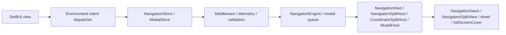
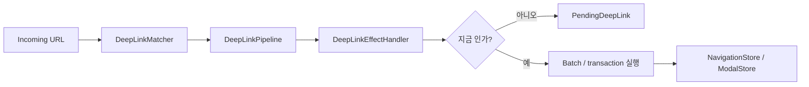

# InnoRouter

[English](README.md) | [한국어](README.ko.md) | [Español](README.es.md) | [Deutsch](README.de.md) | [简体中文](README.zh-Hans.md) | [日本語](README.ja.md) | [Русский](README.ru.md)

[](https://swiftpackageindex.com/InnoSquadCorp/InnoRouter)
[](https://swiftpackageindex.com/InnoSquadCorp/InnoRouter)
[](https://opensource.org/licenses/MIT)
[](https://codecov.io/gh/InnoSquadCorp/InnoRouter)

InnoRouter는 typed state, 명시적 command 실행, 그리고 앱 경계에서의 딥링크 planning을 중심으로 만들어진 SwiftUI 네이티브 네비게이션 프레임워크입니다.

네비게이션을 view 곳곳에 흩어진 부수효과가 아니라 일급(first-class) state machine으로 다룹니다.

## InnoRouter가 책임지는 것

InnoRouter는 다음을 책임집니다:

- `RouteStack`을 통한 stack 네비게이션 상태
- `NavigationCommand`와 `NavigationEngine`을 통한 command 실행
- `NavigationStore`를 통한 SwiftUI 네비게이션 권한
- `ModalStore`를 통한 `sheet`와 `fullScreenCover`의 모달 권한
- `DeepLinkMatcher`와 `DeepLinkPipeline`을 통한 딥링크 매칭과 planning
- `InnoRouterNavigationEffects`와 `InnoRouterDeepLinkEffects`를 통한 앱 경계 실행 헬퍼

InnoRouter는 의도적으로 범용 애플리케이션 state machine이 아닙니다.

다음은 InnoRouter 외부에 두세요:

- 비즈니스 워크플로우 상태
- 인증/세션 lifecycle
- 네트워크 재시도나 transport 상태
- alert 및 confirmation dialog

## 요구 사항

- iOS 18+
- iPadOS 18+
- macOS 15+
- tvOS 18+
- watchOS 11+
- visionOS 2+
- Swift 6.2+

iOS 18 floor와 `swift-tools-version: 6.2` package baseline은 의도적인 선택입니다.
이 floor 덕분에 모든 public 타입이 `@preconcurrency` / `@unchecked Sendable`
탈출구 없이 strict concurrency와 `Sendable`을 채택할 수 있고, 결과적으로
view 코드와 store 사이 경계에서 네비게이션 상태가 main actor 밖으로 은밀하게
새지 않습니다. 비용은 iOS 13~16을 타깃하는 라이브러리들보다 채택 가능 시장이
좁다는 점이고, 이득은 라이브러리의 `Sendable`/`@MainActor` 규율이 산문이 아닌
컴파일러로 검증된다는 점입니다.

매크로 타깃은 현재 `swift-syntax` `603.0.1`에 `.upToNextMinor` 제약으로 의존합니다.
이 의존성과 CI에 핀된 Xcode / Swift toolchain은 더 새로운 Swift host 빌드(예: Swift 6.3)
에서 패키지를 검증할 수 있지만, 지원되는 패키지 floor는 메이저 릴리즈가 명시적으로
올리기 전까지는 Swift 6.2로 유지됩니다.

| Concurrency 자세 | InnoRouter | iOS 13+ 타깃의 TCA / FlowStacks 등 |
|---|---|---|
| public 타입이 무조건 `Sendable` 선언 | ✅ | ⚠ 부분적 — 다수가 `@preconcurrency` 사용 |
| Store가 `@MainActor` 격리, 런타임 hop 없음 | ✅ | ⚠ 라이브러리마다 다름 |
| 소스에 `@unchecked Sendable` / `nonisolated(unsafe)` | ❌ 없음 | ⚠ 일부 어댑터에서 사용 |
| Strict concurrency 모드 | ✅ 모듈별 강제 | ⚠ opt-in이거나 부분 적용 |

## 플랫폼 지원

InnoRouter는 SwiftUI를 통해 모든 Apple 플랫폼에서 동작합니다. UIKit이나
AppKit 브릿지 모듈은 필요하지 않습니다.

| 기능 | iOS | iPadOS | macOS | tvOS | watchOS | visionOS |
|---|---|---|---|---|---|---|
| `NavigationStore` / `NavigationHost` / `FlowStore` / `FlowHost` | ✅ | ✅ | ✅ | ✅ | ✅ | ✅ |
| `NavigationSplitHost` / `CoordinatorSplitHost` | ✅ | ✅ | ✅ | ✅ | ❌ | ✅ |
| `ModalHost` `.sheet` | ✅ | ✅ | ✅ | ✅ | ✅ | ✅ |
| `ModalHost` `.fullScreenCover` 네이티브 | ✅ | ✅ | ⚠ degrades | ✅ | ⚠ degrades | ⚠ degrades |
| `TabCoordinator.badge` 상태 API / 네이티브 시각 표현 | ✅ | ✅ | ✅ | ⚠ 상태 only | ⚠ 상태 only | ✅ |
| `DeepLinkPipeline` / `FlowDeepLinkPipeline` | ✅ | ✅ | ✅ | ✅ | ✅ | ✅ |
| `SceneStore` / `SceneHost` (windows, volumetric, immersive) | — | — | — | — | — | ✅ |
| `innoRouterOrnament(_:content:)` view modifier | no-op | no-op | no-op | no-op | no-op | ✅ |

`⚠ degrades`는 store API가 요청을 그대로 수락하지만 SwiftUI host가 `.fullScreenCover`를
사용할 수 없어 `.sheet`로 렌더링한다는 뜻입니다. `⚠ 상태 only`는 coordinator가
badge 상태를 저장·노출하지만, `.badge(_:)`가 사용 불가능해 `TabCoordinatorView`가
SwiftUI의 네이티브 시각 badge를 생략한다는 뜻입니다. `❌`는 해당 플랫폼에서
심볼이 선언되지 않는다는 뜻이며, `#if !os(...)` 뒤에서 빌드해야 합니다.

## 설치

```swift skip package-manifest-fragment
dependencies: [
    .package(url: "https://github.com/InnoSquadCorp/InnoRouter.git", from: "4.2.0")
]
```

InnoRouter는 source-only SwiftPM 패키지로 배포됩니다. 바이너리 아티팩트를 제공하지
않으며, library evolution은 의도적으로 꺼져 있어 Apple 플랫폼 전반에서 source 빌드가
단순하게 유지됩니다.

문서 게이트는 또한 최소한 하나의 완전한 Swift 스니펫이 패키지에 대해 typecheck되도록
강제합니다:

```swift compile
import InnoRouter

enum CompileCheckedRoute: Route {
    case home
}

let compileCheckedStack = RouteStack<CompileCheckedRoute>()
_ = compileCheckedStack.path
```

## 4.0.0 OSS 릴리즈 계약

`4.0.0`은 InnoRouter의 첫 OSS 릴리즈이며, public SemVer 계약이 적용되는 첫 버전입니다.
신규 채택자는 `4.2.0` 이상에서 시작해야 합니다. 이전의 비공개/내부 패키지 스냅샷은
OSS 호환성 라인의 일부가 아닙니다. 이전 버전을 테스트한 팀은 4.x 문서에 맞춰 public API
사용을 일회성 source migration으로 검증해야 합니다.

### 4.x 라인의 SemVer 약속

`4.x.y` 릴리즈 내에서 InnoRouter는 [Semantic Versioning](https://semver.org/)을
엄격하게 따릅니다:

- **`4.x.y` → `4.x.(y+1)`** 패치 릴리즈: 버그 수정 only.
  public-API 시그니처 변경 없음. 문서화된 버그 수정 외에는 관찰 가능한 동작 변경 없음.
- **`4.x.y` → `4.(x+1).0`** 마이너 릴리즈: 추가만(additive only).
  새 타입, 새 메서드, 새 케이스, 새 설정 옵션. 기존 시그니처는 모양을 유지하고
  기존 호출 사이트는 수정 없이 컴파일됩니다.
- **`4.x.y` → `5.0.0`** 메이저 릴리즈: source 호환성을 깨거나, public 심볼을
  제거하거나, generic 제약을 좁히거나, 문서화된 런타임 동작을 기존 호출 사이트가
  놀랄 만한 방식으로 변경하는 모든 것.

예외: 아래의 `4.1.0` 역사적 정리는 문서화된 일회성 예외입니다. 그 채택
baseline 이후의 4.x 마이너 릴리즈는 이 계약에 따라 additive-only입니다.

Pre-release 태그는 `4.1.0-rc.1` / `4.2.0-beta.2` 형식을 사용합니다. 릴리즈
워크플로우의 `^[0-9]+\.[0-9]+\.[0-9]+$` 정규식은 final 태그만 받아들입니다.
pre-release 태그는 [`RELEASING.md`](RELEASING.md)에 문서화된 별도 수동 흐름을
통해 출시됩니다.

### Breaking change의 정의

4.x SemVer 약속의 목적상, *breaking change*는 다음 중 하나를 의미합니다:

- public 심볼(타입, 메서드, 프로퍼티, associated type, 케이스)의 제거 또는 이름 변경.
- 기존 호출 사이트에서 컴파일 실패를 일으키는 public 메서드 시그니처 변경
  (defaulted가 아닌 파라미터 추가, generic 제약 강화, 반환 타입 교체).
- 기존의 올바른 호출자가 다른 관찰 결과를 만들어내는 방향으로 public API의
  문서화된 동작을 변경하는 것 (예: 기본 `NavigationPathMismatchPolicy` 변경).
- 최소 지원 Swift toolchain 또는 플랫폼 floor 상향.

반대로 다음은 *breaking이 아니며* 어떤 마이너 릴리즈에서도 들어올 수 있습니다:

- non-`@frozen` public enum에 새 케이스 추가.
- public 메서드에 defaulted 파라미터 추가.
- internal-only 타입의 강화.
- 시멘틱을 보존하는 성능 개선.
- 문서만 변경.

전체 4.0 baseline 정리는 [`CHANGELOG.md`](CHANGELOG.md)에 요약되어 있습니다.

### 예외: 4.1.0 역사적 정리

`4.1.0`은 사용자 유입 전 cleanup 패스 이후의 채택 baseline입니다. 사용되지 않던
dispatcher-object API들을 제거하고, `replaceStack`을 단일 풀-스택 교체 intent로
유지하며, effect 관찰을 명시적 이벤트 스트림으로 옮겼습니다. 이는 4.x 라인에서
문서화된 유일한 source-breaking 예외입니다. 신규 앱은 `4.1.0`에서 시작해야 하며,
`4.0.0` 태그는 첫 OSS 스냅샷으로 남아 있습니다.

### Imports

umbrella 타깃 `InnoRouter`는 macros 제품을 제외한 모든 것을 re-export합니다.
`@Routable` / `@CasePathable`은 명시적 `import InnoRouterMacros`가 필요합니다.
umbrella는 의도적으로 그 re-export를 건너뛰어, 매크로를 사용하지 않는 파일들이
매크로 plugin 해결 비용을 지불하지 않게 합니다:

```swift skip doc-fragment
import InnoRouter            // stores, hosts, intents, deep links, scenes
import InnoRouterMacros      // @Routable / @CasePathable 사용 파일에서만
```

`@EnvironmentNavigationIntent`, `@EnvironmentModalIntent`, 기타 모든 property
wrapper와 view modifier는 `InnoRouterMacros`가 아닌 `InnoRouter`에서 옵니다.

SwiftSyntax 기반 매크로 구현은 4.x 라인 동안 이 패키지에 남아 있습니다.
package-traits 또는 매크로-패키지 분리는 `swift package show-traits`,
`swift build --target InnoRouter`, `swift build --target InnoRouterMacros`를
마이그레이션 비용에 비해 실측한 후에만 평가해야 합니다.

| Product | 언제 import할지 |
|---|---|
| `InnoRouter` | store, host, intent, coordinator, deep link, scene, persistence 헬퍼가 필요한 앱 코드. |
| `InnoRouterMacros` | `@Routable` 또는 `@CasePathable`을 사용하는 파일에서만. |
| `InnoRouterNavigationEffects` | SwiftUI view 외부에서 `NavigationCommand` 값을 실행하는 앱-경계 코드. |
| `InnoRouterDeepLinkEffects` | pending 딥링크를 처리하거나 재개하는 앱-경계 코드. |
| `InnoRouterEffects` | effect 모듈 두 개를 함께 re-export해야 하는 호환 import. |
| `InnoRouterTesting` | host-less `NavigationTestStore` / `ModalTestStore` / `FlowTestStore`를 원하는 테스트 타깃. |

## 모듈

- `InnoRouter`: `InnoRouterCore`, `InnoRouterSwiftUI`, `InnoRouterDeepLink`의 umbrella re-export
- `InnoRouterCore`: route stack, validator, command, result, batch/transaction executor, middleware
- `InnoRouterSwiftUI`: store, stack/split/modal host, coordinator, environment intent dispatch
- `InnoRouterDeepLink`: 패턴 매칭, 진단, pipeline planning, pending 딥링크
- `InnoRouterNavigationEffects`: 앱 경계용 동기 `@MainActor` 실행 헬퍼
- `InnoRouterDeepLinkEffects`: 네비게이션 effect 위에 얹은 딥링크 실행 헬퍼
- `InnoRouterEffects`: effect 모듈 두 개의 호환 umbrella
- `InnoRouterMacros`: `@Routable`과 `@CasePathable`

## 적합한 surface 고르기

전이 권한(transition authority)을 갖는 가장 작은 surface를 사용하세요:

| 필요 | 사용 |
|---|---|
| 한 개의 typed SwiftUI stack | `NavigationStore` + `NavigationHost` |
| 지원 플랫폼에서 split-view stack | `NavigationStore` + `NavigationSplitHost` |
| stack reset 없는 sheet / cover 권한 | `ModalStore` + `ModalHost` |
| push + modal 흐름, 복원, 또는 multi-step 딥링크 | `FlowStore` + `FlowHost` + `FlowPlan` |
| URL을 push-only command plan으로 변환 | `DeepLinkMatcher` + `DeepLinkPipeline` |
| URL을 push-prefix + modal-tail 흐름으로 변환 | `FlowDeepLinkMatcher` + `FlowDeepLinkPipeline` |
| visionOS window, volume, immersive space | `SceneStore` + `SceneHost` / `SceneAnchor` |
| Reducer, effect, 또는 앱-경계 실행 | `InnoRouterNavigationEffects` / `InnoRouterDeepLinkEffects` |
| SwiftUI host 없는 router assertion | `InnoRouterTesting` |

`NavigationStore`, `FlowStore`, `ModalStore`, `SceneStore`, effects, testing은
의도적으로 분리되어 있습니다. 이 라이브러리는 이 권한들을 명시적으로 유지해서
앱이 라우팅 경계에 맞는 조각만 채택할 수 있게 합니다.

### 빠른 의사결정 흐름도

```text
화면 surface가 push와 modal을 한 흐름에 결합하나요?
├── 예  → FlowStore + FlowHost (단일 진실, 단일 events 스트림)
└── 아니오 → modal 권한(sheet / cover)만 갖나요?
         ├── 예  → ModalStore + ModalHost
         └── 아니오 → NavigationStore + NavigationHost
                    (split-view 변형: NavigationSplitHost)
```

view 코드에서 store 참조 없이 dispatch하려면, [`Docs/IntentSelectionGuide.md`](Docs/IntentSelectionGuide.md)에서
대응되는 intent 타입을 사용하세요: stack-only store에는 `NavigationIntent`,
`FlowStore`에는 `FlowIntent`(여섯 개의 겹치는 케이스 + `FlowIntent`만 아는
modal-aware 변형들).

## 문서

- 최신 DocC 포털: [InnoRouter latest docs](https://innosquadcorp.github.io/InnoRouter/latest/)
- 버전별 docs root: [InnoRouter docs](https://innosquadcorp.github.io/InnoRouter/)
- 릴리즈 체크리스트: [RELEASING.md](RELEASING.md)
- 메인테이너 빠른 가이드: [CLAUDE.md](CLAUDE.md)

`README.md`는 저장소 진입점입니다.
DocC는 상세한 모듈 레벨 레퍼런스 모음입니다.

### 튜토리얼 아티클

가장 흔한 채택 경로를 단계별로 설명합니다. 각 아티클은 관련 DocC 카탈로그 안에
들어 있어 렌더링된 DocC 사이트, GitHub 소스 뷰, 오프라인
`swift package generate-documentation` 빌드 모두 동일한 내용을 보여줍니다.

| 아티클 | 카탈로그 | 다루는 주제 |
| --- | --- | --- |
| [Tutorial-LoginOnboarding](Sources/InnoRouterSwiftUI/InnoRouterSwiftUI.docc/Articles/Tutorial-LoginOnboarding.md) | `InnoRouterSwiftUI` | `FlowStore`와 `ChildCoordinator`로 login → onboarding → home 흐름 만들기 |
| [Tutorial-DeepLinkReconciliation](Sources/InnoRouterSwiftUI/InnoRouterSwiftUI.docc/Articles/Tutorial-DeepLinkReconciliation.md) | `InnoRouterSwiftUI` | cold-start vs warm 딥링크 조정, pending replay 포함 |
| [Tutorial-MiddlewareComposition](Sources/InnoRouterSwiftUI/InnoRouterSwiftUI.docc/Articles/Tutorial-MiddlewareComposition.md) | `InnoRouterSwiftUI` | typed middleware 구성, command 가로채기, churn 관찰 |
| [Tutorial-MigratingFromNestedHosts](Sources/InnoRouterSwiftUI/InnoRouterSwiftUI.docc/Articles/Tutorial-MigratingFromNestedHosts.md) | `InnoRouterSwiftUI` | 중첩된 `NavigationHost` + `ModalHost` stack을 `FlowHost`로 교체 |
| [Tutorial-Throttling](Sources/InnoRouterSwiftUI/InnoRouterSwiftUI.docc/Articles/Tutorial-Throttling.md) | `InnoRouterSwiftUI` | 결정론적 test clock과 `ThrottleNavigationMiddleware` 사용 |
| [Tutorial-StoreObserver](Sources/InnoRouterSwiftUI/InnoRouterSwiftUI.docc/Articles/Tutorial-StoreObserver.md) | `InnoRouterSwiftUI` | 통합 `events` 스트림 위에서 `StoreObserver` 채택 |
| [Tutorial-VisionOSScenes](Sources/InnoRouterSwiftUI/InnoRouterSwiftUI.docc/Articles/Tutorial-VisionOSScenes.md) | `InnoRouterSwiftUI` | `SceneStore`로 visionOS window, volumetric scene, immersive space 구동 |
| [Tutorial-FlowDeepLinkPipeline](Sources/InnoRouterDeepLink/InnoRouterDeepLink.docc/Articles/Tutorial-FlowDeepLinkPipeline.md) | `InnoRouterDeepLink` | `FlowDeepLinkPipeline`을 통한 push + modal 합성 딥링크 |
| [Tutorial-StatePersistence](Sources/InnoRouterCore/InnoRouterCore.docc/Tutorial-StatePersistence.md) | `InnoRouterCore` | `StatePersistence`로 launch 간 `FlowPlan` / `RouteStack` 영속화 |
| [Tutorial-TestingFlows](Sources/InnoRouterTesting/InnoRouterTesting.docc/Articles/Tutorial-TestingFlows.md) | `InnoRouterTesting` | `FlowTestStore`를 통한 host-less Swift Testing assertion |

## 동작 방식

### 런타임 흐름



- View는 typed intent를 environment dispatcher를 통해 emit합니다.
- Store는 네비게이션 또는 모달 권한을 소유합니다.
- Host는 store 상태를 네이티브 SwiftUI 네비게이션 API로 변환합니다.

### 딥링크 흐름



- 매칭과 planning은 순수합니다.
- Effect 핸들러는 앱 정책이 지금 실행할지 미룰지 결정하는 경계입니다.
- Pending 딥링크는 앱이 replay 가능한 시점까지 계획된 전이를 보존합니다.

## Quick Start

### 1. Route 정의

매크로 없이:

```swift skip doc-fragment
import InnoRouter

enum HomeRoute: Route {
    case list
    case detail(id: String)
    case settings
}
```

매크로 사용:

```swift skip doc-fragment
import InnoRouter
import InnoRouterMacros

@Routable
enum HomeRoute {
    case list
    case detail(id: String)
    case settings
}
```

### 2. `NavigationStore` 생성

```swift skip doc-fragment
import InnoRouter
import OSLog

let store = try NavigationStore<HomeRoute>(
    initialPath: [.list],
    configuration: NavigationStoreConfiguration(
        routeStackValidator: .nonEmpty.combined(with: .rooted(at: .list)),
        logger: Logger(subsystem: "com.example.app", category: "navigation")
    )
)
```

### 3. SwiftUI에서 host

```swift skip doc-fragment
import SwiftUI
import InnoRouter

struct AppRoot: View {
    @State private var store = try! NavigationStore<HomeRoute>(
        initialPath: [.list]
    )

    var body: some View {
        NavigationHost(store: store) { route in
            switch route {
            case .list:
                HomeListView()
            case .detail(let id):
                DetailView(id: id)
            case .settings:
                SettingsView()
            }
        } root: {
            HomeListView()
        }
    }
}
```

### 4. child view에서 intent emit

```swift skip doc-fragment
struct HomeListView: View {
    @EnvironmentNavigationIntent(HomeRoute.self) private var navigationIntent

    var body: some View {
        List {
            Button("Detail") {
                navigationIntent(.go(.detail(id: "123")))
            }

            Button("Settings") {
                navigationIntent(.go(.settings))
            }

            Button("Back") {
                navigationIntent(.back)
            }
        }
    }
}
```

View는 intent를 emit해야 합니다. router state를 직접 변경하는 권한을 가져서는 안 됩니다.

## 상태와 실행 모델

InnoRouter는 세 가지 별개의 실행 시멘틱을 노출합니다.

### 단일 command

`execute(_:)`는 하나의 `NavigationCommand`를 적용하고 typed `NavigationResult`를 반환합니다.

### Batch

`executeBatch(_:stopOnFailure:)`는 step 단위 command 실행을 유지하되 관찰을 합칩니다.

batch 실행을 사용하는 경우:

- 여러 command가 여전히 하나씩 실행되어야 할 때
- middleware가 각 step을 여전히 봐야 할 때
- 관찰자가 한 개의 집계된 전이 이벤트를 받아야 할 때

### Transaction

`executeTransaction(_:)`은 shadow stack에서 command를 미리보고 모든 step이 성공할 때만 commit합니다.

transaction 실행을 사용하는 경우:

- 부분 성공이 허용되지 않을 때
- 실패 또는 취소 시 rollback을 원할 때
- step 단위 관찰보다 all-or-nothing 단일 commit 이벤트가 더 중요할 때

### `.sequence`

`.sequence`는 transaction이 아닌 command algebra입니다.

의도적으로:

- 좌→우 순서
- 비원자적
- `NavigationResult.multiple`을 통해 typed

뒤 step이 실패해도 앞서 성공한 step은 그대로 적용됩니다.

### `send(_:)` vs `execute(_:)` — 올바른 진입점 고르기

InnoRouter는 목적별로 계층화된 4개의 진입점으로 네비게이션을 노출합니다.
데이터 모양이 아니라 호출 위치에 맞는 것을 고르세요.

| 계층 | 진입점 | 사용 시점 |
| ------------ | ---------------------------------- | ------------------------------------------------------------------------------------------------- |
| View intent  | `store.send(_:)`                   | SwiftUI view에서 이름 있는 `NavigationIntent`를 dispatch (`go`, `back`, `backToRoot`, …).            |
| Command      | `store.execute(_:)`                | 단일 `NavigationCommand`를 엔진에 전달하고 typed `NavigationResult`를 검사.                             |
| Batch        | `store.executeBatch(_:)`           | 여러 command를 하나씩 실행하되 middleware 가시성과 단일 관찰자 이벤트를 유지.                                |
| Transaction  | `store.executeTransaction(_:)`     | All-or-nothing commit — shadow stack에 미리보고 모든 step이 성공할 때만 commit.                          |

경험칙:

- View는 send. Coordinator와 effect 경계는 execute.
- `send`는 intent 모양 (반환값 없음); `execute*`는 command 모양 (분기, 텔레메트리, 재시도용 typed 결과 반환).
- 부분 실패 시 rollback이 필요한 atomic multi-step 흐름은 손수 만든 batch보다
  `executeTransaction`을 선호하세요.

`ModalStore`와 `FlowStore`에도 같은 계층이 적용됩니다:
view에서는 `send(_: ModalIntent)` / `send(_: FlowIntent)`, 엔진 경계에서는
`execute(_:)` / `executeBatch(_:)` / `executeTransaction(_:)`.

### `.sequence`, `executeBatch`, `executeTransaction` 중 고르기

| 원하는 것 | 사용 | 이유 |
|---|---|---|
| 여러 command에 대해 best-effort로 단일 관찰 가능 변경 | `executeBatch(_:stopOnFailure:)` | 합쳐진 `onChange` / `events`, 선택적 fail-fast |
| rollback과 함께 all-or-nothing 적용 | `executeTransaction(_:)` | shadow-state 미리보기, journal 기반 폐기 |
| 엔진이 plan/검증하는 합성 *값* | `NavigationCommand.sequence([...])` | 순수 command, 모든 middleware를 한 단위로 통과 |
| 조용한 시간 후 마지막 command만 실행 | `DebouncingNavigator` | async 래핑 navigator, `Clock` 주입 가능 |
| 키별 rate-limit | `ThrottleNavigationMiddleware` | 동기, 마지막 수락 timestamp |

워크 예제와 안티패턴을 포함한 전체 의사결정 매트릭스는 DocC 튜토리얼
[`Guide-SequenceVsBatchVsTransaction`](Sources/InnoRouterSwiftUI/InnoRouterSwiftUI.docc/Articles/Guide-SequenceVsBatchVsTransaction.md)에 있습니다.

## Stack 라우팅 surface

`NavigationIntent`는 공식 SwiftUI stack-intent surface입니다:

- `.go(Route)`
- `.goMany([Route])`
- `.back`
- `.backBy(Int)`
- `.backTo(Route)`
- `.backToRoot`
- `.replaceStack([Route])`

`NavigationStore.send(_:)`는 이 intent들의 SwiftUI 진입점입니다.

## Modal 라우팅 surface

InnoRouter는 다음에 대한 모달 라우팅을 지원합니다:

- `sheet`
- `fullScreenCover`

사용:

- `ModalStore`
- `ModalHost`
- `ModalIntent`
- `@EnvironmentModalIntent`

예제:

```swift skip doc-fragment
@Routable
enum AppModalRoute {
    case profile
    case onboarding
}

struct ShellView: View {
    @State private var modalStore = ModalStore<AppModalRoute>()

    var body: some View {
        ModalHost(store: modalStore) { route in
            switch route {
            case .profile:
                ProfileView()
            case .onboarding:
                OnboardingView()
            }
        } content: {
            HomeView()
        }
    }
}
```

### 모달 scope 경계

iOS와 tvOS에서 `ModalHost`는 style을 `sheet`와 `fullScreenCover`로 직접 매핑합니다.
다른 지원 플랫폼에서는 `fullScreenCover`가 안전하게 `sheet`로 degrade됩니다.

InnoRouter는 의도적으로 다음을 소유하지 **않습니다**:

- `alert`
- `confirmationDialog`

이들은 feature-local 또는 coordinator-local presentation 상태로 두세요.

### 모달 관찰성

`ModalStoreConfiguration`은 가벼운 lifecycle 훅을 제공합니다:

- `logger`
- `onPresented`
- `onDismissed`
- `onQueueChanged`
- `onMiddlewareMutation`
- `onCommandIntercepted`

`ModalDismissalReason`은 다음을 구분합니다:

- `.dismiss`
- `.dismissAll`
- `.systemDismiss`

### 모달 middleware

`ModalStore`는 `NavigationStore`와 동일한 middleware surface를 노출합니다:

- `willExecute` / `didExecute`를 갖는 `ModalMiddleware` / `AnyModalMiddleware<M>`.
- `ModalInterception`은 middleware가 `.proceed(command)` (rewrite된 command 포함) 또는
  `ModalCancellationReason`과 함께 `.cancel(reason:)`을 할 수 있게 합니다.
- `ModalStore.addMiddleware` / `insertMiddleware` / `removeMiddleware` /
  `replaceMiddleware` / `moveMiddleware` — 네비게이션과 동일한 handle 기반 CRUD.
- `execute(_:) -> ModalExecutionResult<M>`은 모든 `.present`, `.dismissCurrent`, `.dismissAll`을
  registry를 통해 라우팅합니다.
- `ModalMiddlewareMutationEvent`는 분석을 위해 registry churn을 노출합니다.

## Split 네비게이션

iPad와 macOS의 detail 네비게이션은 다음을 사용:

- `NavigationSplitHost`
- `CoordinatorSplitHost`

InnoRouter는 split 레이아웃에서 detail stack만 소유합니다.

다음은 앱 소유로 남습니다:

- sidebar 선택
- 컬럼 가시성
- compact 적응

## Coordinator surface

Coordinator는 SwiftUI intent와 command 실행 사이에 위치하는 정책 객체입니다.

다음 경우에 `CoordinatorHost` 또는 `CoordinatorSplitHost`를 사용:

- view intent가 먼저 정책 라우팅을 거쳐야 할 때
- 앱 shell이 조정 로직을 필요로 할 때
- 여러 네비게이션 권한이 하나의 coordinator 뒤에 합성되어야 할 때

`FlowCoordinator`와 `TabCoordinator`는 헬퍼이지 `NavigationStore`의 대체가 아닙니다.

권장 분담:

- `NavigationStore`: route-stack 권한
- `TabCoordinator`: shell/tab 선택 상태
- `FlowCoordinator`: destination 안의 local step 진행

### Child coordinator chaining

`ChildCoordinator`는 부모 coordinator가 child의 finish 값을
`parent.push(child:) -> Task<Child.Result?, Never>`를 통해 inline으로 await할 수 있게 합니다:

```swift skip doc-fragment
let signupResult = await parentCoordinator.push(child: SignUpCoordinator())
if let user = signupResult {
    parentCoordinator.handle(.go(.home(user)))
}
```

콜백(`onFinish`, `onCancel`)은 동기적으로 설치되어 child가 부모의 `await` 이전을
포함한 어떤 시점에서도 발사할 수 있습니다. 설계 근거는
[`Docs/design-child-coordinator-handoff.md`](Docs/design-child-coordinator-handoff.md)
를 참조하세요.

부모 `Task` 취소는 `ChildCoordinator.parentDidCancel()` (기본 빈 no-op)을 통해
child로 전파됩니다. 부모 view가 dismiss되면 transient 상태를 정리하도록 override
하세요 — sheet dismiss, 진행 중 요청 취소, 임시 store 해제 등:

```swift skip doc-fragment
final class SignUpCoordinator: ChildCoordinator {
    typealias Result = UserID
    var onFinish: (@MainActor @Sendable (UserID) -> Void)?
    var onCancel: (@MainActor @Sendable () -> Void)?

    func parentDidCancel() {
        signUpAPIClient.cancelActiveRequests()
    }
}
```

`parentDidCancel`은 방향성을 가집니다 (parent → child). `onCancel`을 호출하지 않습니다
(`onCancel`은 child → parent로 유지). 두 훅은 직교합니다.

## Named 네비게이션 intent

빈도가 높은 intent는 기존 `NavigationCommand` 원시(primitive)에서 합성됩니다:

- `NavigationIntent.replaceStack([R])` — 한 번의 관찰 가능 step에서 stack을 주어진 route들로 reset.
- `NavigationIntent.backOrPush(R)` — `route`가 stack에 이미 있으면 거기까지 pop, 없으면 push.
- `NavigationIntent.pushUniqueRoot(R)` — stack에 동일 route가 없을 때만 push.

이들은 일반 `send` → `execute` pipeline을 통과하므로 middleware와 텔레메트리는
직접적인 `NavigationCommand` 호출과 동일하게 관찰합니다.

## Case-typed destination 바인딩

`NavigationStore`와 `ModalStore`는 `@Routable` / `@CasePathable`이 emit하는 `CasePath`로
키된 `binding(case:)` 헬퍼를 노출합니다:

```swift skip doc-fragment
struct DetailSheet: View {
    @Environment(\.navigationStore) private var store: NavigationStore<AppRoute>

    var body: some View {
        SomeDetailView()
            .sheet(item: store.binding(case: \AppRoute.detail)) { detail in
                DetailView(detail: detail)
            }
    }
}
```

binding은 모든 set을 기존 command pipeline을 통해 라우팅하므로 middleware와
텔레메트리가 직접적인 `execute(...)` 호출과 정확히 동일하게 관찰합니다.
`ModalStore.binding(case:style:)`은 presentation style별로 (`.sheet` / `.fullScreenCover`)
범위가 지정됩니다.

## 딥링크 모델

딥링크는 숨겨진 부수효과가 아닌 plan으로 처리됩니다.

핵심 구성:

- `DeepLinkMatcher`
- `DeepLinkPipeline`
- `DeepLinkDecision`
- `PendingDeepLink`
- `NavigationPlan`

전형적 흐름:

1. URL을 route로 매칭
2. scheme/host로 거부 또는 수락
3. 인증 정책 적용
4. `.plan`, `.pending`, `.rejected`, `.unhandled` 중 하나 emit
5. 결과 네비게이션 plan을 명시적으로 실행

### Matcher 진단

`DeepLinkMatcher`와 `FlowDeepLinkMatcher`는 다음을 보고할 수 있습니다:

- 중복 패턴
- wildcard shadowing
- 파라미터 shadowing
- 비종단(non-terminal) wildcard

진단은 선언 순서 우선권을 변경하지 않습니다. 런타임 동작을 조용히 바꾸지 않으면서
저작 실수를 잡는 데 도움이 됩니다. 진단이 빌드를 실패시켜야 하는 release-readiness
게이트에서는 `try DeepLinkMatcher(strict:)` 또는 `try FlowDeepLinkMatcher(strict:)`를
사용하세요.

### 합성 딥링크 (push + modal tail)

`FlowDeepLinkPipeline`은 push-only pipeline을 확장해 단일 URL이 push prefix와
modal terminal step을 하나의 atomic `FlowStore.apply(_:)` 안에서 rehydrate할 수 있게 합니다:

```swift skip doc-fragment
let matcher = FlowDeepLinkMatcher<AppRoute> {
    FlowDeepLinkMapping("/home/detail/:id") { params in
        guard let id = params.firstValue(forName: "id") else { return nil }
        return FlowPlan(steps: [.push(.home), .push(.detail(id: id))])
    }
    FlowDeepLinkMapping("/onboarding/privacy") { _ in
        FlowPlan(steps: [.sheet(.privacyPolicy)])
    }
}

let pipeline = FlowDeepLinkPipeline(
    allowedSchemes: ["myapp"],
    allowedHosts: ["app"],
    matcher: matcher,
    authenticationPolicy: .required(
        shouldRequireAuthentication: { _ in true },
        isAuthenticated: { SessionStore.shared.isAuthenticated }
    )
)

let handler = FlowDeepLinkEffectHandler(pipeline: pipeline, applier: flowStore)

FlowHost(store: flowStore, destination: destination) { RootView() }
    .onOpenURL { _ = handler.handle($0) }
```

각 `FlowDeepLinkMapping` 핸들러는 **완전한** `FlowPlan`을 반환하므로 multi-segment URL이
선언 사이트에서 명시적입니다. pipeline은 push-only pipeline의 `DeepLinkAuthenticationPolicy`
+ `PendingDeepLink` 시멘틱을 그대로 재사용해 인증 지연과 replay가 대칭이 됩니다.
전체 walk-through는 [`Sources/InnoRouterDeepLink/InnoRouterDeepLink.docc/Articles/Tutorial-FlowDeepLinkPipeline.md`](Sources/InnoRouterDeepLink/InnoRouterDeepLink.docc/Articles/Tutorial-FlowDeepLinkPipeline.md)
를 참조하세요.

## Middleware

Middleware는 command 실행을 둘러싸는 횡단 정책 계층(cross-cutting policy layer)을 제공합니다.

Pre-execution:

- `willExecute(_:state:) -> NavigationInterception`
- `.proceed(updatedCommand)`
- `.cancel(reason)`

Post-execution:

- `didExecute(_:result:state:) -> NavigationResult`

Middleware는 다음을 할 수 있습니다:

- command rewrite
- typed cancellation 사유로 실행 차단
- 실행 후 결과 fold

Middleware는 store 상태를 직접 변경할 수 없습니다.

### Typed cancellation

Cancellation 사유는 `NavigationCancellationReason`을 사용:

- `.middleware(debugName:command:)`
- `.conditionFailed`
- `.custom(String)`

### Middleware 관리

`NavigationStore`는 handle 기반 관리를 노출합니다:

- `addMiddleware`
- `insertMiddleware`
- `removeMiddleware`
- `replaceMiddleware`
- `moveMiddleware`
- `middlewareMetadata`

## Path 조정 (Reconciliation)

SwiftUI `NavigationStack(path:)` 업데이트는 시맨틱 command로 다시 매핑됩니다.

규칙:

- prefix shrink → `.popCount` 또는 `.popToRoot`
- prefix expand → batched `.push`
- non-prefix mismatch → `NavigationPathMismatchPolicy`

사용 가능한 mismatch 정책:

- `.replace` — 기본 production 자세. SwiftUI의 non-prefix path rewrite를 수락하고 mismatch 이벤트 emit.
- `.assertAndReplace` — debug / pre-release 자세. assert 후 동일한 교체 시멘틱으로 복구.
- `.ignore` — store-authoritative 자세. rewrite를 관찰하되 현재 stack을 변경하지 않음.
- `.custom` — 도메인 복구 자세. 옛/새 path를 하나의 command, batch, 또는 no-op으로 매핑.

`NavigationStoreConfiguration.logger`가 설정되면 mismatch 처리는 구조화된 텔레메트리를 emit합니다.

## Effect 모듈

### `InnoRouterNavigationEffects`

앱 shell 코드가 navigator 경계 위의 작은 실행 façade를 원할 때 사용합니다.

핵심 API:

- `execute(_:)`
- `execute(_ commands:)`
- `executeTransaction(_:)`
- `executeGuarded(_:, prepare:)`

명시적 async guard 헬퍼를 제외한 이 API들은 동기 `@MainActor` API입니다.

### `InnoRouterDeepLinkEffects`

앱 경계에서 typed 결과와 함께 딥링크 plan을 실행해야 할 때 사용합니다.

핵심 API:

- `handle(_ url:)`
- `resumePendingDeepLink()`
- `resumePendingDeepLinkIfAllowed(_:)`

### Umbrella `DeepLinkCoordinating`

`DeepLinkCoordinating`을 채택한 coordinator는 `DeepLinkCoordinationOutcome<Route>`를 통해
동일한 typed-결과 surface를 얻습니다. Pipeline 거부(`rejected`, `unhandled`)와 resume
상태(`pending`, `executed`, `noPendingDeepLink`)는 stack 상태를 들여다보지 않고 모두 관찰 가능합니다.

- `handleDeepLink(_:) -> DeepLinkCoordinationOutcome<Route>`
- `resumePendingDeepLinkIfPossible() -> DeepLinkCoordinationOutcome<Route>`
- `resumePendingDeepLinkIfAllowed(_:) async -> DeepLinkCoordinationOutcome<Route>`

## `Examples` vs `ExamplesSmoke`

저장소는 의도적으로 문서 예제와 CI 예제를 분리합니다.

- `Examples/`: 사람용, 관용적, 매크로 기반 예제
- `ExamplesSmoke/`: CI용 컴파일러 안정 smoke fixture

현재 예제는 다음을 다룹니다:

- 단독 stack 라우팅
- coordinator 라우팅
- 딥링크
- split 네비게이션
- 앱 shell 구성
- 모달 라우팅

## 문서와 릴리즈 흐름

### DocC

DocC는 모듈별로 빌드되어 GitHub Pages에 게시됩니다.

게시 구조:

- `/InnoRouter/latest/`
- `/InnoRouter/4.2.0/`
- `/InnoRouter/` 루트 포털

### CI

CI는 다음을 검증합니다:

- `swift test`
- `principle-gates`
- 플랫폼별 SwiftUI 커버리지를 위한 `platforms` 워크플로우
- 예제 smoke 빌드
- DocC 미리보기 빌드

### CD

CD는 bare semver tag에서만 동작합니다:

- `4.1.0`

유효하지 않은 tag 예:

- 선행 `v`가 있는 모든 tag
- `release-4.1.0`

릴리즈 워크플로우 책임:

- 코드/문서 게이트 재실행
- tag 전 로컬 `./scripts/principle-gates.sh --platforms=all` 또는 GitHub `platforms` 워크플로우 green 요구
- 버전별 DocC 빌드
- `/latest/` 업데이트
- 이전 버전별 docs 보존
- GitHub Release 게시

### SwiftUI 철학 정렬

InnoRouter는 SwiftUI의 declarative 방향을 따르되 공유 네비게이션 권한을 위해 의도적인 트레이드오프를 합니다.

- View는 router state를 직접 변경하지 않고 intent를 emit합니다.
- Stack, split-detail, 모달 권한은 분리되어 있습니다.
- environment wiring 누락은 fail fast.
- `NavigationStore`는 ephemeral local state가 아닌 공유 권한이므로 reference 타입으로 유지됩니다.
- `Coordinator`는 같은 이유로 `AnyObject`로 유지됩니다.

이는 SwiftUI에서 우연히 멀어진 것이 아닌 의도적이고 실용적인 트레이드오프입니다.

## Examples

사람용 예제는 여기에 있습니다:

- [Examples/StandaloneExample.swift](https://github.com/InnoSquadCorp/InnoRouter/blob/main/Examples/StandaloneExample.swift)
- [Examples/CoordinatorExample.swift](https://github.com/InnoSquadCorp/InnoRouter/blob/main/Examples/CoordinatorExample.swift)
- [Examples/DeepLinkExample.swift](https://github.com/InnoSquadCorp/InnoRouter/blob/main/Examples/DeepLinkExample.swift)
- [Examples/SplitCoordinatorExample.swift](https://github.com/InnoSquadCorp/InnoRouter/blob/main/Examples/SplitCoordinatorExample.swift)
- [Examples/AppShellExample.swift](https://github.com/InnoSquadCorp/InnoRouter/blob/main/Examples/AppShellExample.swift)

## Quality 게이트

릴리즈 cut 전에 로컬에서 다음을 실행하세요:

```bash
swift test
./scripts/principle-gates.sh
./scripts/build-docc-site.sh --version preview --skip-latest
```

## Flow stack

`FlowStore<R>`는 통합된 push + sheet + cover 흐름을 단일 `RouteStep<R>` 값 배열로 표현합니다.
내부 `NavigationStore<R>`와 `ModalStore<R>`를 소유하며, 각각에 위임하면서 불변식을 강제합니다
(modal은 끝에 최대 하나, modal은 항상 끝, middleware rollback이 path를 조정).

이 내부 store들은 4.0에서 `@_spi(FlowStoreInternals)`입니다. 앱 코드는
`FlowStore.path`, `send(_:)`, `apply(_:)`, `events`, `intentDispatcher`를 public 권한 surface로
취급해야 하며, 직접적인 inner-store 변경은 host와 집중된 invariant 테스트에 한정됩니다.

전형적 사용:

```swift skip doc-fragment
let flow = FlowStore<AppRoute>()
let restoredFlow = try FlowStore<AppRoute>(
    validating: persistedSteps
)

flow.send(.push(.home))
flow.send(.push(.detail(id)))
flow.send(.presentSheet(.share))   // tail modal
flow.apply(FlowPlan(steps: [.push(.home), .cover(.paywall)]))
```

- `FlowHost`는 `NavigationHost` 위에 `ModalHost`를 합성하고 `@EnvironmentFlowIntent(Route.self)`
  dispatch를 위한 environment 클로저를 주입합니다.
- `FlowStoreConfiguration`은 `NavigationStoreConfiguration`과 `ModalStoreConfiguration`을 합성하며,
  `onPathChanged`와 `onIntentRejected`를 추가합니다.
- `FlowStore(validating:configuration:)`는 복원된 또는 외부에서 공급된 `[RouteStep]` 값을 위한
  throwing initializer입니다. 호환용 `initial:` initializer는 여전히 유효하지 않은 입력을 빈 path로 강제합니다.
- `FlowRejectionReason`은 invariant 위반을 노출합니다
  (`pushBlockedByModalTail`, `invalidResetPath`, `middlewareRejected(debugName:)`).

## Host-less 테스트 (`InnoRouterTesting`)

`InnoRouterTesting`은 `NavigationStore`, `ModalStore`, `FlowStore`를 감싸는
shippable Swift Testing 네이티브 assertion 하네스입니다. 테스트는 더 이상
`@testable import InnoRouterSwiftUI`나 손수 만든 `Mutex<[Event]>` 수집기가 필요 없습니다.
모든 public 관찰 콜백이 FIFO queue에 버퍼링되고, 테스트는 TCA 스타일의 `receive(...)`
호출로 그것을 drain합니다.

product를 테스트 타깃에만 추가하세요:

```swift skip doc-fragment
// Package.swift
.testTarget(
    name: "AppTests",
    dependencies: [
        .product(name: "InnoRouter", package: "InnoRouter"),
        .product(name: "InnoRouterTesting", package: "InnoRouter"),
    ]
)
```

그 다음 production intent에 대해 테스트를 작성하세요:

```swift skip doc-fragment
import Testing
import InnoRouter
import InnoRouterTesting

@Test
@MainActor
func pushHomeThenDetail() {
    let store = NavigationTestStore<AppRoute>()

    store.send(.go(.home))
    store.receiveChange { _, new in new.path == [.home] }

    store.executeBatch([.push(.detail("42"))])
    store.receiveChange { _, new in new.path == [.home, .detail("42")] }
    store.receiveBatch { $0.isSuccess }

    store.expectNoMoreEvents()
}
```

하네스가 다루는 범위:

- **`NavigationTestStore<R>`** — `onChange`, `onBatchExecuted`, `onTransactionExecuted`,
  `onMiddlewareMutation`, `onPathMismatch`. `send`, `execute`, `executeBatch`,
  `executeTransaction`을 그대로 underlying store로 forward.
- **`ModalTestStore<M>`** — `onPresented`, `onDismissed`, `onQueueChanged`,
  `onCommandIntercepted`, `onMiddlewareMutation`.
- **`FlowTestStore<R>`** — FlowStore 레벨의 `onPathChanged` + `onIntentRejected` +
  내부 store emission을 단일 queue 위에서 감싸는 `.navigation(...)` / `.modal(...)`.
  하나의 테스트가 단일 `FlowIntent`로 트리거되는 전체 chain (middleware cancellation 경로 포함)을
  assert할 수 있습니다.

Exhaustivity는 기본 `.strict`: store deinit 시 unasserted 이벤트가 있으면 Swift Testing issue 발화.
레거시 fixture에서 점진 마이그레이션 시 `.off` 사용.

## 상태 복원

`Codable`을 채택한 route는 round-trip 가능한 `RouteStack`, `RouteStep`, `FlowPlan` 값을 무료로 얻습니다:

```swift skip doc-fragment
enum AppRoute: Route, Codable {
    case home
    case detail(String)
    case settings
}

let persistence = StatePersistence<AppRoute>()

// scene background / checkpoint 시:
let data = try persistence.encode(FlowPlan(steps: flowStore.path))
try data.write(to: restorationURL, options: .atomic)

// launch 시:
if let data = try? Data(contentsOf: restorationURL) {
    flowStore.apply(try persistence.decode(data))
}
```

`StatePersistence<R: Route & Codable>`은 `JSONEncoder`와 `JSONDecoder`(둘 다 설정 가능)를
감싸고 `Data` 경계에서 멈춥니다 — 파일 URL, `UserDefaults`, iCloud, scene-phase 훅은 앱의 관심사입니다.
오류는 underlying `EncodingError` / `DecodingError`로 전파되어 호출자가 schema drift와 I/O
실패를 구분할 수 있습니다.

`FlowPlan(steps: flowStore.path)`은 현재 가시 흐름의 스냅샷입니다. 네비게이션 push stack에
가시 modal tail이 있으면 그것을 함께 저장합니다. 모달 backlog는 직렬화하지 않습니다.
queued presentation은 `ModalStore.queuedPresentations`에 내부 실행 상태로 존재하며 현재
`FlowPlan` persistence 계약 외부입니다. queued 모달 작업을 복원해야 하는 앱은 `FlowPlan`과
함께 앱 소유 queue 스냅샷을 영속화하고 launch 후 자체 라우팅 정책으로 replay해야 합니다.

## 통합 관찰 스트림

모든 store는 stack 변화, batch / transaction 완료, path-mismatch 해결,
middleware-registry 변경, modal present / dismiss / queue 업데이트, command 가로채기,
flow-level path 또는 intent-rejection 시그널 등 전체 관찰 surface를 단일 `events: AsyncStream`
하나로 publish합니다.

```swift skip doc-fragment
Task {
    for await event in flowStore.events {
        switch event {
        case .navigation(.changed(_, let to)):
            analytics.track("nav_path", to.path)
        case .modal(.commandIntercepted(_, .cancelled(let reason))):
            Log.warning("modal cancelled: \(reason)")
        case .intentRejected(let intent, let reason):
            Log.info("flow rejected \(intent) because \(reason)")
        default:
            continue
        }
    }
}
```

각 `*Configuration` 타입의 개별 `onChange`, `onPresented`, `onCommandIntercepted` 등
콜백은 source-호환으로 유지됩니다. `events` 스트림은 추가 채널이지 대체가 아닙니다.

### Backpressure (역압)

각 store는 모든 이벤트를 subscriber별 `AsyncStream.Continuation`을 통해
모든 subscriber에게 fan-out합니다. 부하 상황에서 subscriber별 queue를 제한하기
위해, 모든 store는 configuration에서 `eventBufferingPolicy`를 받습니다:

- `.bufferingNewest(1024)` (기본값) — subscriber당 가장 최근 1024개 이벤트만
  유지, 버퍼가 차면 오래된 이벤트를 drop. 현실적인 navigation 폭주를 견딜
  크기이면서 유지되는 working set를 한정.
- `.bufferingOldest(N)` — subscriber당 가장 오래된 N개 이벤트만 유지, 버퍼가
  차면 새 이벤트를 drop.
- `.unbounded` — subscriber가 drain할 때까지 모든 이벤트를 버퍼링. 결정적이고
  무손실 순서가 필요한 테스트 하네스 또는 lifetime을 통제할 수 있는
  단명 subscriber에서 사용.

```swift skip doc-fragment
let store = try NavigationStore<HomeRoute>(
    initialPath: [.list],
    configuration: NavigationStoreConfiguration(
        eventBufferingPolicy: .bufferingNewest(2048)
    )
)
```

`ModalStoreConfiguration.eventBufferingPolicy`는 `ModalStore.events`를 제어합니다.
`FlowStoreConfiguration.eventBufferingPolicy`는 flow-level `FlowStore.events`
fan-out을 제어하고, `FlowStoreConfiguration.navigation.eventBufferingPolicy`와
`FlowStoreConfiguration.modal.eventBufferingPolicy`는 감싸진 inner store stream을
제어합니다. drop은 silent하게 일어납니다. analytics pipeline이 "이벤트 없음"과
"이벤트가 버퍼 밖으로 밀려남"을 구분해야 한다면 `.unbounded`로 구독하고 스스로
pacing하세요.

전체 계약은 [`Event-Stream-Backpressure`](Sources/InnoRouterCore/InnoRouterCore.docc/Articles/Event-Stream-Backpressure.md)에 문서화되어 있습니다.

## 로드맵

[`Docs/competitive-analysis-and-roadmap.md`](Docs/competitive-analysis-and-roadmap.md)에서 추적합니다.
P3 polish 클러스터가 출하되면서 P0 / P1 / P3 backlog는 비어 있습니다. public OSS 라인은
4.0 baseline에서 시작합니다. 출하된 surface 변경은 [`CHANGELOG.md`](CHANGELOG.md)를 참조하세요.

- [x] **P2-3 UIKit 탈출구** — 4.0.0 OSS 릴리즈에서는 거절. InnoRouter는 SwiftUI-only
      포지셔닝을 유지합니다. UIKit / AppKit 어댑터가 필요한 팀은 InnoRouter 외부에서 그 surface를 합성할 수 있습니다.
- [x] **Debounce 시멘틱** — 4.0.0에서 `DebouncingNavigator`로 출하. `NavigationCommandExecutor` 위의
      `Clock` 주입 가능 wrapper. 동기 `NavigationCommand` algebra는 timer-free로 유지.

## 채택자

InnoRouter는 public 채택 곡선의 시작점에 있습니다. production에서 InnoRouter를
출하하신다면, 아래 목록에 프로젝트를 추가하는 PR을 열어 주세요. public 이름이
아직 가능하지 않다면 일반적 descriptor (`a finance app at $company`) 도 좋습니다.
채택자 시그널은 잠재 사용자가 성숙도를 가늠하는 데 도움이 됩니다.

- _귀하의 프로젝트._

[`Examples/SampleAppExample.swift`](Examples/SampleAppExample.swift) 파일은 헤드라인 기능
surface 전체를 보여줍니다 — 인증 게이팅이 있는 딥링크 pipeline, FlowStore push+modal projection,
DebouncingNavigator 검색 디바운싱이 하나의 자기완결적 권한 클래스로 합성된 모습입니다.

## 기여

브랜치, 커밋 컨벤션, public-API 변경 규칙, 매크로 테스트 요구 사항은
[`CONTRIBUTING.md`](CONTRIBUTING.md)를 참조하세요. 보안 발견은
[`SECURITY.md`](SECURITY.md)의 비공개 프로세스를 따릅니다. 참여는
[`CODE_OF_CONDUCT.md`](CODE_OF_CONDUCT.md)를 따라야 합니다.

## 라이선스

MIT
