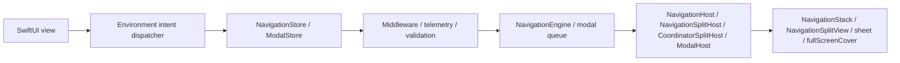
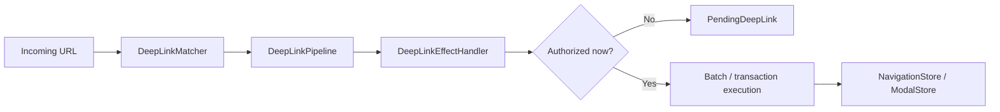

# InnoRouter

InnoRouter is a SwiftUI-native navigation framework built around typed state, explicit command execution, and app-boundary deep-link planning.

It treats navigation as a first-class state machine instead of a scattering of view-local side effects.

## What InnoRouter owns

InnoRouter is responsible for:

- stack navigation state through `RouteStack`
- command execution through `NavigationCommand` and `NavigationEngine`
- SwiftUI navigation authority through `NavigationStore`
- modal authority for `sheet` and `fullScreenCover` through `ModalStore`
- deep-link matching and planning through `DeepLinkMatcher` and `DeepLinkPipeline`
- app-boundary execution helpers through `InnoRouterNavigationEffects` and `InnoRouterDeepLinkEffects`

It is intentionally not a general application state machine.

Keep these concerns outside InnoRouter:

- business workflow state
- authentication/session lifecycle
- networking retry or transport state
- alerts and confirmation dialogs

## Requirements

- iOS 18+
- iPadOS 18+
- macOS 15+
- tvOS 18+
- watchOS 11+
- visionOS 2+
- Swift 6.2+

## Platform support

InnoRouter ships on every Apple platform through SwiftUI. No UIKit or
AppKit bridge modules are required.

| Capability | iOS | iPadOS | macOS | tvOS | watchOS | visionOS |
|---|---|---|---|---|---|---|
| `NavigationStore` / `NavigationHost` / `FlowStore` / `FlowHost` | ✅ | ✅ | ✅ | ✅ | ✅ | ✅ |
| `NavigationSplitHost` / `CoordinatorSplitHost` | ✅ | ✅ | ✅ | ✅ | ❌ | ✅ |
| `ModalHost` `.sheet` | ✅ | ✅ | ✅ | ✅ | ✅ | ✅ |
| `ModalHost` `.fullScreenCover` native | ✅ | ✅ | ⚠ degrades | ✅ | ⚠ degrades | ⚠ degrades |
| `TabCoordinator.badge` | ✅ | ✅ | ✅ | ❌ | ❌ | ✅ |
| `DeepLinkPipeline` / `FlowDeepLinkPipeline` | ✅ | ✅ | ✅ | ✅ | ✅ | ✅ |
| `SceneStore` / `SceneHost` (windows, volumetric, immersive) | — | — | — | — | — | ✅ |
| `innoRouterOrnament(_:content:)` view modifier | no-op | no-op | no-op | no-op | no-op | ✅ |

`⚠ degrades` means the store API accepts the request unchanged but the
SwiftUI host renders it as a `.sheet` because `.fullScreenCover` is
unavailable. `❌` means the symbol is not declared on that platform;
build it behind `#if !os(...)`.

## Installation

```swift
dependencies: [
    .package(url: "https://github.com/InnoSquadCorp/InnoRouter.git", from: "3.0.0")
]
```

## Upgrading to 3.0.0

**3.0.0 is the first public release of InnoRouter.** There is no
public 1.x or 2.x lineage to migrate from — `3.0.0` is the baseline.
The leading-digit `3` reflects internal milestone history, not a
breaking change against any previously shipped public package.

### SemVer commitment for the 3.x line

Within `3.x.y` releases, InnoRouter follows
[Semantic Versioning](https://semver.org/) strictly:

- **`3.x.y` → `3.x.(y+1)`** patch releases: bug fixes only. No
  public-API signature changes. No observable behavior changes other
  than fixing the documented bug.
- **`3.x.y` → `3.(x+1).0`** minor releases: additive only. New types,
  new methods, new cases, new configuration options. Existing
  signatures keep their shape and existing call sites keep compiling
  unmodified.
- **`3.x.y` → `4.0.0`** major releases: anything that breaks source
  compatibility, removes a public symbol, narrows a generic
  constraint, or changes documented runtime behavior in a way that
  can surprise existing call sites.

Pre-release tags use the `3.1.0-rc.1` / `3.2.0-beta.2` form. The
release workflow's `^[0-9]+\.[0-9]+\.[0-9]+$` regex only accepts
final tags; pre-release tags ship through a separate manual flow
documented in [`RELEASING.md`](RELEASING.md).

### What counts as a breaking change

For the purposes of the 3.x SemVer commitment, a *breaking change*
means any of:

- Removing or renaming a public symbol (type, method, property,
  associated type, case).
- Changing a public method signature in a way that fails to compile
  for an existing call site (adding a non-defaulted parameter,
  tightening a generic constraint, swapping return type).
- Changing the documented behavior of a public API such that an
  existing correct caller produces a different observable outcome
  (e.g., flipping a default `NavigationPathMismatchPolicy`).
- Raising the minimum supported Swift toolchain or platform floor.

Conversely, the following are *not* breaking and may land in any
minor release:

- Adding new cases to a non-`@frozen` public enum.
- Adding new defaulted parameters to a public method.
- Tightening internal-only types.
- Performance improvements that preserve semantics.
- Doc-only changes.

The full pre-release sweep that landed in 3.0.0 is summarized in
[`CHANGELOG.md`](CHANGELOG.md).

### Imports

The umbrella target `InnoRouter` re-exports everything except the
macros product. `@Routable` / `@CasePathable` require an explicit
`import InnoRouterMacros` — the umbrella deliberately skips that
re-export so non-macro files don't pay the macro-plugin resolution
cost:

```swift
import InnoRouter            // stores, hosts, intents, deep links, scenes
import InnoRouterMacros      // only in files that use @Routable / @CasePathable
```

`@EnvironmentNavigationIntent`, `@EnvironmentModalIntent`, and every
other property-wrapper or view modifier come from `InnoRouter`, not
from `InnoRouterMacros`.

The SwiftSyntax-backed macro implementation remains in this package
for 3.0.0. A package-traits or separate-macro-package split should be
evaluated only after measuring `swift package show-traits`,
`swift build --target InnoRouter`, and
`swift build --target InnoRouterMacros` against the migration cost.

| Product | Import when |
|---|---|
| `InnoRouter` | App code that needs stores, hosts, intents, coordinators, deep links, scenes, or persistence helpers. |
| `InnoRouterMacros` | Only files that use `@Routable` or `@CasePathable`. |
| `InnoRouterNavigationEffects` | App-boundary code that executes `NavigationCommand` values outside a SwiftUI view. |
| `InnoRouterDeepLinkEffects` | App-boundary code that handles or resumes pending deep links. |
| `InnoRouterEffects` | Compatibility import when both effect modules should be re-exported together. |
| `InnoRouterTesting` | Test targets that want host-less `NavigationTestStore`, `ModalTestStore`, or `FlowTestStore`. |

## Modules

- `InnoRouter`: umbrella re-export of `InnoRouterCore`, `InnoRouterSwiftUI`, and `InnoRouterDeepLink`
- `InnoRouterCore`: route stack, validators, commands, results, batch/transaction executors, middleware
- `InnoRouterSwiftUI`: stores, stack/split/modal hosts, coordinators, environment intent dispatch
- `InnoRouterDeepLink`: pattern matching, diagnostics, pipeline planning, pending deep links
- `InnoRouterNavigationEffects`: synchronous `@MainActor` execution helpers for app boundaries
- `InnoRouterDeepLinkEffects`: deep-link execution helpers layered on navigation effects
- `InnoRouterEffects`: compatibility umbrella for both effect modules
- `InnoRouterMacros`: `@Routable` and `@CasePathable`

## Choosing the right surface

Use the smallest surface that owns the transition authority you need:

| Need | Use |
|---|---|
| One typed SwiftUI stack | `NavigationStore` + `NavigationHost` |
| Split-view stack on supported platforms | `NavigationStore` + `NavigationSplitHost` |
| Sheet / cover authority without stack resets | `ModalStore` + `ModalHost` |
| Push + modal flows, restoration, or multi-step deep links | `FlowStore` + `FlowHost` + `FlowPlan` |
| URL to push-only command plan | `DeepLinkMatcher` + `DeepLinkPipeline` |
| URL to push-prefix plus modal-tail flow | `FlowDeepLinkMatcher` + `FlowDeepLinkPipeline` |
| visionOS windows, volumes, immersive spaces | `SceneStore` + `SceneHost` / `SceneAnchor` |
| Reducer, effect, or app-boundary execution | `InnoRouterNavigationEffects` / `InnoRouterDeepLinkEffects` |
| Router assertions without SwiftUI hosts | `InnoRouterTesting` |

`NavigationStore`, `FlowStore`, `ModalStore`, `SceneStore`, effects,
and testing are intentionally separate. The library keeps these
authorities explicit so apps can adopt only the pieces that match
their routing boundary.

## Documentation

- Latest DocC portal: [InnoRouter latest docs](https://innosquadcorp.github.io/InnoRouter/latest/)
- Versioned docs root: [InnoRouter docs](https://innosquadcorp.github.io/InnoRouter/)
- Release checklist: [RELEASING.md](RELEASING.md)
- Maintainer quick guide: [CLAUDE.md](CLAUDE.md)

`README.md` is the repository entry point.  
DocC is the detailed module-level reference set.

### Tutorial articles

Step-by-step walkthroughs for the most common adoption paths. Each
article lives inside the relevant DocC catalog so the rendered DocC
site, the GitHub source view, and an offline `swift package
generate-documentation` build all show the same content.

| Article | Catalog | Covers |
| --- | --- | --- |
| [Tutorial-LoginOnboarding](Sources/InnoRouterSwiftUI/InnoRouterSwiftUI.docc/Articles/Tutorial-LoginOnboarding.md) | `InnoRouterSwiftUI` | Building a login → onboarding → home flow with `FlowStore` and `ChildCoordinator` |
| [Tutorial-DeepLinkReconciliation](Sources/InnoRouterSwiftUI/InnoRouterSwiftUI.docc/Articles/Tutorial-DeepLinkReconciliation.md) | `InnoRouterSwiftUI` | Reconciling cold-start vs warm deep links, including pending replay |
| [Tutorial-MiddlewareComposition](Sources/InnoRouterSwiftUI/InnoRouterSwiftUI.docc/Articles/Tutorial-MiddlewareComposition.md) | `InnoRouterSwiftUI` | Composing typed middleware, intercepting commands, observing churn |
| [Tutorial-MigratingFromNestedHosts](Sources/InnoRouterSwiftUI/InnoRouterSwiftUI.docc/Articles/Tutorial-MigratingFromNestedHosts.md) | `InnoRouterSwiftUI` | Replacing nested `NavigationHost` + `ModalHost` stacks with `FlowHost` |
| [Tutorial-Throttling](Sources/InnoRouterSwiftUI/InnoRouterSwiftUI.docc/Articles/Tutorial-Throttling.md) | `InnoRouterSwiftUI` | Using `ThrottleNavigationMiddleware` with deterministic test clocks |
| [Tutorial-StoreObserver](Sources/InnoRouterSwiftUI/InnoRouterSwiftUI.docc/Articles/Tutorial-StoreObserver.md) | `InnoRouterSwiftUI` | Adopting `StoreObserver` over the unified `events` stream |
| [Tutorial-VisionOSScenes](Sources/InnoRouterSwiftUI/InnoRouterSwiftUI.docc/Articles/Tutorial-VisionOSScenes.md) | `InnoRouterSwiftUI` | Driving visionOS windows, volumetric scenes, and immersive spaces from `SceneStore` |
| [Tutorial-FlowDeepLinkPipeline](Sources/InnoRouterDeepLink/InnoRouterDeepLink.docc/Articles/Tutorial-FlowDeepLinkPipeline.md) | `InnoRouterDeepLink` | Building composite push + modal deep links through `FlowDeepLinkPipeline` |
| [Tutorial-StatePersistence](Sources/InnoRouterCore/InnoRouterCore.docc/Tutorial-StatePersistence.md) | `InnoRouterCore` | Persisting `FlowPlan` / `RouteStack` across launches with `StatePersistence` |
| [Tutorial-TestingFlows](Sources/InnoRouterTesting/InnoRouterTesting.docc/Articles/Tutorial-TestingFlows.md) | `InnoRouterTesting` | Host-less Swift Testing assertions via `FlowTestStore` |

## How it works

### Runtime flow



- Views emit typed intent through environment dispatchers.
- Stores own navigation or modal authority.
- Hosts translate store state into native SwiftUI navigation APIs.

### Deep-link flow



- Matching and planning stay pure.
- Effect handlers are the boundary where app policy decides whether to execute now or defer.
- Pending deep links preserve the planned transition until the app is ready to replay it.

## Quick Start

### 1. Define a route

Without macros:

```swift
import InnoRouter

enum HomeRoute: Route {
    case list
    case detail(id: String)
    case settings
}
```

With macros:

```swift
import InnoRouter
import InnoRouterMacros

@Routable
enum HomeRoute {
    case list
    case detail(id: String)
    case settings
}
```

### 2. Create a `NavigationStore`

```swift
import InnoRouter
import OSLog

let store = try NavigationStore<HomeRoute>(
    initialPath: [.list],
    configuration: NavigationStoreConfiguration(
        routeStackValidator: .nonEmpty.combined(with: .rooted(at: .list)),
        logger: Logger(subsystem: "com.example.app", category: "navigation")
    )
)
```

### 3. Host it in SwiftUI

```swift
import SwiftUI
import InnoRouter

struct AppRoot: View {
    @State private var store = try! NavigationStore<HomeRoute>(
        initialPath: [.list]
    )

    var body: some View {
        NavigationHost(store: store) { route in
            switch route {
            case .list:
                HomeListView()
            case .detail(let id):
                DetailView(id: id)
            case .settings:
                SettingsView()
            }
        } root: {
            HomeListView()
        }
    }
}
```

### 4. Emit intent from a child view

```swift
struct HomeListView: View {
    @EnvironmentNavigationIntent(HomeRoute.self) private var navigationIntent

    var body: some View {
        List {
            Button("Detail") {
                navigationIntent.send(.go(.detail(id: "123")))
            }

            Button("Settings") {
                navigationIntent.send(.go(.settings))
            }

            Button("Back") {
                navigationIntent.send(.back)
            }
        }
    }
}
```

Views should emit intent. They should not hold direct mutation authority over the router state.

## State and execution model

InnoRouter exposes three distinct execution semantics.

### Single command

`execute(_:)` applies one `NavigationCommand` and returns a typed `NavigationResult`.

### Batch

`executeBatch(_:stopOnFailure:)` preserves per-step command execution but coalesces observation.

Use batch execution when:

- multiple commands should still run one-by-one
- middleware should still see each step
- observers should still receive one aggregated transition event

### Transaction

`executeTransaction(_:)` previews commands on a shadow stack and commits only if every step succeeds.

Use transaction execution when:

- partial success is not acceptable
- you want rollback on failure or cancellation
- one all-or-nothing commit event matters more than step-by-step observation

### `.sequence`

`.sequence` is command algebra, not a transaction.

It is intentionally:

- left-to-right
- non-atomic
- typed through `NavigationResult.multiple`

Earlier successful steps stay applied even if a later step fails.

### `send(_:)` vs `execute(_:)` — picking the right entry point

InnoRouter exposes navigation through four entry points layered by purpose.
Pick the one that matches the call site, not the one that matches the data
shape.

| Layer        | Entry                              | Use when                                                                                          |
| ------------ | ---------------------------------- | ------------------------------------------------------------------------------------------------- |
| View intent  | `store.send(_:)`                   | Dispatching a named `NavigationIntent` from a SwiftUI view (`go`, `back`, `backToRoot`, …).       |
| Command      | `store.execute(_:)`                | Forwarding a single `NavigationCommand` to the engine and inspecting the typed `NavigationResult`. |
| Batch        | `store.executeBatch(_:)`           | Running multiple commands one-by-one while keeping middleware visibility and a single observer event. |
| Transaction  | `store.executeTransaction(_:)`     | Committing all-or-nothing — preview against a shadow stack, then commit only if every step succeeds. |

Rule of thumb:

- Views send. Coordinators and effect boundaries execute.
- `send` is intent-shaped (no return value to inspect); `execute*` is
  command-shaped (returns a typed result for branching, telemetry, retries).
- For atomic multi-step flows that must roll back on partial failure, prefer
  `executeTransaction` over hand-rolled batches.

The same layering applies to `ModalStore` and `FlowStore`:
`send(_: ModalIntent)` / `send(_: FlowIntent)` from views, and
`execute(_:)` / `executeBatch(_:)` / `executeTransaction(_:)` at the engine
boundary.

## Stack routing surface

`NavigationIntent` is the official SwiftUI stack-intent surface:

- `.go(Route)`
- `.goMany([Route])`
- `.back`
- `.backBy(Int)`
- `.backTo(Route)`
- `.backToRoot`
- `.resetTo([Route])`

`NavigationStore.send(_:)` is the SwiftUI entry point for these intents.

## Modal routing surface

InnoRouter supports modal routing for:

- `sheet`
- `fullScreenCover`

Use:

- `ModalStore`
- `ModalHost`
- `ModalIntent`
- `@EnvironmentModalIntent`

Example:

```swift
@Routable
enum AppModalRoute {
    case profile
    case onboarding
}

struct ShellView: View {
    @State private var modalStore = ModalStore<AppModalRoute>()

    var body: some View {
        ModalHost(store: modalStore) { route in
            switch route {
            case .profile:
                ProfileView()
            case .onboarding:
                OnboardingView()
            }
        } content: {
            HomeView()
        }
    }
}
```

### Modal scope boundary

On iOS and tvOS, `ModalHost` maps styles directly to `sheet` and `fullScreenCover`.
On other supported platforms, `fullScreenCover` safely degrades to `sheet`.

InnoRouter intentionally does **not** own:

- `alert`
- `confirmationDialog`

Keep those as feature-local or coordinator-local presentation state.

### Modal observability

`ModalStoreConfiguration` provides lightweight lifecycle hooks:

- `logger`
- `onPresented`
- `onDismissed`
- `onQueueChanged`
- `onMiddlewareMutation`
- `onCommandIntercepted`

`ModalDismissalReason` distinguishes:

- `.dismiss`
- `.dismissAll`
- `.systemDismiss`

### Modal middleware

`ModalStore` exposes the same middleware surface as `NavigationStore`:

- `ModalMiddleware` / `AnyModalMiddleware<M>` with `willExecute` / `didExecute`.
- `ModalInterception` lets middleware `.proceed(command)` (including
  rewritten commands) or `.cancel(reason:)` with a
  `ModalCancellationReason`.
- `ModalStore.addMiddleware` / `insertMiddleware` / `removeMiddleware` /
  `replaceMiddleware` / `moveMiddleware` — handle-based CRUD matching
  navigation.
- `execute(_:) -> ModalExecutionResult<M>` routes all `.present`,
  `.dismissCurrent`, and `.dismissAll` commands through the registry.
- `ModalMiddlewareMutationEvent` surfaces registry churn for analytics.

## Split navigation

For iPad and macOS detail navigation, use:

- `NavigationSplitHost`
- `CoordinatorSplitHost`

InnoRouter owns only the detail stack in split layouts.

These remain app-owned:

- sidebar selection
- column visibility
- compact adaptation

## Coordinator surface

Coordinators are policy objects that sit between SwiftUI intent and command execution.

Use `CoordinatorHost` or `CoordinatorSplitHost` when:

- view intent needs policy routing first
- app shells need coordination logic
- multiple navigation authorities should be composed behind one coordinator

`FlowCoordinator` and `TabCoordinator` are helpers, not replacements for `NavigationStore`.

Recommended division:

- `NavigationStore`: route-stack authority
- `TabCoordinator`: shell/tab selection state
- `FlowCoordinator`: local step progression inside a destination

### Child coordinator chaining

`ChildCoordinator` lets a parent coordinator await a finish value inline
through `parent.push(child:) -> Task<Child.Result?, Never>`:

```swift
let signupResult = await parentCoordinator.push(child: SignUpCoordinator())
if let user = signupResult {
    parentCoordinator.handle(.go(.home(user)))
}
```

Callbacks (`onFinish`, `onCancel`) are installed synchronously so the
child can fire them at any point, including before the parent's
`await`. See [`Docs/design-child-coordinator-handoff.md`](Docs/design-child-coordinator-handoff.md)
for the design rationale.

Parent `Task` cancellation propagates to the child through
`ChildCoordinator.parentDidCancel()` (default empty no-op). Override
it to tear down transient state — dismiss sheets, cancel in-flight
requests, release temporary stores — when the parent view is
dismissed:

```swift
final class SignUpCoordinator: ChildCoordinator {
    typealias Result = UserID
    var onFinish: (@MainActor @Sendable (UserID) -> Void)?
    var onCancel: (@MainActor @Sendable () -> Void)?

    func parentDidCancel() {
        signUpAPIClient.cancelActiveRequests()
    }
}
```

`parentDidCancel` is directional (parent → child). It does not
invoke `onCancel` (which stays child → parent); the two hooks are
orthogonal.

## Named navigation intents

High-frequency intents compose from existing `NavigationCommand`
primitives:

- `NavigationIntent.replaceStack([R])` — reset the stack to the given
  routes in one observable step.
- `NavigationIntent.backOrPush(R)` — pop to `route` if it already
  exists in the stack, otherwise push it.
- `NavigationIntent.pushUniqueRoot(R)` — push only if the stack does
  not already contain an equal route.

These route through the normal `send` → `execute` pipeline so middleware
and telemetry observe them identically to direct `NavigationCommand`
calls.

## Case-typed destination bindings

`NavigationStore` and `ModalStore` expose `binding(case:)` helpers keyed
by the `CasePath` emitted by `@Routable` / `@CasePathable`:

```swift
struct DetailSheet: View {
    @Environment(\.navigationStore) private var store: NavigationStore<AppRoute>

    var body: some View {
        SomeDetailView()
            .sheet(item: store.binding(case: \AppRoute.detail)) { detail in
                DetailView(detail: detail)
            }
    }
}
```

Bindings route every set through the existing command pipeline so
middleware and telemetry observe them exactly as they do direct
`execute(...)` calls. `ModalStore.binding(case:style:)` is scoped per
presentation style (`.sheet` / `.fullScreenCover`).

## Deep-link model

Deep links are handled as plans, not hidden side effects.

Core pieces:

- `DeepLinkMatcher`
- `DeepLinkPipeline`
- `DeepLinkDecision`
- `PendingDeepLink`
- `NavigationPlan`

Typical flow:

1. match a URL into a route
2. reject or accept by scheme/host
3. apply auth policy
4. emit `.plan`, `.pending`, `.rejected`, or `.unhandled`
5. execute the resulting navigation plan explicitly

### Matcher diagnostics

`DeepLinkMatcher` and `FlowDeepLinkMatcher` can report:

- duplicate patterns
- wildcard shadowing
- parameter shadowing

Diagnostics do not change declaration-order precedence. They help catch authoring mistakes without silently changing runtime behavior.

### Composite deep links (push + modal tail)

`FlowDeepLinkPipeline` extends the push-only pipeline so a single URL
can rehydrate a push prefix **plus** a modal terminal step in one
atomic `FlowStore.apply(_:)`:

```swift
let matcher = FlowDeepLinkMatcher<AppRoute> {
    FlowDeepLinkMapping("/home/detail/:id") { params in
        guard let id = params.firstValue(forName: "id") else { return nil }
        return FlowPlan(steps: [.push(.home), .push(.detail(id: id))])
    }
    FlowDeepLinkMapping("/onboarding/privacy") { _ in
        FlowPlan(steps: [.sheet(.privacyPolicy)])
    }
}

let pipeline = FlowDeepLinkPipeline(
    allowedSchemes: ["myapp"],
    allowedHosts: ["app"],
    matcher: matcher,
    authenticationPolicy: .required(
        shouldRequireAuthentication: { _ in true },
        isAuthenticated: { SessionStore.shared.isAuthenticated }
    )
)

let handler = FlowDeepLinkEffectHandler(pipeline: pipeline, applier: flowStore)

FlowHost(store: flowStore, destination: destination) { RootView() }
    .onOpenURL { _ = handler.handle($0) }
```

Each `FlowDeepLinkMapping` handler returns a **complete** `FlowPlan`,
so multi-segment URLs are explicit at the declaration site. The
pipeline reuses `DeepLinkAuthenticationPolicy` + `PendingDeepLink`
semantics from the push-only pipeline for symmetric authentication
deferral and replay. See
[`Sources/InnoRouterDeepLink/InnoRouterDeepLink.docc/Articles/Tutorial-FlowDeepLinkPipeline.md`](Sources/InnoRouterDeepLink/InnoRouterDeepLink.docc/Articles/Tutorial-FlowDeepLinkPipeline.md)
for the full walk-through.

## Middleware

Middleware provides a cross-cutting policy layer around command execution.

Pre-execution:

- `willExecute(_:state:) -> NavigationInterception`
- `.proceed(updatedCommand)`
- `.cancel(reason)`

Post-execution:

- `didExecute(_:result:state:) -> NavigationResult`

Middleware can:

- rewrite commands
- block execution with typed cancellation reasons
- fold results after execution

Middleware cannot mutate store state directly.

### Typed cancellation

Cancellation reasons use `NavigationCancellationReason`:

- `.middleware(debugName:command:)`
- `.conditionFailed`
- `.custom(String)`

### Middleware management

`NavigationStore` exposes handle-based management:

- `addMiddleware`
- `insertMiddleware`
- `removeMiddleware`
- `replaceMiddleware`
- `moveMiddleware`
- `middlewareMetadata`

## Path reconciliation

SwiftUI `NavigationStack(path:)` updates are mapped back into semantic commands.

Rules:

- prefix shrink -> `.popCount` or `.popToRoot`
- prefix expand -> batched `.push`
- non-prefix mismatch -> `NavigationPathMismatchPolicy`

Available mismatch policies:

- `.replace`
- `.assertAndReplace`
- `.ignore`
- `.custom`

When `NavigationStoreConfiguration.logger` is set, mismatch handling emits structured telemetry.

## Effect modules

### `InnoRouterNavigationEffects`

Use this when app-shell code wants a small execution façade over a navigator boundary.

Key API:

- `execute(_:)`
- `execute(_ commands:)`
- `executeTransaction(_:)`
- `executeGuarded(_:, prepare:)`

These APIs are synchronous `@MainActor` APIs, except the explicit async guard helper.

### `InnoRouterDeepLinkEffects`

Use this when deep-link plans should be executed at an app boundary with typed outcomes.

Key API:

- `handle(_ url:)`
- `resumePendingDeepLink()`
- `resumePendingDeepLinkIfAllowed(_:)`

### Umbrella `DeepLinkCoordinating`

Coordinators that adopt `DeepLinkCoordinating` get the same typed-outcome
surface through `DeepLinkCoordinationOutcome<Route>`. Pipeline refusals
(`rejected`, `unhandled`) and resume states (`pending`, `executed`,
`noPendingDeepLink`) are all observable without peeking at stack state.

- `handleDeepLink(_:) -> DeepLinkCoordinationOutcome<Route>`
- `resumePendingDeepLinkIfPossible() -> DeepLinkCoordinationOutcome<Route>`
- `resumePendingDeepLinkIfAllowed(_:) async -> DeepLinkCoordinationOutcome<Route>`

## `Examples` vs `ExamplesSmoke`

The repository intentionally separates documentation examples from CI examples.

- `Examples/`: human-facing, idiomatic, macro-based examples
- `ExamplesSmoke/`: compiler-stable smoke fixtures for CI

Current examples cover:

- standalone stack routing
- coordinator routing
- deep links
- split navigation
- app shell composition
- modal routing

## Docs and release flow

### DocC

DocC is built per module and published to GitHub Pages.

Published structure:

- `/InnoRouter/latest/`
- `/InnoRouter/3.0.0/`
- `/InnoRouter/` root portal

### CI

CI validates:

- `swift test`
- `principle-gates`
- example smoke builds
- DocC preview build

### CD

CD runs on bare semver tags only:

- `3.0.0`

Invalid tag examples:

- any tag with a leading `v`
- `release-3.0.0`

Release workflow responsibilities:

- rerun code/documentation gates
- build versioned DocC
- update `/latest/`
- preserve older versioned docs
- publish GitHub Release

### SwiftUI Philosophy Alignment

InnoRouter follows SwiftUI’s declarative direction while making deliberate trade-offs for shared navigation authority.

- Views emit intent instead of directly mutating router state.
- Stack, split-detail, and modal authorities stay separate.
- Missing environment wiring fails fast.
- `NavigationStore` remains a reference type because it is shared authority, not ephemeral local state.
- `Coordinator` remains `AnyObject` for the same reason.

This is an intentional pragmatic trade-off, not an accidental drift away from SwiftUI.

## Examples

Human-facing examples live here:

- [Examples/StandaloneExample.swift](https://github.com/InnoSquadCorp/InnoRouter/blob/main/Examples/StandaloneExample.swift)
- [Examples/CoordinatorExample.swift](https://github.com/InnoSquadCorp/InnoRouter/blob/main/Examples/CoordinatorExample.swift)
- [Examples/DeepLinkExample.swift](https://github.com/InnoSquadCorp/InnoRouter/blob/main/Examples/DeepLinkExample.swift)
- [Examples/SplitCoordinatorExample.swift](https://github.com/InnoSquadCorp/InnoRouter/blob/main/Examples/SplitCoordinatorExample.swift)
- [Examples/AppShellExample.swift](https://github.com/InnoSquadCorp/InnoRouter/blob/main/Examples/AppShellExample.swift)

## Quality gates

Run these locally before cutting a release:

```bash
swift test
./scripts/principle-gates.sh
./scripts/build-docc-site.sh --version preview
```

## Flow stack

`FlowStore<R>` represents a unified push + sheet + cover flow as a
single array of `RouteStep<R>` values. It owns an inner
`NavigationStore<R>` and `ModalStore<R>`, delegating to each while
enforcing invariants (one trailing modal at most, modal always at the
tail, middleware rollbacks reconcile the path).

Typical usage:

```swift
let flow = FlowStore<AppRoute>()

flow.send(.push(.home))
flow.send(.push(.detail(id)))
flow.send(.presentSheet(.share))   // tail modal
flow.apply(FlowPlan(steps: [.push(.home), .cover(.paywall)]))
```

- `FlowHost` composes `ModalHost` over `NavigationHost` and injects an
  `AnyFlowIntentDispatcher<R>` for `@EnvironmentFlowIntent(Route.self)`
  dispatch.
- `FlowStoreConfiguration` composes `NavigationStoreConfiguration` and
  `ModalStoreConfiguration`, adding `onPathChanged` and
  `onIntentRejected`.
- `FlowRejectionReason` surfaces invariant violations
  (`pushBlockedByModalTail`, `invalidResetPath`,
  `middlewareRejected(debugName:)`).

## Host-less testing (`InnoRouterTesting`)

`InnoRouterTesting` is a shippable Swift-Testing-native assertion
harness that wraps `NavigationStore`, `ModalStore`, and `FlowStore`.
Tests no longer need `@testable import InnoRouterSwiftUI` or
hand-rolled `Mutex<[Event]>` collectors — every public observation
callback is buffered into a FIFO queue, and tests drain it with
TCA-style `receive(...)` calls.

Add the product to the test target only:

```swift
// Package.swift
.testTarget(
    name: "AppTests",
    dependencies: [
        .product(name: "InnoRouter", package: "InnoRouter"),
        .product(name: "InnoRouterTesting", package: "InnoRouter"),
    ]
)
```

Then author tests against the production intents:

```swift
import Testing
import InnoRouter
import InnoRouterTesting

@Test
@MainActor
func pushHomeThenDetail() {
    let store = NavigationTestStore<AppRoute>()

    store.send(.go(.home))
    store.receiveChange { _, new in new.path == [.home] }

    store.executeBatch([.push(.detail("42"))])
    store.receiveChange { _, new in new.path == [.home, .detail("42")] }
    store.receiveBatch { $0.isSuccess }

    store.expectNoMoreEvents()
}
```

What the harness covers:

- **`NavigationTestStore<R>`** — `onChange`, `onBatchExecuted`,
  `onTransactionExecuted`, `onMiddlewareMutation`, and
  `onPathMismatch`. Forwards `send`, `execute`, `executeBatch`,
  `executeTransaction` to the underlying store unchanged.
- **`ModalTestStore<M>`** — `onPresented`, `onDismissed`,
  `onQueueChanged`, `onCommandIntercepted`, `onMiddlewareMutation`.
- **`FlowTestStore<R>`** — FlowStore-level
  `onPathChanged` + `onIntentRejected`, plus `.navigation(...)` and
  `.modal(...)` wrappers around the inner store emissions on a
  single queue. One test can assert the complete chain triggered by
  a single `FlowIntent`, including middleware cancellation paths.

Exhaustivity defaults to `.strict`: any unasserted event at store
deinit fires a Swift Testing issue. Use `.off` for incremental
migrations from legacy test fixtures.

## State restoration

Routes that opt into `Codable` get round-trippable `RouteStack`,
`RouteStep`, and `FlowPlan` values for free:

```swift
enum AppRoute: Route, Codable {
    case home
    case detail(String)
    case settings
}

let persistence = StatePersistence<AppRoute>()

// On scene background / checkpoint:
let data = try persistence.encode(FlowPlan(steps: flowStore.path))
try data.write(to: restorationURL, options: .atomic)

// On launch:
if let data = try? Data(contentsOf: restorationURL) {
    flowStore.apply(try persistence.decode(data))
}
```

`StatePersistence<R: Route & Codable>` wraps a `JSONEncoder` and
`JSONDecoder` (both configurable) and stops at the `Data`
boundary — file URLs, `UserDefaults`, iCloud, and scene-phase
hooks are app concerns. Errors propagate as the underlying
`EncodingError` / `DecodingError` so callers can distinguish
schema drift from I/O failures.

## Unified observation stream

Every store publishes a single `events: AsyncStream` that covers
the complete observation surface — stack changes, batch /
transaction completions, path-mismatch resolutions,
middleware-registry mutations, modal present / dismiss / queue
updates, command interceptions, and flow-level path or
intent-rejection signals.

```swift
Task {
    for await event in flowStore.events {
        switch event {
        case .navigation(.changed(_, let to)):
            analytics.track("nav_path", to.path)
        case .modal(.commandIntercepted(_, .cancelled(let reason))):
            Log.warning("modal cancelled: \(reason)")
        case .intentRejected(let intent, let reason):
            Log.info("flow rejected \(intent) because \(reason)")
        default:
            continue
        }
    }
}
```

Individual `onChange`, `onPresented`, `onCommandIntercepted`, etc.
callbacks on each `*Configuration` type remain source-compatible;
the `events` stream is an additional channel, not a replacement.

## Roadmap

Tracked in
[`Docs/competitive-analysis-and-roadmap.md`](Docs/competitive-analysis-and-roadmap.md).
With the P3 polish cluster shipped, the P0 / P1 / P3 backlog is
empty. **3.0.0 release candidate.** See
[`CHANGELOG.md`](CHANGELOG.md) for the full 3.0.0 surface.

- [x] **P2-3 UIKit escape hatch** — declined for 3.0.0. InnoRouter
      keeps a SwiftUI-only positioning stance; teams that need
      UIKit / AppKit adapters can compose those surfaces outside
      InnoRouter.
- [ ] **`.debounce` NavigationCommand** — deferred from P3-4;
      needs Clock injection + deferred Task infrastructure
      outside the synchronous engine contract.

## Adopters

InnoRouter is at the start of its public adoption curve. If you
ship InnoRouter in production, please open a PR that appends your
project to the list below — a generic descriptor
(`a finance app at $company`) is fine if a public name is not yet
possible. Adopter signal helps prospective users gauge maturity.

- _Your project here._

## Contributing

See [`CONTRIBUTING.md`](CONTRIBUTING.md) for branching, commit
conventions, public-API change rules, and macro test requirements.
Security findings follow the private process in
[`SECURITY.md`](SECURITY.md). Participation is expected to follow
[`CODE_OF_CONDUCT.md`](CODE_OF_CONDUCT.md).

## License

MIT
