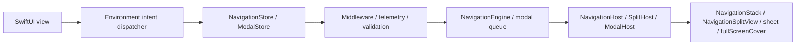
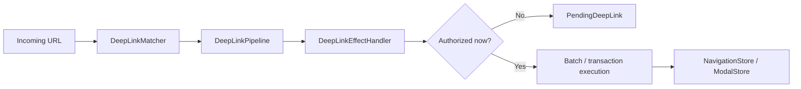

# InnoRouter

InnoRouter is a SwiftUI-native navigation framework built around typed state, explicit command execution, and app-boundary deep-link planning.

It treats navigation as a first-class state machine instead of a scattering of view-local side effects.

## What InnoRouter owns

InnoRouter is responsible for:

- stack navigation state through `RouteStack`
- command execution through `NavigationCommand` and `NavigationEngine`
- SwiftUI navigation authority through `NavigationStore`
- modal authority for `sheet` and `fullScreenCover` through `ModalStore`
- deep-link matching and planning through `DeepLinkMatcher` and `DeepLinkPipeline`
- app-boundary execution helpers through `InnoRouterNavigationEffects` and `InnoRouterDeepLinkEffects`

It is intentionally not a general application state machine.

Keep these concerns outside InnoRouter:

- business workflow state
- authentication/session lifecycle
- networking retry or transport state
- alerts and confirmation dialogs

## Requirements

- iOS 18+
- macOS 15+
- tvOS 18+
- watchOS 11+
- Swift 6.2+

## Installation

```swift
dependencies: [
    .package(url: "https://github.com/InnoSquadCorp/InnoRouter.git", from: "3.0.0")
]
```

## Modules

- `InnoRouter`: umbrella re-export of `InnoRouterCore`, `InnoRouterSwiftUI`, and `InnoRouterDeepLink`
- `InnoRouterCore`: route stack, validators, commands, results, batch/transaction executors, middleware
- `InnoRouterSwiftUI`: stores, stack/split/modal hosts, coordinators, environment intent dispatch
- `InnoRouterDeepLink`: pattern matching, diagnostics, pipeline planning, pending deep links
- `InnoRouterNavigationEffects`: synchronous `@MainActor` execution helpers for app boundaries
- `InnoRouterDeepLinkEffects`: deep-link execution helpers layered on navigation effects
- `InnoRouterEffects`: compatibility umbrella for both effect modules
- `InnoRouterMacros`: `@Routable` and `@CasePathable`

## Documentation

- Latest DocC portal: [InnoRouter latest docs](https://innosquadcorp.github.io/InnoRouter/latest/)
- Versioned docs root: [InnoRouter docs](https://innosquadcorp.github.io/InnoRouter/)
- Release checklist: [RELEASING.md](RELEASING.md)
- Maintainer quick guide: [CLAUDE.md](CLAUDE.md)

`README.md` is the repository entry point.  
DocC is the detailed module-level reference set.

## How it works

### Runtime flow



- Views emit typed intent through environment dispatchers.
- Stores own navigation or modal authority.
- Hosts translate store state into native SwiftUI navigation APIs.

### Deep-link flow



- Matching and planning stay pure.
- Effect handlers are the boundary where app policy decides whether to execute now or defer.
- Pending deep links preserve the planned transition until the app is ready to replay it.

## Quick Start

### 1. Define a route

Without macros:

```swift
import InnoRouter

enum HomeRoute: Route {
    case list
    case detail(id: String)
    case settings
}
```

With macros:

```swift
import InnoRouter
import InnoRouterMacros

@Routable
enum HomeRoute {
    case list
    case detail(id: String)
    case settings
}
```

### 2. Create a `NavigationStore`

```swift
import InnoRouter
import OSLog

let store = try NavigationStore<HomeRoute>(
    initialPath: [.list],
    configuration: NavigationStoreConfiguration(
        routeStackValidator: .nonEmpty.combined(with: .rooted(at: .list)),
        logger: Logger(subsystem: "com.example.app", category: "navigation")
    )
)
```

### 3. Host it in SwiftUI

```swift
import SwiftUI
import InnoRouter

struct AppRoot: View {
    @State private var store = try! NavigationStore<HomeRoute>(
        initialPath: [.list]
    )

    var body: some View {
        NavigationHost(store: store) { route in
            switch route {
            case .list:
                HomeListView()
            case .detail(let id):
                DetailView(id: id)
            case .settings:
                SettingsView()
            }
        } root: {
            HomeListView()
        }
    }
}
```

### 4. Emit intent from a child view

```swift
struct HomeListView: View {
    @EnvironmentNavigationIntent(HomeRoute.self) private var navigationIntent

    var body: some View {
        List {
            Button("Detail") {
                navigationIntent.send(.go(.detail(id: "123")))
            }

            Button("Settings") {
                navigationIntent.send(.go(.settings))
            }

            Button("Back") {
                navigationIntent.send(.back)
            }
        }
    }
}
```

Views should emit intent. They should not hold direct mutation authority over the router state.

## State and execution model

InnoRouter exposes three distinct execution semantics.

### Single command

`execute(_:)` applies one `NavigationCommand` and returns a typed `NavigationResult`.

### Batch

`executeBatch(_:stopOnFailure:)` preserves per-step command execution but coalesces observation.

Use batch execution when:

- multiple commands should still run one-by-one
- middleware should still see each step
- observers should still receive one aggregated transition event

### Transaction

`executeTransaction(_:)` previews commands on a shadow stack and commits only if every step succeeds.

Use transaction execution when:

- partial success is not acceptable
- you want rollback on failure or cancellation
- one all-or-nothing commit event matters more than step-by-step observation

### `.sequence`

`.sequence` is command algebra, not a transaction.

It is intentionally:

- left-to-right
- non-atomic
- typed through `NavigationResult.multiple`

Earlier successful steps stay applied even if a later step fails.

## Stack routing surface

`NavigationIntent` is the official SwiftUI stack-intent surface:

- `.go(Route)`
- `.goMany([Route])`
- `.back`
- `.backBy(Int)`
- `.backTo(Route)`
- `.backToRoot`
- `.resetTo([Route])`

`NavigationStore.send(_:)` is the SwiftUI entry point for these intents.

## Modal routing surface

InnoRouter supports modal routing for:

- `sheet`
- `fullScreenCover`

Use:

- `ModalStore`
- `ModalHost`
- `ModalIntent`
- `@EnvironmentModalIntent`

Example:

```swift
@Routable
enum AppModalRoute {
    case profile
    case onboarding
}

struct ShellView: View {
    @State private var modalStore = ModalStore<AppModalRoute>()

    var body: some View {
        ModalHost(store: modalStore) { route in
            switch route {
            case .profile:
                ProfileView()
            case .onboarding:
                OnboardingView()
            }
        } content: {
            HomeView()
        }
    }
}
```

### Modal scope boundary

InnoRouter intentionally does **not** own:

- `alert`
- `confirmationDialog`

Keep those as feature-local or coordinator-local presentation state.

### Modal observability

`ModalStoreConfiguration` provides lightweight lifecycle hooks:

- `logger`
- `onPresented`
- `onDismissed`
- `onQueueChanged`

`ModalDismissalReason` distinguishes:

- `.dismiss`
- `.dismissAll`
- `.systemDismiss`

Unlike `NavigationStore`, modal routing intentionally does not expose middleware.

## Split navigation

For iPad and macOS detail navigation, use:

- `NavigationSplitHost`
- `CoordinatorSplitHost`

InnoRouter owns only the detail stack in split layouts.

These remain app-owned:

- sidebar selection
- column visibility
- compact adaptation

## Coordinator surface

Coordinators are policy objects that sit between SwiftUI intent and command execution.

Use `CoordinatorHost` or `CoordinatorSplitHost` when:

- view intent needs policy routing first
- app shells need coordination logic
- multiple navigation authorities should be composed behind one coordinator

`FlowCoordinator` and `TabCoordinator` are helpers, not replacements for `NavigationStore`.

Recommended division:

- `NavigationStore`: route-stack authority
- `TabCoordinator`: shell/tab selection state
- `FlowCoordinator`: local step progression inside a destination

## Deep-link model

Deep links are handled as plans, not hidden side effects.

Core pieces:

- `DeepLinkMatcher`
- `DeepLinkPipeline`
- `DeepLinkDecision`
- `PendingDeepLink`
- `NavigationPlan`

Typical flow:

1. match a URL into a route
2. reject or accept by scheme/host
3. apply auth policy
4. emit `.plan`, `.pending`, `.rejected`, or `.unhandled`
5. execute the resulting navigation plan explicitly

### Matcher diagnostics

`DeepLinkMatcher` can report:

- duplicate patterns
- wildcard shadowing
- parameter shadowing

Diagnostics do not change declaration-order precedence. They help catch authoring mistakes without silently changing runtime behavior.

## Middleware

Middleware provides a cross-cutting policy layer around command execution.

Pre-execution:

- `willExecute(_:state:) -> NavigationInterception`
- `.proceed(updatedCommand)`
- `.cancel(reason)`

Post-execution:

- `didExecute(_:result:state:) -> NavigationResult`

Middleware can:

- rewrite commands
- block execution with typed cancellation reasons
- fold results after execution

Middleware cannot mutate store state directly.

### Typed cancellation

Cancellation reasons use `NavigationCancellationReason`:

- `.middleware(debugName:command:)`
- `.conditionFailed`
- `.custom(String)`

### Middleware management

`NavigationStore` exposes handle-based management:

- `addMiddleware`
- `insertMiddleware`
- `removeMiddleware`
- `replaceMiddleware`
- `moveMiddleware`
- `middlewareMetadata`

## Path reconciliation

SwiftUI `NavigationStack(path:)` updates are mapped back into semantic commands.

Rules:

- prefix shrink -> `.popCount` or `.popToRoot`
- prefix expand -> batched `.push`
- non-prefix mismatch -> `NavigationPathMismatchPolicy`

Available mismatch policies:

- `.replace`
- `.assertAndReplace`
- `.ignore`
- `.custom`

When `NavigationStoreConfiguration.logger` is set, mismatch handling emits structured telemetry.

## Effect modules

### `InnoRouterNavigationEffects`

Use this when app-shell code wants a small execution façade over a navigator boundary.

Key API:

- `execute(_:)`
- `execute(_ commands:)`
- `executeTransaction(_:)`
- `executeGuarded(_:, prepare:)`

These APIs are synchronous `@MainActor` APIs, except the explicit async guard helper.

### `InnoRouterDeepLinkEffects`

Use this when deep-link plans should be executed at an app boundary with typed outcomes.

Key API:

- `handle(_ url:)`
- `resumePendingDeepLink()`
- `resumePendingDeepLinkIfAllowed(_:)`

## `Examples` vs `ExamplesSmoke`

The repository intentionally separates documentation examples from CI examples.

- `Examples/`: human-facing, idiomatic, macro-based examples
- `ExamplesSmoke/`: compiler-stable smoke fixtures for CI

Current examples cover:

- standalone stack routing
- coordinator routing
- deep links
- split navigation
- app shell composition
- modal routing

## Docs and release flow

### DocC

DocC is built per module and published to GitHub Pages.

Published structure:

- `/InnoRouter/latest/`
- `/InnoRouter/3.0.0/`
- `/InnoRouter/` root portal

### CI

CI validates:

- `swift test`
- `principle-gates`
- example smoke builds
- DocC preview build

### CD

CD runs on bare semver tags only:

- `3.0.0`

Invalid tag examples:

- any tag with a leading `v`
- `release-3.0.0`

Release workflow responsibilities:

- rerun code/documentation gates
- build versioned DocC
- update `/latest/`
- preserve older versioned docs
- publish GitHub Release

### SwiftUI Philosophy Alignment

InnoRouter follows SwiftUI’s declarative direction while making deliberate trade-offs for shared navigation authority.

- Views emit intent instead of directly mutating router state.
- Stack, split-detail, and modal authorities stay separate.
- Missing environment wiring fails fast.
- `NavigationStore` remains a reference type because it is shared authority, not ephemeral local state.
- `Coordinator` remains `AnyObject` for the same reason.

This is an intentional pragmatic trade-off, not an accidental drift away from SwiftUI.

## Examples

Human-facing examples live here:

- [Examples/StandaloneExample.swift](https://github.com/InnoSquadCorp/InnoRouter/blob/main/Examples/StandaloneExample.swift)
- [Examples/CoordinatorExample.swift](https://github.com/InnoSquadCorp/InnoRouter/blob/main/Examples/CoordinatorExample.swift)
- [Examples/DeepLinkExample.swift](https://github.com/InnoSquadCorp/InnoRouter/blob/main/Examples/DeepLinkExample.swift)
- [Examples/SplitCoordinatorExample.swift](https://github.com/InnoSquadCorp/InnoRouter/blob/main/Examples/SplitCoordinatorExample.swift)
- [Examples/AppShellExample.swift](https://github.com/InnoSquadCorp/InnoRouter/blob/main/Examples/AppShellExample.swift)

## Quality gates

Run these locally before cutting a release:

```bash
swift test
./scripts/principle-gates.sh
./scripts/build-docc-site.sh --version preview
```

## Roadmap

Potential next steps for a future major release:

- [ ] Modal middleware (medium priority)
  Add a middleware-style policy layer to `ModalStore` for auth gating, deduplication, and coordinated presentation rules.
- [ ] Composite navigation plans (low priority)
  Explore a unified plan model that can express stack and modal transitions together, such as “dismiss modal, then push route” as one higher-level transition.

## License

MIT
