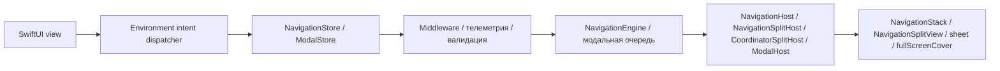
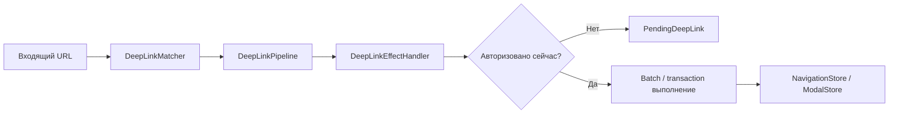

# InnoRouter

[English](README.md) | [한국어](README.ko.md) | [Español](README.es.md) | [Deutsch](README.de.md) | [简体中文](README.zh-Hans.md) | [日本語](README.ja.md) | [Русский](README.ru.md)

[](https://swiftpackageindex.com/InnoSquadCorp/InnoRouter)
[](https://swiftpackageindex.com/InnoSquadCorp/InnoRouter)
[](https://opensource.org/licenses/MIT)
[](https://codecov.io/gh/InnoSquadCorp/InnoRouter)

InnoRouter — это SwiftUI-нативный фреймворк навигации, построенный вокруг типизированного состояния, явного выполнения команд и планирования deep-link на границе приложения.

Он рассматривает навигацию как state machine первого класса, а не как разбросанные view-локальные побочные эффекты.

## Что принадлежит InnoRouter

InnoRouter отвечает за:

- состояние стековой навигации через `RouteStack`
- выполнение команд через `NavigationCommand` и `NavigationEngine`
- авторитет навигации SwiftUI через `NavigationStore`
- модальный авторитет для `sheet` и `fullScreenCover` через `ModalStore`
- сопоставление и планирование deep-link через `DeepLinkMatcher` и `DeepLinkPipeline`
- помощники выполнения на границе приложения через `InnoRouterNavigationEffects` и `InnoRouterDeepLinkEffects`

Он намеренно не является общим state machine приложения.

Держите эти заботы вне InnoRouter:

- состояние бизнес-workflow
- жизненный цикл аутентификации/сессии
- состояние повтора сети или транспорта
- алерты и диалоги подтверждения

## Требования

- iOS 18+
- iPadOS 18+
- macOS 15+
- tvOS 18+
- watchOS 11+
- visionOS 2+
- Swift 6.2+

Минимум iOS 18 и базовая линия пакета `swift-tools-version: 6.2` — это
осознанный выбор: они позволяют каждому публичному типу принять строгую
concurrency и `Sendable` без аварийных выходов `@preconcurrency` /
`@unchecked Sendable`, что означает, что состояние навигации никогда тихо
не утекает с main actor на границе между view-кодом и store. Цена — окно
адопции меньше, чем у библиотек, нацеленных на iOS 13–16; выгода —
маршрутизатор, чья дисциплина `Sendable`/`@MainActor` проверяется
компилятором, а не задокументирована в прозе.

Macros target в настоящее время зависит от `swift-syntax` `603.0.1` с
ограничением `.upToNextMinor`. Эта зависимость и закреплённый в CI
toolchain Xcode/Swift могут проверять пакет с более новой Swift host
сборкой (например, Swift 6.3), но поддерживаемая базовая линия пакета
остаётся на Swift 6.2 до тех пор, пока major релиз не поднимет её явно.

| Стойка concurrency | InnoRouter | TCA / FlowStacks / другие на iOS 13+ |
|---|---|---|
| Публичные типы безусловно объявляют `Sendable` | ✅ | ⚠ частично — многие используют `@preconcurrency` |
| Stores изолированы `@MainActor`, без хопов в runtime | ✅ | ⚠ варьируется |
| `@unchecked Sendable` / `nonisolated(unsafe)` в коде | ❌ нет | ⚠ используется в некоторых адаптерах |
| Режим строгой concurrency | ✅ принудительно по модулю | ⚠ opt-in или частично |

## Поддержка платформ

InnoRouter поставляется на каждой платформе Apple через SwiftUI. Мостовые
модули UIKit или AppKit не требуются.

| Возможность | iOS | iPadOS | macOS | tvOS | watchOS | visionOS |
|---|---|---|---|---|---|---|
| `NavigationStore` / `NavigationHost` / `FlowStore` / `FlowHost` | ✅ | ✅ | ✅ | ✅ | ✅ | ✅ |
| `NavigationSplitHost` / `CoordinatorSplitHost` | ✅ | ✅ | ✅ | ✅ | ❌ | ✅ |
| `ModalHost` `.sheet` | ✅ | ✅ | ✅ | ✅ | ✅ | ✅ |
| `ModalHost` `.fullScreenCover` нативно | ✅ | ✅ | ⚠ деградирует | ✅ | ⚠ деградирует | ⚠ деградирует |
| `TabCoordinator.badge` API состояния / нативное визуальное представление | ✅ | ✅ | ✅ | ⚠ только состояние | ⚠ только состояние | ✅ |
| `DeepLinkPipeline` / `FlowDeepLinkPipeline` | ✅ | ✅ | ✅ | ✅ | ✅ | ✅ |
| `SceneStore` / `SceneHost` (windows, volumetric, immersive) | — | — | — | — | — | ✅ |
| `innoRouterOrnament(_:content:)` view modifier | no-op | no-op | no-op | no-op | no-op | ✅ |

`⚠ деградирует` означает, что store API принимает запрос без изменений, но
SwiftUI host рендерит его как `.sheet`, потому что `.fullScreenCover`
недоступен. `⚠ только состояние` означает, что coordinator хранит и
выставляет состояние badge, но `TabCoordinatorView` опускает нативный
визуальный badge SwiftUI, потому что `.badge(_:)` недоступен. `❌` означает,
что символ не объявлен на этой платформе; постройте его за `#if !os(...)`.

## Установка

```swift skip package-manifest-fragment
dependencies: [
    .package(url: "https://github.com/InnoSquadCorp/InnoRouter.git", from: "4.1.0")
]
```

InnoRouter распространяется как SwiftPM-пакет только из исходников. Он не
поставляет бинарные артефакты, и library evolution намеренно отключена,
чтобы сборки из исходников оставались простыми на всех платформах Apple.

Шлюз документации также удерживает по крайней мере один полный Swift
сниппет, проверенный по типам относительно пакета:

```swift compile
import InnoRouter

enum CompileCheckedRoute: Route {
    case home
}

let compileCheckedStack = RouteStack<CompileCheckedRoute>()
_ = compileCheckedStack.path
```

## Контракт OSS-релиза 4.0.0

`4.0.0` — это первый OSS-релиз InnoRouter и первая версия, покрытая
публичным контрактом SemVer. Новые усыновители должны устанавливать с
`4.0.0` или новее. Более ранние приватные/внутренние снимки пакета не
являются частью линии OSS-совместимости; команды, которые их тестировали,
должны проверить использование публичного API относительно документов 4.x
как одноразовую миграцию исходного кода.

### SemVer-обязательство для линии 4.x

В рамках релизов `4.x.y` InnoRouter строго следует
[Semantic Versioning](https://semver.org/):

- **`4.x.y` → `4.x.(y+1)`** patch релизы: только исправления багов. Никаких
  изменений сигнатуры публичного API. Никаких наблюдаемых изменений
  поведения, кроме исправления документированного бага.
- **`4.x.y` → `4.(x+1).0`** minor релизы: только аддитивные. Новые типы,
  новые методы, новые case, новые опции конфигурации. Существующие
  сигнатуры сохраняют свою форму, и существующие места вызова продолжают
  компилироваться без изменений.
- **`4.x.y` → `5.0.0`** major релизы: всё, что нарушает совместимость
  исходного кода, удаляет публичный символ, сужает обобщённое ограничение
  или изменяет задокументированное поведение в runtime таким образом,
  что может удивить существующие места вызова.

Pre-release теги используют форму `4.1.0-rc.1` / `4.2.0-beta.2`. Регулярное
выражение `^[0-9]+\.[0-9]+\.[0-9]+$` workflow релиза принимает только
финальные теги; pre-release теги отгружаются через отдельный ручной поток,
задокументированный в [`RELEASING.md`](RELEASING.md).

### Что считается breaking change

Для целей обязательства SemVer 4.x, *breaking change* означает любое из:

- Удаление или переименование публичного символа (тип, метод, свойство,
  associated type, case).
- Изменение сигнатуры публичного метода таким образом, что компиляция
  существующего места вызова не удаётся (добавление параметра без
  значения по умолчанию, ужесточение обобщённого ограничения, замена
  возвращаемого типа).
- Изменение задокументированного поведения публичного API таким образом,
  что существующий корректный вызывающий производит другой наблюдаемый
  результат (например, переключение `NavigationPathMismatchPolicy` по
  умолчанию).
- Поднятие минимально поддерживаемого Swift toolchain или базы платформы.

Напротив, следующие *не* являются breaking и могут попадать в любой
minor релиз:

- Добавление новых case в не-`@frozen` публичный enum.
- Добавление новых параметров со значением по умолчанию в публичный метод.
- Ужесточение только-внутренних типов.
- Улучшения производительности, сохраняющие семантику.
- Изменения только в документации.

Полная зачистка базовой линии 4.0 суммирована в
[`CHANGELOG.md`](CHANGELOG.md).

### Breaking-cleanup 4.1.0

`4.1.0` — это базовая линия адопции после прохода предпользовательской
очистки. Удаляются неиспользуемые API диспетчер-объектов, `replaceStack`
сохраняется как единственный intent полной замены стека, и наблюдение
эффектов перемещается в явные потоки событий. Новые приложения должны
начинать с `4.1.0`; тег `4.0.0` остаётся доступным как первый OSS-снимок.

### Imports

Зонтичный target `InnoRouter` re-export всё, кроме macros продукта.
`@Routable` / `@CasePathable` требуют явного `import InnoRouterMacros` —
зонт намеренно пропускает этот re-export, чтобы файлы без macros не
платили цену разрешения macro plugin:

```swift skip doc-fragment
import InnoRouter            // stores, hosts, intents, deep links, scenes
import InnoRouterMacros      // только в файлах, которые используют @Routable / @CasePathable
```

`@EnvironmentNavigationIntent`, `@EnvironmentModalIntent` и каждый другой
property wrapper или view modifier приходят из `InnoRouter`, а не из
`InnoRouterMacros`.

Реализация macro на основе SwiftSyntax остаётся в этом пакете для линии
4.x. Разделение на package-traits или отдельный macro-пакет должно
оцениваться только после измерения `swift package show-traits`,
`swift build --target InnoRouter` и `swift build --target InnoRouterMacros`
относительно стоимости миграции.

| Product | Когда импортировать |
|---|---|
| `InnoRouter` | Код приложения, которому нужны stores, hosts, intents, coordinators, deep links, scenes или помощники persistence. |
| `InnoRouterMacros` | Только файлы, которые используют `@Routable` или `@CasePathable`. |
| `InnoRouterNavigationEffects` | Код границы приложения, который выполняет значения `NavigationCommand` вне SwiftUI view. |
| `InnoRouterDeepLinkEffects` | Код границы приложения, который обрабатывает или возобновляет ожидающие deep links. |
| `InnoRouterEffects` | Совместимый импорт, когда оба effect модуля должны быть re-export вместе. |
| `InnoRouterTesting` | Test targets, которые хотят host-less `NavigationTestStore`, `ModalTestStore` или `FlowTestStore`. |

## Модули

- `InnoRouter`: зонтичный re-export `InnoRouterCore`, `InnoRouterSwiftUI` и `InnoRouterDeepLink`
- `InnoRouterCore`: route stack, validators, commands, results, batch/transaction executors, middleware
- `InnoRouterSwiftUI`: stores, stack/split/modal hosts, coordinators, environment intent dispatch
- `InnoRouterDeepLink`: сопоставление шаблонов, диагностика, планирование pipeline, ожидающие deep links
- `InnoRouterNavigationEffects`: синхронные `@MainActor` помощники выполнения для границ приложения
- `InnoRouterDeepLinkEffects`: помощники выполнения deep-link, наслоённые на эффекты навигации
- `InnoRouterEffects`: совместимый зонт для обоих effect модулей
- `InnoRouterMacros`: `@Routable` и `@CasePathable`

## Выбор правильной поверхности

Используйте наименьшую поверхность, которая владеет нужным авторитетом
перехода:

| Потребность | Используйте |
|---|---|
| Один типизированный SwiftUI стек | `NavigationStore` + `NavigationHost` |
| Split-view стек на поддерживаемых платформах | `NavigationStore` + `NavigationSplitHost` |
| Авторитет sheet / cover без сброса стека | `ModalStore` + `ModalHost` |
| Push + modal flows, восстановление или multi-step deep links | `FlowStore` + `FlowHost` + `FlowPlan` |
| URL в push-only план команд | `DeepLinkMatcher` + `DeepLinkPipeline` |
| URL в push-prefix плюс modal-tail flow | `FlowDeepLinkMatcher` + `FlowDeepLinkPipeline` |
| visionOS windows, volumes, immersive spaces | `SceneStore` + `SceneHost` / `SceneAnchor` |
| Reducer, effect или выполнение на границе приложения | `InnoRouterNavigationEffects` / `InnoRouterDeepLinkEffects` |
| Утверждения router без SwiftUI hosts | `InnoRouterTesting` |

`NavigationStore`, `FlowStore`, `ModalStore`, `SceneStore`, effects и
testing намеренно разделены. Библиотека сохраняет эти авторитеты явными,
чтобы приложения принимали только те части, которые соответствуют их
границе маршрутизации.

### Быстрая блок-схема решений

```text
Совмещает ли поверхность экрана push и modal в одном flow?
├── Да → FlowStore + FlowHost (один источник правды, один поток событий)
└── Нет → владеет ли она только модальным авторитетом (sheet / cover)?
         ├── Да → ModalStore + ModalHost
         └── Нет → NavigationStore + NavigationHost
                  (split-view вариант: NavigationSplitHost)
```

Для dispatch из view-кода (без ссылки на store) используйте соответствующий
тип intent в [`Docs/IntentSelectionGuide.md`](Docs/IntentSelectionGuide.md):
`NavigationIntent` для stores только-стека, `FlowIntent` для `FlowStore`
(шесть перекрывающихся case плюс modal-aware варианты, известные только
`FlowIntent`).

## Документация

- Последний DocC портал: [InnoRouter latest docs](https://innosquadcorp.github.io/InnoRouter/latest/)
- Корень версионных docs: [InnoRouter docs](https://innosquadcorp.github.io/InnoRouter/)
- Контрольный список релиза: [RELEASING.md](RELEASING.md)
- Быстрое руководство сопровождающего: [CLAUDE.md](CLAUDE.md)

`README.md` — точка входа в репозиторий.
DocC — детальный модульный набор справочников.

### Tutorial-статьи

Пошаговые руководства для самых распространённых путей адопции. Каждая
статья находится внутри соответствующего DocC-каталога, поэтому
отрендеренный DocC-сайт, исходный вид GitHub и offline сборка
`swift package generate-documentation` показывают одинаковое содержимое.

| Статья | Каталог | Покрывает |
| --- | --- | --- |
| [Tutorial-LoginOnboarding](Sources/InnoRouterSwiftUI/InnoRouterSwiftUI.docc/Articles/Tutorial-LoginOnboarding.md) | `InnoRouterSwiftUI` | Создание flow login → onboarding → home с `FlowStore` и `ChildCoordinator` |
| [Tutorial-DeepLinkReconciliation](Sources/InnoRouterSwiftUI/InnoRouterSwiftUI.docc/Articles/Tutorial-DeepLinkReconciliation.md) | `InnoRouterSwiftUI` | Согласование cold-start vs warm deep links, включая ожидающий replay |
| [Tutorial-MiddlewareComposition](Sources/InnoRouterSwiftUI/InnoRouterSwiftUI.docc/Articles/Tutorial-MiddlewareComposition.md) | `InnoRouterSwiftUI` | Композиция типизированной middleware, перехват команд, наблюдение churn |
| [Tutorial-MigratingFromNestedHosts](Sources/InnoRouterSwiftUI/InnoRouterSwiftUI.docc/Articles/Tutorial-MigratingFromNestedHosts.md) | `InnoRouterSwiftUI` | Замена вложенных стеков `NavigationHost` + `ModalHost` на `FlowHost` |
| [Tutorial-Throttling](Sources/InnoRouterSwiftUI/InnoRouterSwiftUI.docc/Articles/Tutorial-Throttling.md) | `InnoRouterSwiftUI` | Использование `ThrottleNavigationMiddleware` с детерминированными test clocks |
| [Tutorial-StoreObserver](Sources/InnoRouterSwiftUI/InnoRouterSwiftUI.docc/Articles/Tutorial-StoreObserver.md) | `InnoRouterSwiftUI` | Принятие `StoreObserver` поверх единого потока `events` |
| [Tutorial-VisionOSScenes](Sources/InnoRouterSwiftUI/InnoRouterSwiftUI.docc/Articles/Tutorial-VisionOSScenes.md) | `InnoRouterSwiftUI` | Управление visionOS windows, volumetric scenes и immersive spaces из `SceneStore` |
| [Tutorial-FlowDeepLinkPipeline](Sources/InnoRouterDeepLink/InnoRouterDeepLink.docc/Articles/Tutorial-FlowDeepLinkPipeline.md) | `InnoRouterDeepLink` | Создание составных push + modal deep links через `FlowDeepLinkPipeline` |
| [Tutorial-StatePersistence](Sources/InnoRouterCore/InnoRouterCore.docc/Tutorial-StatePersistence.md) | `InnoRouterCore` | Сохранение `FlowPlan` / `RouteStack` между запусками с `StatePersistence` |
| [Tutorial-TestingFlows](Sources/InnoRouterTesting/InnoRouterTesting.docc/Articles/Tutorial-TestingFlows.md) | `InnoRouterTesting` | Host-less Swift Testing утверждения через `FlowTestStore` |

## Как это работает

### Runtime flow



- Views издают типизированный intent через environment dispatchers.
- Stores владеют авторитетом навигации или модального.
- Hosts переводят состояние store в нативные SwiftUI API навигации.

### Deep-link flow



- Сопоставление и планирование остаются чистыми.
- Effect handlers — это граница, где политика приложения решает, выполнить
  сейчас или отложить.
- Ожидающие deep links сохраняют запланированный переход, пока приложение
  не будет готово его повторить.

## Быстрый старт

### 1. Определите маршрут

Без macros:

```swift skip doc-fragment
import InnoRouter

enum HomeRoute: Route {
    case list
    case detail(id: String)
    case settings
}
```

С macros:

```swift skip doc-fragment
import InnoRouter
import InnoRouterMacros

@Routable
enum HomeRoute {
    case list
    case detail(id: String)
    case settings
}
```

### 2. Создайте `NavigationStore`

```swift skip doc-fragment
import InnoRouter
import OSLog

let store = try NavigationStore<HomeRoute>(
    initialPath: [.list],
    configuration: NavigationStoreConfiguration(
        routeStackValidator: .nonEmpty.combined(with: .rooted(at: .list)),
        logger: Logger(subsystem: "com.example.app", category: "navigation")
    )
)
```

### 3. Хостите в SwiftUI

```swift skip doc-fragment
import SwiftUI
import InnoRouter

struct AppRoot: View {
    @State private var store = try! NavigationStore<HomeRoute>(
        initialPath: [.list]
    )

    var body: some View {
        NavigationHost(store: store) { route in
            switch route {
            case .list:
                HomeListView()
            case .detail(let id):
                DetailView(id: id)
            case .settings:
                SettingsView()
            }
        } root: {
            HomeListView()
        }
    }
}
```

### 4. Издавайте intent из дочерней view

```swift skip doc-fragment
struct HomeListView: View {
    @EnvironmentNavigationIntent(HomeRoute.self) private var navigationIntent

    var body: some View {
        List {
            Button("Detail") {
                navigationIntent(.go(.detail(id: "123")))
            }

            Button("Settings") {
                navigationIntent(.go(.settings))
            }

            Button("Back") {
                navigationIntent(.back)
            }
        }
    }
}
```

Views должны издавать intent. У них не должно быть прямого авторитета
мутации над состоянием router.

## Модель состояния и выполнения

InnoRouter раскрывает три разные семантики выполнения.

### Одиночная команда

`execute(_:)` применяет один `NavigationCommand` и возвращает
типизированный `NavigationResult`.

### Batch

`executeBatch(_:stopOnFailure:)` сохраняет пошаговое выполнение команд,
но объединяет наблюдение.

Используйте batch выполнение, когда:

- несколько команд всё равно должны выполняться по одной
- middleware должна продолжать видеть каждый шаг
- наблюдатели должны продолжать получать одно агрегированное событие
  перехода

### Transaction

`executeTransaction(_:)` предпросматривает команды на теневом стеке и
коммитит только если каждый шаг успешен.

Используйте transaction выполнение, когда:

- частичный успех неприемлем
- вы хотите rollback при ошибке или отмене
- одно событие коммита всё-или-ничего важнее, чем пошаговое наблюдение

### `.sequence`

`.sequence` — это алгебра команд, не транзакция.

Это намеренно:

- слева-направо
- неатомарно
- типизировано через `NavigationResult.multiple`

Ранее успешные шаги остаются применёнными, даже если последующий шаг
терпит неудачу.

### `send(_:)` vs `execute(_:)` — выбор правильной точки входа

InnoRouter раскрывает навигацию через четыре точки входа, расслоённые
по назначению. Выберите ту, которая соответствует месту вызова, а не ту,
которая соответствует форме данных.

| Слой         | Вход                                | Используйте, когда                                                                                |
| ------------ | ---------------------------------- | ------------------------------------------------------------------------------------------------- |
| View intent  | `store.send(_:)`                   | Dispatch именованного `NavigationIntent` из SwiftUI view (`go`, `back`, `backToRoot`, …).         |
| Команда      | `store.execute(_:)`                | Перенаправить одну `NavigationCommand` в engine и проверить типизированный `NavigationResult`.    |
| Batch        | `store.executeBatch(_:)`           | Запустить несколько команд по одной, сохраняя видимость middleware и одно событие наблюдателя.    |
| Transaction  | `store.executeTransaction(_:)`     | Зафиксировать всё-или-ничего — предпросмотреть на теневом стеке, затем зафиксировать только если каждый шаг успешен. |

Эмпирическое правило:

- Views отправляют. Coordinators и границы effect выполняют.
- `send` имеет форму intent (нет возвращаемого значения для проверки);
  `execute*` имеет форму команды (возвращает типизированный результат
  для ветвления, телеметрии, повторов).
- Для атомарных multi-step flows, которые должны откатываться при
  частичной неудаче, предпочтите `executeTransaction` ручным batch.

То же расслоение применяется к `ModalStore` и `FlowStore`:
`send(_: ModalIntent)` / `send(_: FlowIntent)` из views, и
`execute(_:)` / `executeBatch(_:)` / `executeTransaction(_:)` на границе
engine.

### Выбор между `.sequence`, `executeBatch` и `executeTransaction`

| Вы хотите… | Используйте | Почему |
|---|---|---|
| Одно наблюдаемое изменение для многих команд, лучшее усилие | `executeBatch(_:stopOnFailure:)` | Объединённые `onChange` / `events`, опциональный fail-fast |
| Применение всё-или-ничего с rollback | `executeTransaction(_:)` | Предпросмотр теневого состояния, отбрасывание на основе журнала |
| Композитное *значение*, которое engine планирует / валидирует | `NavigationCommand.sequence([...])` | Чистая команда, проходит через каждую middleware как одна единица |
| Запустить только последнюю команду после тихого окна | `DebouncingNavigator` | Async wrapping navigator, `Clock`-инжектируемый |
| Ограничение скорости по ключу | `ThrottleNavigationMiddleware` | Синхронный, последняя метка времени принятия |

Полная матрица решений с проработанными примерами и антипаттернами живёт
в DocC tutorial
[`Guide-SequenceVsBatchVsTransaction`](Sources/InnoRouterSwiftUI/InnoRouterSwiftUI.docc/Articles/Guide-SequenceVsBatchVsTransaction.md).

## Поверхность маршрутизации стека

`NavigationIntent` — официальная поверхность SwiftUI stack-intent:

- `.go(Route)`
- `.goMany([Route])`
- `.back`
- `.backBy(Int)`
- `.backTo(Route)`
- `.backToRoot`
- `.replaceStack([Route])`

`NavigationStore.send(_:)` — точка входа SwiftUI для этих intent.

## Поверхность модальной маршрутизации

InnoRouter поддерживает модальную маршрутизацию для:

- `sheet`
- `fullScreenCover`

Используйте:

- `ModalStore`
- `ModalHost`
- `ModalIntent`
- `@EnvironmentModalIntent`

Пример:

```swift skip doc-fragment
@Routable
enum AppModalRoute {
    case profile
    case onboarding
}

struct ShellView: View {
    @State private var modalStore = ModalStore<AppModalRoute>()

    var body: some View {
        ModalHost(store: modalStore) { route in
            switch route {
            case .profile:
                ProfileView()
            case .onboarding:
                OnboardingView()
            }
        } content: {
            HomeView()
        }
    }
}
```

### Граница модального scope

На iOS и tvOS `ModalHost` отображает стили напрямую в `sheet` и
`fullScreenCover`. На других поддерживаемых платформах `fullScreenCover`
безопасно деградирует в `sheet`.

InnoRouter намеренно **не** владеет:

- `alert`
- `confirmationDialog`

Держите их как feature-локальное или coordinator-локальное состояние
презентации.

### Модальная наблюдаемость

`ModalStoreConfiguration` предоставляет лёгкие хуки жизненного цикла:

- `logger`
- `onPresented`
- `onDismissed`
- `onQueueChanged`
- `onMiddlewareMutation`
- `onCommandIntercepted`

`ModalDismissalReason` различает:

- `.dismiss`
- `.dismissAll`
- `.systemDismiss`

### Модальная middleware

`ModalStore` раскрывает ту же поверхность middleware, что и `NavigationStore`:

- `ModalMiddleware` / `AnyModalMiddleware<M>` с `willExecute` / `didExecute`.
- `ModalInterception` позволяет middleware `.proceed(command)` (включая
  переписанные команды) или `.cancel(reason:)` с `ModalCancellationReason`.
- `ModalStore.addMiddleware` / `insertMiddleware` / `removeMiddleware` /
  `replaceMiddleware` / `moveMiddleware` — handle-based CRUD,
  соответствующий навигации.
- `execute(_:) -> ModalExecutionResult<M>` маршрутизирует все `.present`,
  `.dismissCurrent` и `.dismissAll` через registry.
- `ModalMiddlewareMutationEvent` раскрывает churn registry для аналитики.

## Split-навигация

Для детальной навигации iPad и macOS используйте:

- `NavigationSplitHost`
- `CoordinatorSplitHost`

InnoRouter в split layouts владеет только стеком деталей.

Эти остаются собственностью приложения:

- выбор sidebar
- видимость колонки
- compact-адаптация

## Поверхность coordinator

Coordinators — это объекты политики, которые сидят между SwiftUI intent
и выполнением команд.

Используйте `CoordinatorHost` или `CoordinatorSplitHost`, когда:

- view intent сначала нуждается в маршрутизации политики
- app shells нуждаются в логике координации
- несколько авторитетов навигации должны быть составлены за одним coordinator

`FlowCoordinator` и `TabCoordinator` — это помощники, не замены
`NavigationStore`.

Рекомендуемое разделение:

- `NavigationStore`: авторитет route-stack
- `TabCoordinator`: состояние выбора shell/tab
- `FlowCoordinator`: локальная прогрессия шагов внутри назначения

### Цепочка дочернего coordinator

`ChildCoordinator` позволяет родительскому coordinator inline ожидать
значение завершения через
`parent.push(child:) -> Task<Child.Result?, Never>`:

```swift skip doc-fragment
let signupResult = await parentCoordinator.push(child: SignUpCoordinator())
if let user = signupResult {
    parentCoordinator.handle(.go(.home(user)))
}
```

Колбэки (`onFinish`, `onCancel`) устанавливаются синхронно, поэтому
ребёнок может запускать их в любой момент, включая до `await` родителя.
См. [`Docs/design-child-coordinator-handoff.md`](Docs/design-child-coordinator-handoff.md)
для обоснования дизайна.

Отмена родительского `Task` распространяется на ребёнка через
`ChildCoordinator.parentDidCancel()` (по умолчанию пустой no-op).
Переопределите его, чтобы разобрать переходное состояние — отклонить
sheets, отменить запросы в полёте, освободить временные stores — когда
родительская view отклоняется:

```swift skip doc-fragment
final class SignUpCoordinator: ChildCoordinator {
    typealias Result = UserID
    var onFinish: (@MainActor @Sendable (UserID) -> Void)?
    var onCancel: (@MainActor @Sendable () -> Void)?

    func parentDidCancel() {
        signUpAPIClient.cancelActiveRequests()
    }
}
```

`parentDidCancel` направлен (родитель → ребёнок). Он не вызывает
`onCancel` (который остаётся ребёнок → родитель); два хука ортогональны.

## Именованные навигационные intents

Высокочастотные intents составлены из существующих примитивов
`NavigationCommand`:

- `NavigationIntent.replaceStack([R])` — сбрасывает стек к заданным
  маршрутам в одном наблюдаемом шаге.
- `NavigationIntent.backOrPush(R)` — pop к `route`, если он уже существует
  в стеке, иначе push.
- `NavigationIntent.pushUniqueRoot(R)` — push только если стек ещё не
  содержит равный маршрут.

Они маршрутизируют через нормальный pipeline `send` → `execute`, поэтому
middleware и телеметрия наблюдают их идентично прямым вызовам
`NavigationCommand`.

## Case-типизированные привязки назначения

`NavigationStore` и `ModalStore` раскрывают помощники `binding(case:)`,
индексированные `CasePath`, выпускаемым `@Routable` / `@CasePathable`:

```swift skip doc-fragment
struct DetailSheet: View {
    @Environment(\.navigationStore) private var store: NavigationStore<AppRoute>

    var body: some View {
        SomeDetailView()
            .sheet(item: store.binding(case: \AppRoute.detail)) { detail in
                DetailView(detail: detail)
            }
    }
}
```

Привязки маршрутизируют каждый set через существующий pipeline команд,
поэтому middleware и телеметрия наблюдают их точно так же, как они
наблюдают прямые вызовы `execute(...)`. `ModalStore.binding(case:style:)`
ограничен по стилю презентации (`.sheet` / `.fullScreenCover`).

## Модель Deep-link

Deep links обрабатываются как планы, а не скрытые побочные эффекты.

Основные части:

- `DeepLinkMatcher`
- `DeepLinkPipeline`
- `DeepLinkDecision`
- `PendingDeepLink`
- `NavigationPlan`

Типичный flow:

1. сопоставить URL с маршрутом
2. отклонить или принять по scheme/host
3. применить политику аутентификации
4. издать `.plan`, `.pending`, `.rejected` или `.unhandled`
5. явно выполнить результирующий план навигации

### Диагностика matcher

`DeepLinkMatcher` и `FlowDeepLinkMatcher` могут сообщать:

- дублирующиеся шаблоны
- shadowing wildcards
- shadowing параметров
- нетерминальные wildcards

Диагностика не меняет приоритет порядка объявления. Она помогает поймать
ошибки авторства, не меняя тихо runtime-поведение. Используйте
`try DeepLinkMatcher(strict:)` или `try FlowDeepLinkMatcher(strict:)` в
шлюзах готовности к релизу, когда диагностика должна провалить сборку.

### Композитные deep links (push + modal tail)

`FlowDeepLinkPipeline` расширяет push-only pipeline, чтобы один URL
мог регидрировать push prefix **плюс** модальный терминальный шаг в
одном атомарном `FlowStore.apply(_:)`:

```swift skip doc-fragment
let matcher = FlowDeepLinkMatcher<AppRoute> {
    FlowDeepLinkMapping("/home/detail/:id") { params in
        guard let id = params.firstValue(forName: "id") else { return nil }
        return FlowPlan(steps: [.push(.home), .push(.detail(id: id))])
    }
    FlowDeepLinkMapping("/onboarding/privacy") { _ in
        FlowPlan(steps: [.sheet(.privacyPolicy)])
    }
}

let pipeline = FlowDeepLinkPipeline(
    allowedSchemes: ["myapp"],
    allowedHosts: ["app"],
    matcher: matcher,
    authenticationPolicy: .required(
        shouldRequireAuthentication: { _ in true },
        isAuthenticated: { SessionStore.shared.isAuthenticated }
    )
)

let handler = FlowDeepLinkEffectHandler(pipeline: pipeline, applier: flowStore)

FlowHost(store: flowStore, destination: destination) { RootView() }
    .onOpenURL { _ = handler.handle($0) }
```

Каждый handler `FlowDeepLinkMapping` возвращает **полный** `FlowPlan`,
поэтому multi-segment URLs явные на сайте объявления. Pipeline дословно
переиспользует семантику `DeepLinkAuthenticationPolicy` + `PendingDeepLink`
из push-only pipeline для симметричной отсрочки и replay аутентификации.
См. [`Sources/InnoRouterDeepLink/InnoRouterDeepLink.docc/Articles/Tutorial-FlowDeepLinkPipeline.md`](Sources/InnoRouterDeepLink/InnoRouterDeepLink.docc/Articles/Tutorial-FlowDeepLinkPipeline.md)
для полного walk-through.

## Middleware

Middleware предоставляет слой сквозной политики вокруг выполнения команд.

Pre-выполнение:

- `willExecute(_:state:) -> NavigationInterception`
- `.proceed(updatedCommand)`
- `.cancel(reason)`

Post-выполнение:

- `didExecute(_:result:state:) -> NavigationResult`

Middleware может:

- переписывать команды
- блокировать выполнение типизированными причинами отмены
- сворачивать результаты после выполнения

Middleware не может напрямую мутировать состояние store.

### Типизированная отмена

Причины отмены используют `NavigationCancellationReason`:

- `.middleware(debugName:command:)`
- `.conditionFailed`
- `.custom(String)`

### Управление middleware

`NavigationStore` раскрывает handle-based управление:

- `addMiddleware`
- `insertMiddleware`
- `removeMiddleware`
- `replaceMiddleware`
- `moveMiddleware`
- `middlewareMetadata`

## Согласование путей

Обновления SwiftUI `NavigationStack(path:)` отображаются обратно в
семантические команды.

Правила:

- сжатие префикса → `.popCount` или `.popToRoot`
- расширение префикса → batched `.push`
- не-префиксное несоответствие → `NavigationPathMismatchPolicy`

Доступные политики несоответствия:

- `.replace` — стандартная производственная позиция; принимает
  не-префиксное переписывание пути SwiftUI и издаёт событие несоответствия.
- `.assertAndReplace` — debug / pre-release позиция; assert, затем
  восстановиться с той же семантикой замены.
- `.ignore` — store-авторитарная позиция; наблюдает переписывание, но
  держит текущий стек неизменным.
- `.custom` — позиция доменного восстановления; отображает старые/новые
  пути в одну команду, batch или no-op.

Когда `NavigationStoreConfiguration.logger` установлен, обработка
несоответствия издаёт структурированную телеметрию.

## Effect модули

### `InnoRouterNavigationEffects`

Используйте это, когда коду app shell нужен небольшой исполнительный
фасад над границей navigator.

Ключевые API:

- `execute(_:)`
- `execute(_ commands:)`
- `executeTransaction(_:)`
- `executeGuarded(_:, prepare:)`

Эти API синхронные `@MainActor` API, за исключением явного async guard
помощника.

### `InnoRouterDeepLinkEffects`

Используйте это, когда планы deep-link должны выполняться на границе
приложения с типизированными результатами.

Ключевые API:

- `handle(_ url:)`
- `resumePendingDeepLink()`
- `resumePendingDeepLinkIfAllowed(_:)`

### Зонт `DeepLinkCoordinating`

Coordinators, которые принимают `DeepLinkCoordinating`, получают ту же
поверхность типизированных результатов через
`DeepLinkCoordinationOutcome<Route>`. Отказы pipeline (`rejected`,
`unhandled`) и состояния возобновления (`pending`, `executed`,
`noPendingDeepLink`) все наблюдаемы без подсматривания состояния стека.

- `handleDeepLink(_:) -> DeepLinkCoordinationOutcome<Route>`
- `resumePendingDeepLinkIfPossible() -> DeepLinkCoordinationOutcome<Route>`
- `resumePendingDeepLinkIfAllowed(_:) async -> DeepLinkCoordinationOutcome<Route>`

## `Examples` vs `ExamplesSmoke`

Репозиторий намеренно отделяет примеры документации от примеров CI.

- `Examples/`: для людей, идиоматические, основанные на macros примеры
- `ExamplesSmoke/`: компилятор-стабильные smoke-фикстуры для CI

Текущие примеры покрывают:

- автономную маршрутизацию стека
- маршрутизацию coordinator
- deep links
- split-навигацию
- композицию app shell
- модальную маршрутизацию

## Docs и flow релиза

### DocC

DocC собирается по модулю и публикуется на GitHub Pages.

Опубликованная структура:

- `/InnoRouter/latest/`
- `/InnoRouter/4.0.0/`
- `/InnoRouter/` корневой портал

### CI

CI валидирует:

- `swift test`
- `principle-gates`
- workflow `platforms` для покрытия SwiftUI по платформе
- smoke сборки примеров
- DocC preview сборка

### CD

CD запускается только на чистых semver тегах:

- `4.0.0`

Примеры невалидных тегов:

- любой тег с ведущим `v`
- `release-4.0.0`

Обязанности release workflow:

- перезапустить шлюзы кода/документации
- требовать локального `./scripts/principle-gates.sh --platforms=all` или зелёного workflow `platforms` GitHub перед тегированием
- собрать версионный DocC
- обновить `/latest/`
- сохранить старые версионные docs
- опубликовать GitHub Release

### Согласование с философией SwiftUI

InnoRouter следует декларативному направлению SwiftUI, делая обдуманные
trade-off для общего авторитета навигации.

- Views издают intent вместо прямой мутации состояния router.
- Авторитеты стека, split-detail и модального остаются разделёнными.
- Отсутствующее environment-связывание быстро падает.
- `NavigationStore` остаётся reference type, потому что это общий
  авторитет, а не эфемерное локальное состояние.
- `Coordinator` остаётся `AnyObject` по той же причине.

Это намеренный прагматичный trade-off, а не случайное отклонение от SwiftUI.

## Examples

Примеры для людей живут здесь:

- [Examples/StandaloneExample.swift](https://github.com/InnoSquadCorp/InnoRouter/blob/main/Examples/StandaloneExample.swift)
- [Examples/CoordinatorExample.swift](https://github.com/InnoSquadCorp/InnoRouter/blob/main/Examples/CoordinatorExample.swift)
- [Examples/DeepLinkExample.swift](https://github.com/InnoSquadCorp/InnoRouter/blob/main/Examples/DeepLinkExample.swift)
- [Examples/SplitCoordinatorExample.swift](https://github.com/InnoSquadCorp/InnoRouter/blob/main/Examples/SplitCoordinatorExample.swift)
- [Examples/AppShellExample.swift](https://github.com/InnoSquadCorp/InnoRouter/blob/main/Examples/AppShellExample.swift)

## Шлюзы качества

Запустите их локально перед нарезкой релиза:

```bash
swift test
./scripts/principle-gates.sh
./scripts/build-docc-site.sh --version preview --skip-latest
```

## Flow стек

`FlowStore<R>` представляет единый push + sheet + cover flow как один
массив значений `RouteStep<R>`. Он владеет внутренним `NavigationStore<R>`
и `ModalStore<R>`, делегируя каждому, в то же время обеспечивая
инварианты (один хвостовой modal максимум, modal всегда в хвосте,
rollback middleware согласовывает путь).

Эти внутренние stores в 4.0 — `@_spi(FlowStoreInternals)`. Код приложения
должен относиться к `FlowStore.path`, `send(_:)`, `apply(_:)`, `events`
и `intentDispatcher` как к публичной поверхности авторитета; прямая
мутация внутреннего store зарезервирована для hosts и сфокусированных
тестов инвариантов.

Типичное использование:

```swift skip doc-fragment
let flow = FlowStore<AppRoute>()
let restoredFlow = try FlowStore<AppRoute>(
    validating: persistedSteps
)

flow.send(.push(.home))
flow.send(.push(.detail(id)))
flow.send(.presentSheet(.share))   // tail modal
flow.apply(FlowPlan(steps: [.push(.home), .cover(.paywall)]))
```

- `FlowHost` составляет `ModalHost` поверх `NavigationHost` и инжектит
  environment closure для dispatch `@EnvironmentFlowIntent(Route.self)`.
- `FlowStoreConfiguration` составляет `NavigationStoreConfiguration` и
  `ModalStoreConfiguration`, добавляя `onPathChanged` и `onIntentRejected`.
- `FlowStore(validating:configuration:)` — это throwing initializer для
  восстановленных или внешне предоставленных значений `[RouteStep]`;
  совместимый initializer `initial:` всё ещё принуждает невалидный ввод
  к пустому пути.
- `FlowRejectionReason` раскрывает нарушения инвариантов
  (`pushBlockedByModalTail`, `invalidResetPath`, `middlewareRejected(debugName:)`).

## Тестирование без host (`InnoRouterTesting`)

`InnoRouterTesting` — это поставляемый Swift-Testing-нативный harness
утверждений, который оборачивает `NavigationStore`, `ModalStore` и
`FlowStore`. Тестам больше не нужен `@testable import InnoRouterSwiftUI`
или ручные коллекторы `Mutex<[Event]>` — каждый публичный observation
callback буферизуется в FIFO очередь, и тесты осушают её TCA-style
вызовами `receive(...)`.

Добавьте product только к test target:

```swift skip doc-fragment
// Package.swift
.testTarget(
    name: "AppTests",
    dependencies: [
        .product(name: "InnoRouter", package: "InnoRouter"),
        .product(name: "InnoRouterTesting", package: "InnoRouter"),
    ]
)
```

Затем пишите тесты против production intents:

```swift skip doc-fragment
import Testing
import InnoRouter
import InnoRouterTesting

@Test
@MainActor
func pushHomeThenDetail() {
    let store = NavigationTestStore<AppRoute>()

    store.send(.go(.home))
    store.receiveChange { _, new in new.path == [.home] }

    store.executeBatch([.push(.detail("42"))])
    store.receiveChange { _, new in new.path == [.home, .detail("42")] }
    store.receiveBatch { $0.isSuccess }

    store.expectNoMoreEvents()
}
```

Что покрывает harness:

- **`NavigationTestStore<R>`** — `onChange`, `onBatchExecuted`,
  `onTransactionExecuted`, `onMiddlewareMutation`, `onPathMismatch`.
  Перенаправляет `send`, `execute`, `executeBatch`, `executeTransaction`
  в подлежащий store без изменений.
- **`ModalTestStore<M>`** — `onPresented`, `onDismissed`, `onQueueChanged`,
  `onCommandIntercepted`, `onMiddlewareMutation`.
- **`FlowTestStore<R>`** — FlowStore-уровень `onPathChanged` +
  `onIntentRejected`, плюс обёртки `.navigation(...)` и `.modal(...)`
  вокруг эмиссий внутреннего store в одной очереди. Один тест может
  утверждать полную цепочку, запущенную одним `FlowIntent`, включая
  пути отмены middleware.

Исчерпывающность по умолчанию `.strict`: любое неутверждённое событие при
deinit store запускает Swift Testing issue. Используйте `.off` для
инкрементальных миграций из legacy test fixtures.

## Восстановление состояния

Маршруты, которые opt-in `Codable`, бесплатно получают round-trippable
значения `RouteStack`, `RouteStep` и `FlowPlan`:

```swift skip doc-fragment
enum AppRoute: Route, Codable {
    case home
    case detail(String)
    case settings
}

let persistence = StatePersistence<AppRoute>()

// При scene background / checkpoint:
let data = try persistence.encode(FlowPlan(steps: flowStore.path))
try data.write(to: restorationURL, options: .atomic)

// При запуске:
if let data = try? Data(contentsOf: restorationURL) {
    flowStore.apply(try persistence.decode(data))
}
```

`StatePersistence<R: Route & Codable>` оборачивает `JSONEncoder` и
`JSONDecoder` (оба настраиваемые) и останавливается на границе `Data` —
файловые URLs, `UserDefaults`, iCloud и хуки scene-phase — это заботы
приложения. Ошибки распространяются как нижележащие `EncodingError` /
`DecodingError`, поэтому вызывающие могут отличить schema drift от сбоя
I/O.

`FlowPlan(steps: flowStore.path)` — это снимок текущего видимого flow:
он хранит navigation push stack плюс активный модальный хвост, если он
видим. Он не сериализует модальный backlog. Очерёдные презентации живут
в `ModalStore.queuedPresentations` как внутреннее состояние выполнения
и вне текущего контракта persistence `FlowPlan`. Приложения, которые
должны восстанавливать очерёдную модальную работу, должны сохранять
снимок очереди, принадлежащий приложению, рядом с `FlowPlan` и
повторять его через свою собственную политику маршрутизации после
запуска.

## Единый поток наблюдения

Каждый store публикует один `events: AsyncStream`, который покрывает
полную поверхность наблюдения — изменения стека, завершения batch /
transaction, разрешения path-mismatch, мутации middleware-registry,
обновления modal present / dismiss / queue, перехваты команд и сигналы
flow-level path или intent-rejection.

```swift skip doc-fragment
Task {
    for await event in flowStore.events {
        switch event {
        case .navigation(.changed(_, let to)):
            analytics.track("nav_path", to.path)
        case .modal(.commandIntercepted(_, .cancelled(let reason))):
            Log.warning("modal cancelled: \(reason)")
        case .intentRejected(let intent, let reason):
            Log.info("flow rejected \(intent) because \(reason)")
        default:
            continue
        }
    }
}
```

Индивидуальные колбэки `onChange`, `onPresented`, `onCommandIntercepted`
и т. д. на каждом типе `*Configuration` остаются source-совместимыми;
поток `events` — дополнительный канал, не замена.

## Roadmap

Отслеживается в
[`Docs/competitive-analysis-and-roadmap.md`](Docs/competitive-analysis-and-roadmap.md).
С отгрузкой кластера полировки P3, backlog P0 / P1 / P3 пуст. Публичная
OSS линия начинается с базовой линии 4.0; см. [`CHANGELOG.md`](CHANGELOG.md)
для отгруженных изменений поверхности.

- [x] **P2-3 UIKit escape hatch** — отклонено для OSS-релиза 4.0.0.
      InnoRouter сохраняет позицию только-SwiftUI; команды, которым нужны
      адаптеры UIKit / AppKit, могут составлять эти поверхности вне
      InnoRouter.
- [x] **Семантика debounce** — отгружена в 4.0.0 как `DebouncingNavigator`,
      обёртка с инжектируемым `Clock` вокруг `NavigationCommandExecutor`.
      Синхронная алгебра `NavigationCommand` остаётся timer-free.

## Усыновители

InnoRouter находится в начале своей кривой публичной адопции. Если вы
поставляете InnoRouter в production, пожалуйста, откройте PR, добавляя
ваш проект в список ниже — общий дескриптор (`a finance app at $company`)
подойдёт, если публичное имя ещё невозможно. Сигнал усыновителей помогает
потенциальным пользователям оценить зрелость.

- _Ваш проект здесь._

Файл [`Examples/SampleAppExample.swift`](Examples/SampleAppExample.swift)
показывает полную поверхность заголовочной фичи — pipeline deep-link с
auth gating, FlowStore push+modal проекция и DebouncingNavigator
debouncing поиска — составленные в один самодостаточный класс авторитета.

## Вклад

См. [`CONTRIBUTING.md`](CONTRIBUTING.md) для ветвления, конвенций
коммитов, правил изменения публичного API и требований к тестам macros.
Находки безопасности следуют приватному процессу в [`SECURITY.md`](SECURITY.md).
Участие должно следовать [`CODE_OF_CONDUCT.md`](CODE_OF_CONDUCT.md).

## Лицензия

MIT
