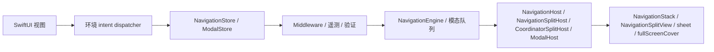
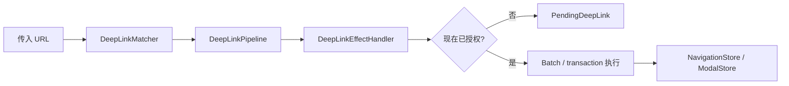

# InnoRouter

[English](README.md) | [한국어](README.ko.md) | [Español](README.es.md) | [Deutsch](README.de.md) | [简体中文](README.zh-Hans.md) | [日本語](README.ja.md) | [Русский](README.ru.md)

[](https://swiftpackageindex.com/InnoSquadCorp/InnoRouter)
[](https://swiftpackageindex.com/InnoSquadCorp/InnoRouter)
[](https://opensource.org/licenses/MIT)
[](https://codecov.io/gh/InnoSquadCorp/InnoRouter)

InnoRouter 是一个 SwiftUI 原生的导航框架,围绕类型化状态、显式命令执行和应用边界深链接规划构建。

它将导航视为一等公民的状态机,而不是分散在视图局部的副作用。

## InnoRouter 拥有什么

InnoRouter 负责:

- 通过 `RouteStack` 管理栈式导航状态
- 通过 `NavigationCommand` 和 `NavigationEngine` 执行命令
- 通过 `NavigationStore` 提供 SwiftUI 导航权限
- 通过 `ModalStore` 提供 `sheet` 和 `fullScreenCover` 的模态权限
- 通过 `DeepLinkMatcher` 和 `DeepLinkPipeline` 进行深链接匹配和规划
- 通过 `InnoRouterNavigationEffects` 和 `InnoRouterDeepLinkEffects` 提供应用边界的执行助手

它有意不是通用的应用程序状态机。

请将以下关注点放在 InnoRouter 之外:

- 业务工作流状态
- 认证/会话生命周期
- 网络重试或传输状态
- 警告和确认对话框

## 要求

- iOS 18+
- iPadOS 18+
- macOS 15+
- tvOS 18+
- watchOS 11+
- visionOS 2+
- Swift 6.2+

iOS 18 floor 和 `swift-tools-version: 6.2` 包基线是有意为之:它们让每个公开类型
都能采用严格并发和 `Sendable`,而无需 `@preconcurrency` / `@unchecked Sendable`
逃生口,这意味着导航状态绝不会在视图代码和 store 之间的边界悄悄泄漏出 main actor。
代价是比那些目标 iOS 13–16 的库更小的采用窗口;好处是 router 的 `Sendable`/`@MainActor`
纪律由编译器检查而不是文字描述。

宏目标当前依赖 `swift-syntax` `603.0.1`,使用 `.upToNextMinor` 约束。该依赖和
CI 中固定的 Xcode/Swift toolchain 可能用更新的 Swift host build(例如 Swift 6.3)
来验证包,但支持的包基线仍保持 Swift 6.2,直到主版本明确提升它。

| 并发态度 | InnoRouter | iOS 13+ 上的 TCA / FlowStacks / 其他 |
|---|---|---|
| 公开类型无条件声明 `Sendable` | ✅ | ⚠ 部分 — 许多使用 `@preconcurrency` |
| Store 是 `@MainActor` 隔离的,无运行时 hop | ✅ | ⚠ 视情况而定 |
| 源码中的 `@unchecked Sendable` / `nonisolated(unsafe)` | ❌ 无 | ⚠ 在某些适配器中使用 |
| 严格并发模式 | ✅ 按模块强制 | ⚠ 选择加入或部分启用 |

## 平台支持

InnoRouter 通过 SwiftUI 在每个 Apple 平台上发布。无需 UIKit 或 AppKit 桥接模块。

| 能力 | iOS | iPadOS | macOS | tvOS | watchOS | visionOS |
|---|---|---|---|---|---|---|
| `NavigationStore` / `NavigationHost` / `FlowStore` / `FlowHost` | ✅ | ✅ | ✅ | ✅ | ✅ | ✅ |
| `NavigationSplitHost` / `CoordinatorSplitHost` | ✅ | ✅ | ✅ | ✅ | ❌ | ✅ |
| `ModalHost` `.sheet` | ✅ | ✅ | ✅ | ✅ | ✅ | ✅ |
| `ModalHost` `.fullScreenCover` 原生 | ✅ | ✅ | ⚠ 降级 | ✅ | ⚠ 降级 | ⚠ 降级 |
| `TabCoordinator.badge` 状态 API / 原生视觉效果 | ✅ | ✅ | ✅ | ⚠ 仅状态 | ⚠ 仅状态 | ✅ |
| `DeepLinkPipeline` / `FlowDeepLinkPipeline` | ✅ | ✅ | ✅ | ✅ | ✅ | ✅ |
| `SceneStore` / `SceneHost` (windows、volumetric、immersive) | — | — | — | — | — | ✅ |
| `innoRouterOrnament(_:content:)` 视图 modifier | no-op | no-op | no-op | no-op | no-op | ✅ |

`⚠ 降级` 表示 store API 不变地接受请求,但 SwiftUI host 因为 `.fullScreenCover`
不可用而将其渲染为 `.sheet`。`⚠ 仅状态` 表示 coordinator 存储并暴露 badge 状态,
但 `TabCoordinatorView` 因为 `.badge(_:)` 不可用而省略了 SwiftUI 的原生视觉
badge。`❌` 表示该符号在该平台上未声明;请用 `#if !os(...)` 包住构建。

## 安装

```swift skip package-manifest-fragment
dependencies: [
    .package(url: "https://github.com/InnoSquadCorp/InnoRouter.git", from: "4.1.0")
]
```

InnoRouter 作为纯源码 SwiftPM 包发布。它不发布二进制工件,并且 library evolution
有意关闭,以便在 Apple 平台上保持源码构建的简单性。

文档门也保持至少一个完整的 Swift 片段对包进行类型检查:

```swift compile
import InnoRouter

enum CompileCheckedRoute: Route {
    case home
}

let compileCheckedStack = RouteStack<CompileCheckedRoute>()
_ = compileCheckedStack.path
```

## 4.0.0 OSS 发布合约

`4.0.0` 是 InnoRouter 的首个 OSS 发布,也是公开 SemVer 合约覆盖的第一个版本。
新的采用者应该从 `4.0.0` 或更新版本安装。早期的私有/内部包快照不属于 OSS
兼容性线;测试过它们的团队应该作为一次性源代码迁移,根据 4.x 文档验证公开 API 使用。

### 4.x 线的 SemVer 承诺

在 `4.x.y` 发布中,InnoRouter 严格遵循 [Semantic Versioning](https://semver.org/):

- **`4.x.y` → `4.x.(y+1)`** 补丁发布:仅 bug 修复。无公开 API 签名变更。
  除修复文档化的 bug 外,无可观察行为变更。
- **`4.x.y` → `4.(x+1).0`** 次版本发布:仅添加。新类型、新方法、新 case、
  新配置选项。现有签名保持其形状,现有调用点未经修改即可编译。
- **`4.x.y` → `5.0.0`** 主版本发布:任何破坏源代码兼容性、删除公开符号、
  收窄泛型约束,或以可能令现有调用点惊讶的方式更改文档化运行时行为的事项。

例外:下面的 `4.1.0` 历史性清理是文档化的一次性例外。在该采用基线之后,
4.x 次版本发布按此合约仅允许添加。

预发布标签使用 `4.1.0-rc.1` / `4.2.0-beta.2` 形式。发布工作流的
`^[0-9]+\.[0-9]+\.[0-9]+$` 正则表达式只接受最终标签;预发布标签通过
[`RELEASING.md`](RELEASING.md) 中文档化的单独手动流程发布。

### 什么算破坏性变更

就 4.x SemVer 承诺而言,*破坏性变更*指以下任何之一:

- 删除或重命名公开符号(类型、方法、属性、associated type、case)。
- 以使现有调用点编译失败的方式更改公开方法签名(添加非默认参数、收紧泛型
  约束、交换返回类型)。
- 更改公开 API 的文档化行为,使现有的正确调用者产生不同的可观察结果(例如,
  翻转默认 `NavigationPathMismatchPolicy`)。
- 提高最低支持的 Swift toolchain 或平台基线。

相反,以下*不是*破坏性的,可能在任何次版本发布中登陆:

- 向非 `@frozen` 公开 enum 添加新 case。
- 向公开方法添加新的默认参数。
- 收紧仅内部的类型。
- 保留语义的性能改进。
- 仅文档变更。

完整的 4.0 基线扫描总结在 [`CHANGELOG.md`](CHANGELOG.md) 中。

### 例外:4.1.0 历史性清理

`4.1.0` 是预用户清理 pass 之后的采用基线。它移除了未使用的 dispatcher 对象 API,
将 `replaceStack` 保留为唯一的全栈替换 intent,并将 effect 观察转移到显式事件流。
这是 4.x 线中唯一文档化的源码破坏性例外。新应用应从 `4.1.0` 开始;
`4.0.0` 标签仍可用作首个 OSS 快照。

### Imports

伞形目标 `InnoRouter` 重新导出除 macros 产品外的所有内容。`@Routable` /
`@CasePathable` 需要显式 `import InnoRouterMacros` — 伞形有意跳过该重新导出,
以便非 macro 文件不必支付 macro 插件解析成本:

```swift skip doc-fragment
import InnoRouter            // stores、hosts、intents、deep links、scenes
import InnoRouterMacros      // 仅在使用 @Routable / @CasePathable 的文件中
```

`@EnvironmentNavigationIntent`、`@EnvironmentModalIntent`,以及其他每个属性包装器
或视图修饰符都来自 `InnoRouter`,而不是 `InnoRouterMacros`。

SwiftSyntax 支持的 macro 实现在 4.x 线中保持在此包中。package-traits 或独立
macro 包拆分应在测量 `swift package show-traits`、
`swift build --target InnoRouter` 和 `swift build --target InnoRouterMacros`
对照迁移成本之后才评估。

| 产品 | 何时导入 |
|---|---|
| `InnoRouter` | 需要 stores、hosts、intents、coordinators、deep links、scenes 或持久化助手的应用代码。 |
| `InnoRouterMacros` | 仅使用 `@Routable` 或 `@CasePathable` 的文件。 |
| `InnoRouterNavigationEffects` | 在 SwiftUI 视图外部执行 `NavigationCommand` 值的应用边界代码。 |
| `InnoRouterDeepLinkEffects` | 处理或恢复挂起深链接的应用边界代码。 |
| `InnoRouterEffects` | 当两个 effect 模块应一起重新导出时的兼容性 import。 |
| `InnoRouterTesting` | 想要无 host 的 `NavigationTestStore`、`ModalTestStore` 或 `FlowTestStore` 的测试目标。 |

## 模块

- `InnoRouter`:`InnoRouterCore`、`InnoRouterSwiftUI` 和 `InnoRouterDeepLink` 的伞形重新导出
- `InnoRouterCore`:route stack、validators、commands、results、batch/transaction executors、middleware
- `InnoRouterSwiftUI`:stores、stack/split/modal hosts、coordinators、environment intent dispatch
- `InnoRouterDeepLink`:模式匹配、诊断、pipeline 规划、挂起深链接
- `InnoRouterNavigationEffects`:用于应用边界的同步 `@MainActor` 执行助手
- `InnoRouterDeepLinkEffects`:在导航 effect 之上分层的深链接执行助手
- `InnoRouterEffects`:两个 effect 模块的兼容性伞形
- `InnoRouterMacros`:`@Routable` 和 `@CasePathable`

## 选择正确的表面

使用拥有所需转换权限的最小表面:

| 需求 | 使用 |
|---|---|
| 一个类型化 SwiftUI 栈 | `NavigationStore` + `NavigationHost` |
| 在支持的平台上的分屏视图栈 | `NavigationStore` + `NavigationSplitHost` |
| 不重置栈的 sheet / cover 权限 | `ModalStore` + `ModalHost` |
| Push + modal 流程、恢复或多步深链接 | `FlowStore` + `FlowHost` + `FlowPlan` |
| URL 转 push-only 命令计划 | `DeepLinkMatcher` + `DeepLinkPipeline` |
| URL 转 push-prefix 加 modal-tail 流程 | `FlowDeepLinkMatcher` + `FlowDeepLinkPipeline` |
| visionOS windows、volumes、immersive spaces | `SceneStore` + `SceneHost` / `SceneAnchor` |
| Reducer、effect 或应用边界执行 | `InnoRouterNavigationEffects` / `InnoRouterDeepLinkEffects` |
| 无 SwiftUI hosts 的 router 断言 | `InnoRouterTesting` |

`NavigationStore`、`FlowStore`、`ModalStore`、`SceneStore`、effects 和 testing
有意分离。该库保持这些权限明确,以便应用只采用与其路由边界匹配的部分。

### 快速决策流程图

```text
屏幕表面是否在一个流程中结合了 push 和 modal?
├── 是 → FlowStore + FlowHost (单一真相源、单一事件流)
└── 否 → 它是否仅拥有模态权限(sheet / cover)?
         ├── 是 → ModalStore + ModalHost
         └── 否 → NavigationStore + NavigationHost
                 (分屏视图变体: NavigationSplitHost)
```

要从视图代码 dispatch(无 store 引用),请使用
[`Docs/IntentSelectionGuide.md`](Docs/IntentSelectionGuide.md) 中的对应 intent
类型:仅栈 store 使用 `NavigationIntent`,`FlowStore` 使用 `FlowIntent`(六个
重叠的 case 加上仅 `FlowIntent` 知晓的 modal-aware 变体)。

## 文档

- 最新 DocC 门户: [InnoRouter latest docs](https://innosquadcorp.github.io/InnoRouter/latest/)
- 版本化 docs 根目录: [InnoRouter docs](https://innosquadcorp.github.io/InnoRouter/)
- 发布检查清单: [RELEASING.md](RELEASING.md)
- 维护者快速指南: [CLAUDE.md](CLAUDE.md)

`README.md` 是仓库的入口点。
DocC 是详细的模块级参考集合。

### 教程文章

针对最常见采用路径的逐步演练。每篇文章都位于相关 DocC 目录中,因此渲染的 DocC 站点、
GitHub 源代码视图和离线 `swift package generate-documentation` 构建都显示相同内容。

| 文章 | 目录 | 涵盖 |
| --- | --- | --- |
| [Tutorial-LoginOnboarding](Sources/InnoRouterSwiftUI/InnoRouterSwiftUI.docc/Articles/Tutorial-LoginOnboarding.md) | `InnoRouterSwiftUI` | 使用 `FlowStore` 和 `ChildCoordinator` 构建登录 → onboarding → 主页流程 |
| [Tutorial-DeepLinkReconciliation](Sources/InnoRouterSwiftUI/InnoRouterSwiftUI.docc/Articles/Tutorial-DeepLinkReconciliation.md) | `InnoRouterSwiftUI` | 协调 cold-start vs warm 深链接,包括挂起重放 |
| [Tutorial-MiddlewareComposition](Sources/InnoRouterSwiftUI/InnoRouterSwiftUI.docc/Articles/Tutorial-MiddlewareComposition.md) | `InnoRouterSwiftUI` | 组合类型化 middleware、拦截命令、观察 churn |
| [Tutorial-MigratingFromNestedHosts](Sources/InnoRouterSwiftUI/InnoRouterSwiftUI.docc/Articles/Tutorial-MigratingFromNestedHosts.md) | `InnoRouterSwiftUI` | 用 `FlowHost` 替换嵌套的 `NavigationHost` + `ModalHost` 栈 |
| [Tutorial-Throttling](Sources/InnoRouterSwiftUI/InnoRouterSwiftUI.docc/Articles/Tutorial-Throttling.md) | `InnoRouterSwiftUI` | 配合确定性测试 clock 使用 `ThrottleNavigationMiddleware` |
| [Tutorial-StoreObserver](Sources/InnoRouterSwiftUI/InnoRouterSwiftUI.docc/Articles/Tutorial-StoreObserver.md) | `InnoRouterSwiftUI` | 在统一 `events` 流之上采用 `StoreObserver` |
| [Tutorial-VisionOSScenes](Sources/InnoRouterSwiftUI/InnoRouterSwiftUI.docc/Articles/Tutorial-VisionOSScenes.md) | `InnoRouterSwiftUI` | 从 `SceneStore` 驱动 visionOS windows、volumetric scenes 和 immersive spaces |
| [Tutorial-FlowDeepLinkPipeline](Sources/InnoRouterDeepLink/InnoRouterDeepLink.docc/Articles/Tutorial-FlowDeepLinkPipeline.md) | `InnoRouterDeepLink` | 通过 `FlowDeepLinkPipeline` 构建组合 push + modal 深链接 |
| [Tutorial-StatePersistence](Sources/InnoRouterCore/InnoRouterCore.docc/Tutorial-StatePersistence.md) | `InnoRouterCore` | 使用 `StatePersistence` 跨启动持久化 `FlowPlan` / `RouteStack` |
| [Tutorial-TestingFlows](Sources/InnoRouterTesting/InnoRouterTesting.docc/Articles/Tutorial-TestingFlows.md) | `InnoRouterTesting` | 通过 `FlowTestStore` 进行无 host 的 Swift Testing 断言 |

## 工作原理

### 运行时流程



- 视图通过环境 dispatcher 发出类型化 intent。
- Store 拥有导航或模态权限。
- Host 将 store 状态翻译为原生 SwiftUI 导航 API。

### 深链接流程



- 匹配和规划保持纯净。
- Effect 处理器是应用策略决定是现在执行还是延迟的边界。
- 挂起深链接保留计划的转换,直到应用准备好重放它。

## 快速开始

### 1. 定义路由

不使用 macros:

```swift skip doc-fragment
import InnoRouter

enum HomeRoute: Route {
    case list
    case detail(id: String)
    case settings
}
```

使用 macros:

```swift skip doc-fragment
import InnoRouter
import InnoRouterMacros

@Routable
enum HomeRoute {
    case list
    case detail(id: String)
    case settings
}
```

### 2. 创建 `NavigationStore`

```swift skip doc-fragment
import InnoRouter
import OSLog

let store = try NavigationStore<HomeRoute>(
    initialPath: [.list],
    configuration: NavigationStoreConfiguration(
        routeStackValidator: .nonEmpty.combined(with: .rooted(at: .list)),
        logger: Logger(subsystem: "com.example.app", category: "navigation")
    )
)
```

### 3. 在 SwiftUI 中托管

```swift skip doc-fragment
import SwiftUI
import InnoRouter

struct AppRoot: View {
    @State private var store = try! NavigationStore<HomeRoute>(
        initialPath: [.list]
    )

    var body: some View {
        NavigationHost(store: store) { route in
            switch route {
            case .list:
                HomeListView()
            case .detail(let id):
                DetailView(id: id)
            case .settings:
                SettingsView()
            }
        } root: {
            HomeListView()
        }
    }
}
```

### 4. 从子视图发出 intent

```swift skip doc-fragment
struct HomeListView: View {
    @EnvironmentNavigationIntent(HomeRoute.self) private var navigationIntent

    var body: some View {
        List {
            Button("Detail") {
                navigationIntent(.go(.detail(id: "123")))
            }

            Button("Settings") {
                navigationIntent(.go(.settings))
            }

            Button("Back") {
                navigationIntent(.back)
            }
        }
    }
}
```

视图应该发出 intent。它们不应该拥有对 router 状态的直接变更权限。

## 状态和执行模型

InnoRouter 暴露三种不同的执行语义。

### 单一命令

`execute(_:)` 应用一个 `NavigationCommand` 并返回类型化的 `NavigationResult`。

### Batch

`executeBatch(_:stopOnFailure:)` 保留每步的命令执行,但合并观察。

何时使用 batch 执行:

- 多个命令仍应一个接一个地运行
- middleware 仍应看到每一步
- 观察者仍应收到一个聚合的转换事件

### Transaction

`executeTransaction(_:)` 在影子栈上预览命令,仅当每一步都成功时才提交。

何时使用 transaction 执行:

- 不接受部分成功
- 你希望在失败或取消时回滚
- 全有或全无的提交事件比逐步观察更重要

### `.sequence`

`.sequence` 是命令代数,不是事务。

它有意是:

- 从左到右
- 非原子
- 通过 `NavigationResult.multiple` 类型化

即使后面的步骤失败,先前成功的步骤仍保持应用。

### `send(_:)` vs `execute(_:)` — 选择正确的入口点

InnoRouter 通过按目的分层的四个入口点暴露导航。
选择匹配调用点的那个,而不是匹配数据形状的那个。

| 层 | 入口 | 何时使用 |
| ------------ | ---------------------------------- | ------------------------------------------------------------------------------------------------- |
| View intent  | `store.send(_:)`                   | 从 SwiftUI 视图 dispatch 命名的 `NavigationIntent` (`go`、`back`、`backToRoot`、…)。            |
| Command      | `store.execute(_:)`                | 将单个 `NavigationCommand` 转发到 engine 并检查类型化 `NavigationResult`。                        |
| Batch        | `store.executeBatch(_:)`           | 一个接一个运行多个命令,同时保持 middleware 可见性和单个观察者事件。                                |
| Transaction  | `store.executeTransaction(_:)`     | 全有或全无地提交 — 对照影子栈预览,然后仅当每一步都成功时才提交。                                  |

经验法则:

- 视图 send。Coordinators 和 effect 边界 execute。
- `send` 是 intent 形态(无返回值可检查);`execute*` 是命令形态(返回类型化结果用于分支、遥测、重试)。
- 对于必须在部分失败时回滚的原子多步流程,优先使用 `executeTransaction` 而不是手工 batch。

相同的分层适用于 `ModalStore` 和 `FlowStore`:
来自视图的 `send(_: ModalIntent)` / `send(_: FlowIntent)`,以及在 engine 边界
的 `execute(_:)` / `executeBatch(_:)` / `executeTransaction(_:)`。

### 在 `.sequence`、`executeBatch` 和 `executeTransaction` 之间选择

| 你想要… | 使用 | 原因 |
|---|---|---|
| 多个命令的一个可观察变更,尽力而为 | `executeBatch(_:stopOnFailure:)` | 合并的 `onChange` / `events`、可选 fail-fast |
| 全有或全无的应用并支持回滚 | `executeTransaction(_:)` | 影子状态预览、基于 journal 的丢弃 |
| engine 规划/验证的组合*值* | `NavigationCommand.sequence([...])` | 纯命令,作为一个单元流过每个 middleware |
| 在静默窗口后仅触发最新命令 | `DebouncingNavigator` | Async 包装 navigator、`Clock` 可注入 |
| 按 key 速率限制 | `ThrottleNavigationMiddleware` | 同步、最后接受时间戳 |

带有工作示例和反模式的完整决策矩阵存在于 DocC 教程
[`Guide-SequenceVsBatchVsTransaction`](Sources/InnoRouterSwiftUI/InnoRouterSwiftUI.docc/Articles/Guide-SequenceVsBatchVsTransaction.md)。

## 栈路由表面

`NavigationIntent` 是官方 SwiftUI 栈 intent 表面:

- `.go(Route)`
- `.goMany([Route])`
- `.back`
- `.backBy(Int)`
- `.backTo(Route)`
- `.backToRoot`
- `.replaceStack([Route])`

`NavigationStore.send(_:)` 是这些 intent 的 SwiftUI 入口点。

## 模态路由表面

InnoRouter 支持以下模态路由:

- `sheet`
- `fullScreenCover`

使用:

- `ModalStore`
- `ModalHost`
- `ModalIntent`
- `@EnvironmentModalIntent`

示例:

```swift skip doc-fragment
@Routable
enum AppModalRoute {
    case profile
    case onboarding
}

struct ShellView: View {
    @State private var modalStore = ModalStore<AppModalRoute>()

    var body: some View {
        ModalHost(store: modalStore) { route in
            switch route {
            case .profile:
                ProfileView()
            case .onboarding:
                OnboardingView()
            }
        } content: {
            HomeView()
        }
    }
}
```

### 模态作用域边界

在 iOS 和 tvOS 上,`ModalHost` 直接将样式映射到 `sheet` 和 `fullScreenCover`。
在其他支持的平台上,`fullScreenCover` 安全地降级为 `sheet`。

InnoRouter **有意不**拥有:

- `alert`
- `confirmationDialog`

将这些保留为 feature-local 或 coordinator-local 的呈现状态。

### 模态可观察性

`ModalStoreConfiguration` 提供轻量级生命周期 hook:

- `logger`
- `onPresented`
- `onDismissed`
- `onQueueChanged`
- `onMiddlewareMutation`
- `onCommandIntercepted`

`ModalDismissalReason` 区分:

- `.dismiss`
- `.dismissAll`
- `.systemDismiss`

### 模态 middleware

`ModalStore` 暴露与 `NavigationStore` 相同的 middleware 表面:

- 带 `willExecute` / `didExecute` 的 `ModalMiddleware` / `AnyModalMiddleware<M>`。
- `ModalInterception` 让 middleware `.proceed(command)`(包括重写的命令)
  或带 `ModalCancellationReason` 的 `.cancel(reason:)`。
- `ModalStore.addMiddleware` / `insertMiddleware` / `removeMiddleware` /
  `replaceMiddleware` / `moveMiddleware` — 与导航匹配的基于 handle 的 CRUD。
- `execute(_:) -> ModalExecutionResult<M>` 通过 registry 路由所有
  `.present`、`.dismissCurrent` 和 `.dismissAll`。
- `ModalMiddlewareMutationEvent` 为分析浮现 registry churn。

## 分屏导航

对于 iPad 和 macOS 详情导航,使用:

- `NavigationSplitHost`
- `CoordinatorSplitHost`

InnoRouter 在分屏布局中仅拥有详情栈。

以下保持应用所有:

- 侧边栏选择
- 列可见性
- 紧凑适配

## Coordinator 表面

Coordinator 是位于 SwiftUI intent 和命令执行之间的策略对象。

何时使用 `CoordinatorHost` 或 `CoordinatorSplitHost`:

- 视图 intent 需要先经过策略路由
- 应用 shell 需要协调逻辑
- 多个导航权限应在一个 coordinator 后组合

`FlowCoordinator` 和 `TabCoordinator` 是助手,而不是 `NavigationStore` 的替代品。

推荐分工:

- `NavigationStore`:route-stack 权限
- `TabCoordinator`:shell/tab 选择状态
- `FlowCoordinator`:目的地内的局部步骤进展

### 子 coordinator 链接

`ChildCoordinator` 让父 coordinator 通过
`parent.push(child:) -> Task<Child.Result?, Never>` inline await 完成值:

```swift skip doc-fragment
let signupResult = await parentCoordinator.push(child: SignUpCoordinator())
if let user = signupResult {
    parentCoordinator.handle(.go(.home(user)))
}
```

回调(`onFinish`、`onCancel`)同步安装,因此子可以在任何时候触发它们,
包括在父的 `await` 之前。设计原理见
[`Docs/design-child-coordinator-handoff.md`](Docs/design-child-coordinator-handoff.md)。

父 `Task` 取消通过 `ChildCoordinator.parentDidCancel()`(默认空 no-op)
传播到子。覆盖它以拆除瞬态状态 — 关闭 sheet、取消进行中的请求、释放临时 store
— 当父视图被消除时:

```swift skip doc-fragment
final class SignUpCoordinator: ChildCoordinator {
    typealias Result = UserID
    var onFinish: (@MainActor @Sendable (UserID) -> Void)?
    var onCancel: (@MainActor @Sendable () -> Void)?

    func parentDidCancel() {
        signUpAPIClient.cancelActiveRequests()
    }
}
```

`parentDidCancel` 是有方向的(父 → 子)。它不调用 `onCancel`(后者保持子 → 父);
两个 hook 是正交的。

## 命名导航 intent

高频 intent 由现有 `NavigationCommand` 原语组合而成:

- `NavigationIntent.replaceStack([R])` — 在一个可观察步骤中将栈重置为给定的路由。
- `NavigationIntent.backOrPush(R)` — 如果 `route` 已在栈中,则 pop 到它,否则 push。
- `NavigationIntent.pushUniqueRoot(R)` — 仅当栈不包含相等路由时 push。

这些通过正常的 `send` → `execute` pipeline 路由,因此 middleware 和遥测的观察
与直接 `NavigationCommand` 调用相同。

## Case 类型化目的地绑定

`NavigationStore` 和 `ModalStore` 暴露由 `@Routable` / `@CasePathable`
发出的 `CasePath` 索引的 `binding(case:)` 助手:

```swift skip doc-fragment
struct DetailSheet: View {
    @Environment(\.navigationStore) private var store: NavigationStore<AppRoute>

    var body: some View {
        SomeDetailView()
            .sheet(item: store.binding(case: \AppRoute.detail)) { detail in
                DetailView(detail: detail)
            }
    }
}
```

绑定通过现有命令 pipeline 路由每个 set,因此 middleware 和遥测的观察
与直接 `execute(...)` 调用完全相同。`ModalStore.binding(case:style:)` 按
呈现样式作用域(`.sheet` / `.fullScreenCover`)。

## 深链接模型

深链接被作为计划处理,而不是隐藏的副作用。

核心部分:

- `DeepLinkMatcher`
- `DeepLinkPipeline`
- `DeepLinkDecision`
- `PendingDeepLink`
- `NavigationPlan`

典型流程:

1. 将 URL 匹配到路由
2. 按 scheme/host 拒绝或接受
3. 应用认证策略
4. 发出 `.plan`、`.pending`、`.rejected` 或 `.unhandled`
5. 显式执行结果导航计划

### Matcher 诊断

`DeepLinkMatcher` 和 `FlowDeepLinkMatcher` 可以报告:

- 重复模式
- 通配符 shadowing
- 参数 shadowing
- 非终结通配符

诊断不更改声明顺序优先级。它们帮助捕获创作错误,而不会悄悄地改变运行时行为。
当诊断应使构建失败时,在发布就绪门中使用 `try DeepLinkMatcher(strict:)` 或
`try FlowDeepLinkMatcher(strict:)`。

### 组合深链接(push + modal tail)

`FlowDeepLinkPipeline` 扩展了仅 push pipeline,使单个 URL 可以在一个原子
`FlowStore.apply(_:)` 中重新水合 push 前缀**加上**模态终端步骤:

```swift skip doc-fragment
let matcher = FlowDeepLinkMatcher<AppRoute> {
    FlowDeepLinkMapping("/home/detail/:id") { params in
        guard let id = params.firstValue(forName: "id") else { return nil }
        return FlowPlan(steps: [.push(.home), .push(.detail(id: id))])
    }
    FlowDeepLinkMapping("/onboarding/privacy") { _ in
        FlowPlan(steps: [.sheet(.privacyPolicy)])
    }
}

let pipeline = FlowDeepLinkPipeline(
    allowedSchemes: ["myapp"],
    allowedHosts: ["app"],
    matcher: matcher,
    authenticationPolicy: .required(
        shouldRequireAuthentication: { _ in true },
        isAuthenticated: { SessionStore.shared.isAuthenticated }
    )
)

let handler = FlowDeepLinkEffectHandler(pipeline: pipeline, applier: flowStore)

FlowHost(store: flowStore, destination: destination) { RootView() }
    .onOpenURL { _ = handler.handle($0) }
```

每个 `FlowDeepLinkMapping` 处理器返回**完整**的 `FlowPlan`,因此多段 URL 在
声明站点是显式的。pipeline 逐字重用仅 push pipeline 的
`DeepLinkAuthenticationPolicy` + `PendingDeepLink` 语义,以实现对称的认证延迟
和重放。完整演练参见
[`Sources/InnoRouterDeepLink/InnoRouterDeepLink.docc/Articles/Tutorial-FlowDeepLinkPipeline.md`](Sources/InnoRouterDeepLink/InnoRouterDeepLink.docc/Articles/Tutorial-FlowDeepLinkPipeline.md)。

## Middleware

Middleware 在命令执行周围提供横切策略层。

预执行:

- `willExecute(_:state:) -> NavigationInterception`
- `.proceed(updatedCommand)`
- `.cancel(reason)`

后执行:

- `didExecute(_:result:state:) -> NavigationResult`

Middleware 可以:

- 重写命令
- 用类型化取消原因阻止执行
- 在执行后折叠结果

Middleware 不能直接变更 store 状态。

### 类型化取消

取消原因使用 `NavigationCancellationReason`:

- `.middleware(debugName:command:)`
- `.conditionFailed`
- `.custom(String)`

### Middleware 管理

`NavigationStore` 暴露基于 handle 的管理:

- `addMiddleware`
- `insertMiddleware`
- `removeMiddleware`
- `replaceMiddleware`
- `moveMiddleware`
- `middlewareMetadata`

## 路径协调

SwiftUI `NavigationStack(path:)` 更新被映射回语义命令。

规则:

- 前缀缩短 → `.popCount` 或 `.popToRoot`
- 前缀扩展 → 批量 `.push`
- 非前缀不匹配 → `NavigationPathMismatchPolicy`

可用的不匹配策略:

- `.replace` — 默认生产姿态;接受 SwiftUI 的非前缀路径重写并发出不匹配事件。
- `.assertAndReplace` — 调试 / 预发布姿态;assert 然后用相同的替换语义恢复。
- `.ignore` — store 权威姿态;观察重写但保持当前栈不变。
- `.custom` — 域修复姿态;将旧/新路径映射到一个命令、一个 batch 或 no-op。

当 `NavigationStoreConfiguration.logger` 设置时,不匹配处理会发出结构化遥测。

## Effect 模块

### `InnoRouterNavigationEffects`

当应用 shell 代码想要 navigator 边界上的小型执行 façade 时使用。

关键 API:

- `execute(_:)`
- `execute(_ commands:)`
- `executeTransaction(_:)`
- `executeGuarded(_:, prepare:)`

除了显式 async guard 助手外,这些 API 都是同步 `@MainActor` API。

### `InnoRouterDeepLinkEffects`

当应在带类型化结果的应用边界执行深链接计划时使用。

关键 API:

- `handle(_ url:)`
- `resumePendingDeepLink()`
- `resumePendingDeepLinkIfAllowed(_:)`

### 伞形 `DeepLinkCoordinating`

采用 `DeepLinkCoordinating` 的 coordinator 通过
`DeepLinkCoordinationOutcome<Route>` 获得相同的类型化结果表面。Pipeline
拒绝(`rejected`、`unhandled`)和恢复状态(`pending`、`executed`、
`noPendingDeepLink`)都可观察,无需窥视栈状态。

- `handleDeepLink(_:) -> DeepLinkCoordinationOutcome<Route>`
- `resumePendingDeepLinkIfPossible() -> DeepLinkCoordinationOutcome<Route>`
- `resumePendingDeepLinkIfAllowed(_:) async -> DeepLinkCoordinationOutcome<Route>`

## `Examples` vs `ExamplesSmoke`

仓库有意将文档示例与 CI 示例分开。

- `Examples/`:面向人的、惯用的、基于 macro 的示例
- `ExamplesSmoke/`:用于 CI 的编译器稳定 smoke 固件

当前示例涵盖:

- 独立栈路由
- coordinator 路由
- 深链接
- 分屏导航
- 应用 shell 组合
- 模态路由

## 文档和发布流程

### DocC

DocC 按模块构建并发布到 GitHub Pages。

发布结构:

- `/InnoRouter/latest/`
- `/InnoRouter/4.0.0/`
- `/InnoRouter/` 根门户

### CI

CI 验证:

- `swift test`
- `principle-gates`
- 用于每平台 SwiftUI 覆盖的 `platforms` 工作流
- 示例 smoke 构建
- DocC 预览构建

### CD

CD 仅在裸 semver 标签上运行:

- `4.0.0`

无效标签示例:

- 任何带前导 `v` 的标签
- `release-4.0.0`

发布工作流职责:

- 重新运行代码/文档门
- 在打标签之前要求本地 `./scripts/principle-gates.sh --platforms=all` 或绿色的 GitHub `platforms` 工作流
- 构建版本化 DocC
- 更新 `/latest/`
- 保留旧版本化文档
- 发布 GitHub Release

### SwiftUI 哲学对齐

InnoRouter 遵循 SwiftUI 的声明式方向,同时为共享导航权限做出有意的权衡。

- 视图发出 intent,而不是直接变更 router 状态。
- 栈、分屏详情和模态权限保持分离。
- 缺失的 environment 接线快速失败。
- `NavigationStore` 保持引用类型,因为它是共享权限,而不是临时局部状态。
- `Coordinator` 出于相同原因保持 `AnyObject`。

这是有意的实用权衡,而不是与 SwiftUI 的意外漂移。

## Examples

面向人的示例位于此处:

- [Examples/StandaloneExample.swift](https://github.com/InnoSquadCorp/InnoRouter/blob/main/Examples/StandaloneExample.swift)
- [Examples/CoordinatorExample.swift](https://github.com/InnoSquadCorp/InnoRouter/blob/main/Examples/CoordinatorExample.swift)
- [Examples/DeepLinkExample.swift](https://github.com/InnoSquadCorp/InnoRouter/blob/main/Examples/DeepLinkExample.swift)
- [Examples/SplitCoordinatorExample.swift](https://github.com/InnoSquadCorp/InnoRouter/blob/main/Examples/SplitCoordinatorExample.swift)
- [Examples/AppShellExample.swift](https://github.com/InnoSquadCorp/InnoRouter/blob/main/Examples/AppShellExample.swift)

## 质量门

在切发布之前在本地运行这些:

```bash
swift test
./scripts/principle-gates.sh
./scripts/build-docc-site.sh --version preview --skip-latest
```

## Flow 栈

`FlowStore<R>` 将统一的 push + sheet + cover 流表示为单个
`RouteStep<R>` 值数组。它拥有内部 `NavigationStore<R>` 和 `ModalStore<R>`,
委托给每个,同时强制不变量(尾部最多一个 modal、modal 始终在尾部、
middleware 回滚协调路径)。

那些内部 store 在 4.0 中是 `@_spi(FlowStoreInternals)`。应用代码应将
`FlowStore.path`、`send(_:)`、`apply(_:)`、`events` 和 `intentDispatcher`
视为公开权限表面;直接的内部 store 变更保留给 host 和聚焦的不变量测试。

典型用法:

```swift skip doc-fragment
let flow = FlowStore<AppRoute>()
let restoredFlow = try FlowStore<AppRoute>(
    validating: persistedSteps
)

flow.send(.push(.home))
flow.send(.push(.detail(id)))
flow.send(.presentSheet(.share))   // tail modal
flow.apply(FlowPlan(steps: [.push(.home), .cover(.paywall)]))
```

- `FlowHost` 在 `NavigationHost` 之上组合 `ModalHost`,并为
  `@EnvironmentFlowIntent(Route.self)` dispatch 注入环境闭包。
- `FlowStoreConfiguration` 组合 `NavigationStoreConfiguration` 和
  `ModalStoreConfiguration`,添加 `onPathChanged` 和 `onIntentRejected`。
- `FlowStore(validating:configuration:)` 是用于恢复的或外部提供的
  `[RouteStep]` 值的 throwing initializer;兼容性 `initial:` initializer
  仍将无效输入强制为空路径。
- `FlowRejectionReason` 浮现不变量违规
  (`pushBlockedByModalTail`、`invalidResetPath`、`middlewareRejected(debugName:)`)。

## 无 Host 测试 (`InnoRouterTesting`)

`InnoRouterTesting` 是包装 `NavigationStore`、`ModalStore` 和 `FlowStore`
的可发布 Swift Testing 原生断言 harness。测试不再需要
`@testable import InnoRouterSwiftUI` 或手工的 `Mutex<[Event]>` 收集器 —
每个公开观察回调都被缓冲到 FIFO 队列中,测试用 TCA 风格的 `receive(...)`
调用排空它。

仅向测试目标添加产品:

```swift skip doc-fragment
// Package.swift
.testTarget(
    name: "AppTests",
    dependencies: [
        .product(name: "InnoRouter", package: "InnoRouter"),
        .product(name: "InnoRouterTesting", package: "InnoRouter"),
    ]
)
```

然后针对生产 intent 编写测试:

```swift skip doc-fragment
import Testing
import InnoRouter
import InnoRouterTesting

@Test
@MainActor
func pushHomeThenDetail() {
    let store = NavigationTestStore<AppRoute>()

    store.send(.go(.home))
    store.receiveChange { _, new in new.path == [.home] }

    store.executeBatch([.push(.detail("42"))])
    store.receiveChange { _, new in new.path == [.home, .detail("42")] }
    store.receiveBatch { $0.isSuccess }

    store.expectNoMoreEvents()
}
```

Harness 涵盖:

- **`NavigationTestStore<R>`** — `onChange`、`onBatchExecuted`、
  `onTransactionExecuted`、`onMiddlewareMutation` 和 `onPathMismatch`。
  将 `send`、`execute`、`executeBatch`、`executeTransaction` 不变地
  转发到底层 store。
- **`ModalTestStore<M>`** — `onPresented`、`onDismissed`、`onQueueChanged`、
  `onCommandIntercepted`、`onMiddlewareMutation`。
- **`FlowTestStore<R>`** — FlowStore 级别的 `onPathChanged` + `onIntentRejected`,
  加上围绕单个队列上内部 store 发射的 `.navigation(...)` 和 `.modal(...)` 包装器。
  一个测试可以断言由单个 `FlowIntent` 触发的完整链,包括 middleware 取消路径。

完备性默认为 `.strict`:store deinit 时任何未断言的事件都触发 Swift Testing issue。
对于从遗留测试固件的增量迁移使用 `.off`。

## 状态恢复

选择加入 `Codable` 的路由免费获得可往返的 `RouteStack`、`RouteStep` 和
`FlowPlan` 值:

```swift skip doc-fragment
enum AppRoute: Route, Codable {
    case home
    case detail(String)
    case settings
}

let persistence = StatePersistence<AppRoute>()

// 在 scene 后台 / 检查点:
let data = try persistence.encode(FlowPlan(steps: flowStore.path))
try data.write(to: restorationURL, options: .atomic)

// 启动时:
if let data = try? Data(contentsOf: restorationURL) {
    flowStore.apply(try persistence.decode(data))
}
```

`StatePersistence<R: Route & Codable>` 包装一个 `JSONEncoder` 和
`JSONDecoder`(都可配置)并在 `Data` 边界停止 — 文件 URL、`UserDefaults`、
iCloud 和 scene-phase hook 是应用关注点。错误作为底层 `EncodingError` /
`DecodingError` 传播,因此调用者可以区分 schema 漂移和 I/O 失败。

`FlowPlan(steps: flowStore.path)` 是当前可见流的快照:它存储导航 push 栈
加上活动模态尾部(如果可见)。它不序列化模态 backlog。排队的呈现作为内部
执行状态存在于 `ModalStore.queuedPresentations` 中,在当前 `FlowPlan`
持久化合约之外。必须恢复排队模态工作的应用应在 `FlowPlan` 旁边持久化
应用拥有的队列快照,并在启动后通过自己的路由策略重放它。

## 统一观察流

每个 store 都发布单个 `events: AsyncStream`,涵盖完整的观察表面 — 栈变更、
batch / transaction 完成、路径不匹配解决、middleware-registry 变更、
模态 present / dismiss / queue 更新、命令拦截,以及 flow 级路径或 intent
拒绝信号。

```swift skip doc-fragment
Task {
    for await event in flowStore.events {
        switch event {
        case .navigation(.changed(_, let to)):
            analytics.track("nav_path", to.path)
        case .modal(.commandIntercepted(_, .cancelled(let reason))):
            Log.warning("modal cancelled: \(reason)")
        case .intentRejected(let intent, let reason):
            Log.info("flow rejected \(intent) because \(reason)")
        default:
            continue
        }
    }
}
```

每个 `*Configuration` 类型上的单独 `onChange`、`onPresented`、
`onCommandIntercepted` 等回调保持源代码兼容;`events` 流是附加通道,
而不是替代品。

### 背压 (Backpressure)

每个 store 通过每订阅者一个的 `AsyncStream.Continuation` 将每个事件 fan-out
给每个订阅者。为了在负载下限制每订阅者的队列,每个 store 在其配置中
接受一个 `eventBufferingPolicy`:

- `.bufferingNewest(1024)`(默认)— 每订阅者保留最近 1024 个事件,缓冲区
  填满时丢弃较旧的事件。为现实的导航突发量设计,同时保持保留的工作集有界。
- `.bufferingOldest(N)` — 每订阅者保留最早的 N 个事件,缓冲区填满时丢弃
  较新的事件。
- `.unbounded` — 缓冲每个事件直到订阅者排空它。用于你控制生命周期且
  需要确定性、无损排序的测试 harness 或短命订阅者。

```swift skip doc-fragment
let store = try NavigationStore<HomeRoute>(
    initialPath: [.list],
    configuration: NavigationStoreConfiguration(
        eventBufferingPolicy: .bufferingNewest(2048)
    )
)
```

`ModalStoreConfiguration.eventBufferingPolicy` 控制 `ModalStore.events`。
`FlowStoreConfiguration.eventBufferingPolicy` 控制 flow-level `FlowStore.events`
fan-out,而 `FlowStoreConfiguration.navigation.eventBufferingPolicy` 和
`FlowStoreConfiguration.modal.eventBufferingPolicy` 控制被包装的内部 store stream。
丢弃是静默的 — 如果你的分析 pipeline 必须区分"无事件发生"和"事件被缓冲外丢弃",
请用 `.unbounded` 订阅并自行调节节奏。

完整契约文档化于
[`Event-Stream-Backpressure`](Sources/InnoRouterCore/InnoRouterCore.docc/Articles/Event-Stream-Backpressure.md)。

## 路线图

在 [`Docs/competitive-analysis-and-roadmap.md`](Docs/competitive-analysis-and-roadmap.md)
中跟踪。随着 P3 抛光集群发货,P0 / P1 / P3 backlog 已空。公开 OSS 线从 4.0 基线开始;
有关已发货的表面变更,请参阅 [`CHANGELOG.md`](CHANGELOG.md)。

- [x] **P2-3 UIKit 逃生口** — 4.0.0 OSS 发布拒绝。InnoRouter 保持仅 SwiftUI
      定位姿态;需要 UIKit / AppKit 适配器的团队可以在 InnoRouter 之外组合这些表面。
- [x] **Debounce 语义** — 在 4.0.0 中作为 `DebouncingNavigator` 发货,
      围绕 `NavigationCommandExecutor` 的 `Clock` 可注入包装器。同步
      `NavigationCommand` 代数保持无 timer。

## 采用者

InnoRouter 处于其公开采用曲线的开始。如果你在生产中发布 InnoRouter,请打开
一个 PR,将你的项目附加到下面的列表 — 如果还不可能使用公开名称,通用描述符
(`a finance app at $company`)也可以。采用者信号有助于潜在用户衡量成熟度。

- _你的项目在这里。_

[`Examples/SampleAppExample.swift`](Examples/SampleAppExample.swift) 文件展示了
完整的标题特性表面 — 带认证 gating 的深链接 pipeline、FlowStore push+modal
投影,以及 DebouncingNavigator 搜索去抖 — 组合到一个自包含的权限类中。

## 贡献

有关分支、提交约定、公开 API 变更规则和 macro 测试要求,参见
[`CONTRIBUTING.md`](CONTRIBUTING.md)。
安全发现遵循 [`SECURITY.md`](SECURITY.md) 中的私有流程。
参与应遵循 [`CODE_OF_CONDUCT.md`](CODE_OF_CONDUCT.md)。

## 许可

MIT
